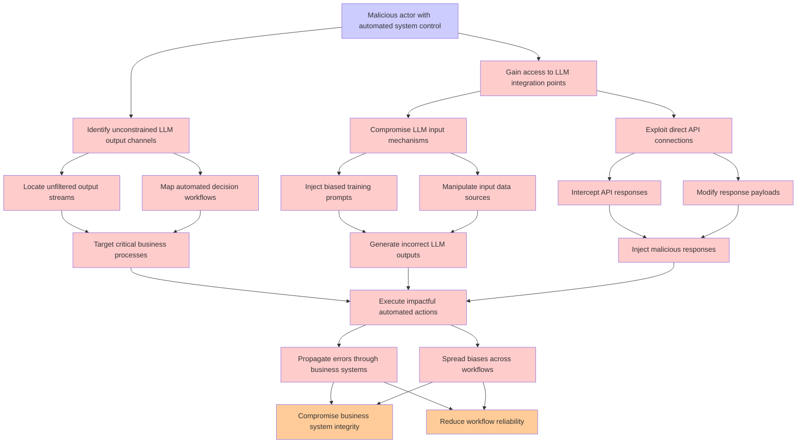

# Attack Tree: LLM09 Misinformation

**Threat ID**: 8c24eec4-40be-4f17-888d-f22d37b39724  
**Associated threat statement**: A malicious actor who controls an automated system with direct access to unconstrained LLM outputs can execute impactful actions or make critical decisions based on potentially incorrect, biased, or manipulated data, which leads to automated propagation of errors or biases, resulting in reduced integrity and/or reliability of business systems and workflows

- **Threat Source**: malicious actor
- **Prerequisites**: who controls an automated system with direct access to unconstrained LLM outputs
- **Threat Action**: execute impactful actions or make critical decisions based on potentially incorrect, biased, or manipulated data
- **Threat Impact**: automated propagation of errors or biases
- **Reduced Goal**: integrity, reliability
- **Impacted Assets**: business systems and workflows
- **Priority**: High
- **Category**: LLM09 Misinformation

---

## Attack Tree Diagram

## Attack Path Analysis

This attack tree represents the potential attack paths for the identified threat. Each node in the tree represents either:
- **Attack Goal** (orange): The ultimate objective
- **Attack Step** (red): Individual attack actions
- **Fact/Condition** (blue): Prerequisites or conditions
- **Mitigation** (green): Defensive measures

Review this attack tree to:
1. Identify critical attack paths
2. Implement appropriate security controls
3. Monitor for indicators of these attack patterns
4. Develop incident response procedures

---
*Generated by ThreatForest - Attack Tree Analysis*
