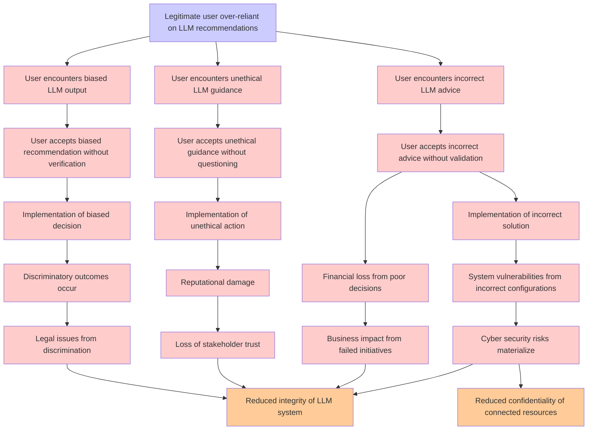

# Attack Tree: LLM09 Misinformation

**Threat ID**: b89e6369-cca5-43a1-a756-3587e52cf263  
**Associated threat statement**: A legitimate user who is over reliant on LLM recommendation can accept biased, unethical, or incorrect guidance and advice, which leads to discriminatory outcomes, reputational damage, financial loss, legal issues or cyber risks, resulting in reduced integrity and/or confidentiality of LLM system and connected resources

- **Threat Source**: legitimate user
- **Prerequisites**: who is over reliant on LLM recommendation
- **Threat Action**: accept biased, unethical, or incorrect guidance and advice
- **Threat Impact**: discriminatory outcomes, reputational damage, financial loss, legal issues or cyber risks
- **Reduced Goal**: integrity, confidentiality
- **Impacted Assets**: LLM system and connected resources
- **Priority**: High
- **Category**: LLM09 Misinformation

---

## Attack Tree Diagram

## Attack Path Analysis

This attack tree represents the potential attack paths for the identified threat. Each node in the tree represents either:
- **Attack Goal** (orange): The ultimate objective
- **Attack Step** (red): Individual attack actions
- **Fact/Condition** (blue): Prerequisites or conditions
- **Mitigation** (green): Defensive measures

Review this attack tree to:
1. Identify critical attack paths
2. Implement appropriate security controls
3. Monitor for indicators of these attack patterns
4. Develop incident response procedures

---
*Generated by ThreatForest - Attack Tree Analysis*
