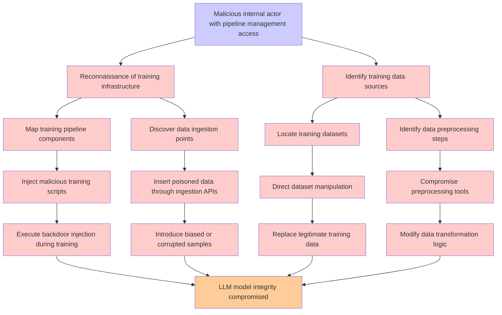

# Attack Tree: LLM04 Data/Model Poisoning

**Threat ID**: c1ef6f15-be68-46ed-a724-1a8647f2439c  
**Associated threat statement**: A malicious internal actor with access to manage training or fine tuning pipelines can inject malicious tools or processes, which leads to tampering with training data, resulting in reduced integrity of the LLM model

- **Threat Source**: malicious internal actor
- **Prerequisites**: with access to manage training or fine tuning pipelines
- **Threat Action**: inject malicious tools or processes
- **Threat Impact**: tampering with training data
- **Reduced Goal**: integrity
- **Impacted Assets**: the LLM model
- **Priority**: High
- **Category**: LLM04 Data/Model Poisoning

---

## Attack Tree Diagram

## Attack Path Analysis

This attack tree represents the potential attack paths for the identified threat. Each node in the tree represents either:
- **Attack Goal** (orange): The ultimate objective
- **Attack Step** (red): Individual attack actions
- **Fact/Condition** (blue): Prerequisites or conditions
- **Mitigation** (green): Defensive measures

Review this attack tree to:
1. Identify critical attack paths
2. Implement appropriate security controls
3. Monitor for indicators of these attack patterns
4. Develop incident response procedures

---
*Generated by ThreatForest - Attack Tree Analysis*
