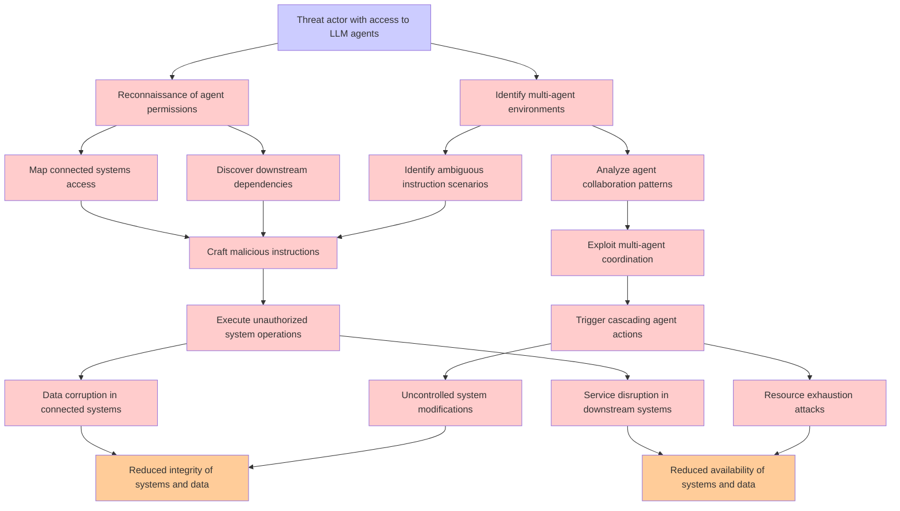

# Attack Tree: LLM06 Excessive Agency

**Threat ID**: c5119071-e818-4e18-82da-b1f9670cd138  
**Associated threat statement**: An external or internal threat actor who has access to LLM agents granted permissions to access external systems can abuse those permissions, which leads to damage connected systems when operating under ambiguous instructions or in multi-agent collaborative environments, resulting in reduced integrity and/or availability of connected and downstream systems and data

- **Threat Source**: external or internal threat actor
- **Prerequisites**: who has access to LLM agents granted permissions to access external systems
- **Threat Action**: abuse those permissions
- **Threat Impact**: damage connected systems when operating under ambiguous instructions or in multi-agent collaborative environments
- **Reduced Goal**: integrity, availability
- **Impacted Assets**: connected and downstream systems and data
- **Priority**: High
- **Category**: LLM06 Excessive Agency

---

## Attack Tree Diagram

## Attack Path Analysis

This attack tree represents the potential attack paths for the identified threat. Each node in the tree represents either:
- **Attack Goal** (orange): The ultimate objective
- **Attack Step** (red): Individual attack actions
- **Fact/Condition** (blue): Prerequisites or conditions
- **Mitigation** (green): Defensive measures

Review this attack tree to:
1. Identify critical attack paths
2. Implement appropriate security controls
3. Monitor for indicators of these attack patterns
4. Develop incident response procedures

---
*Generated by ThreatForest - Attack Tree Analysis*
