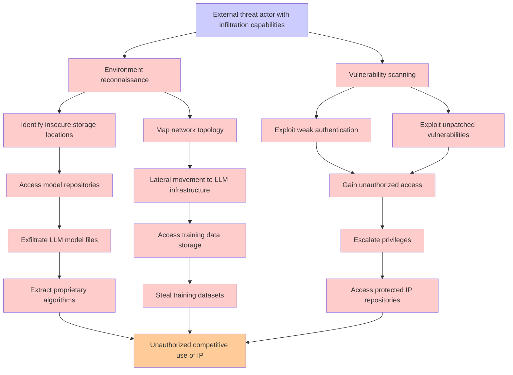

# Attack Tree: LLM03 Supply Chain, LLM10 Unbounded Consumption

**Threat ID**: e746ae8d-2840-4dd0-96a2-5d9656f7a62b  
**Associated threat statement**: An external threat actor who can infiltrate insecure environments can exfiltrate proprietary LLM models and artifacts, which leads to unauthorized competitive use, resulting in reduced confidentiality of intellectual property

- **Threat Source**: external threat actor
- **Prerequisites**: who can infiltrate insecure environments
- **Threat Action**: exfiltrate proprietary LLM models and artifacts
- **Threat Impact**: unauthorized competitive use
- **Reduced Goal**: confidentiality
- **Impacted Assets**: intellectual property
- **Priority**: High
- **Category**: LLM03 Supply Chain, LLM10 Unbounded Consumption

---

## Attack Tree Diagram

## Attack Path Analysis

This attack tree represents the potential attack paths for the identified threat. Each node in the tree represents either:
- **Attack Goal** (orange): The ultimate objective
- **Attack Step** (red): Individual attack actions
- **Fact/Condition** (blue): Prerequisites or conditions
- **Mitigation** (green): Defensive measures

Review this attack tree to:
1. Identify critical attack paths
2. Implement appropriate security controls
3. Monitor for indicators of these attack patterns
4. Develop incident response procedures

---
*Generated by ThreatForest - Attack Tree Analysis*
