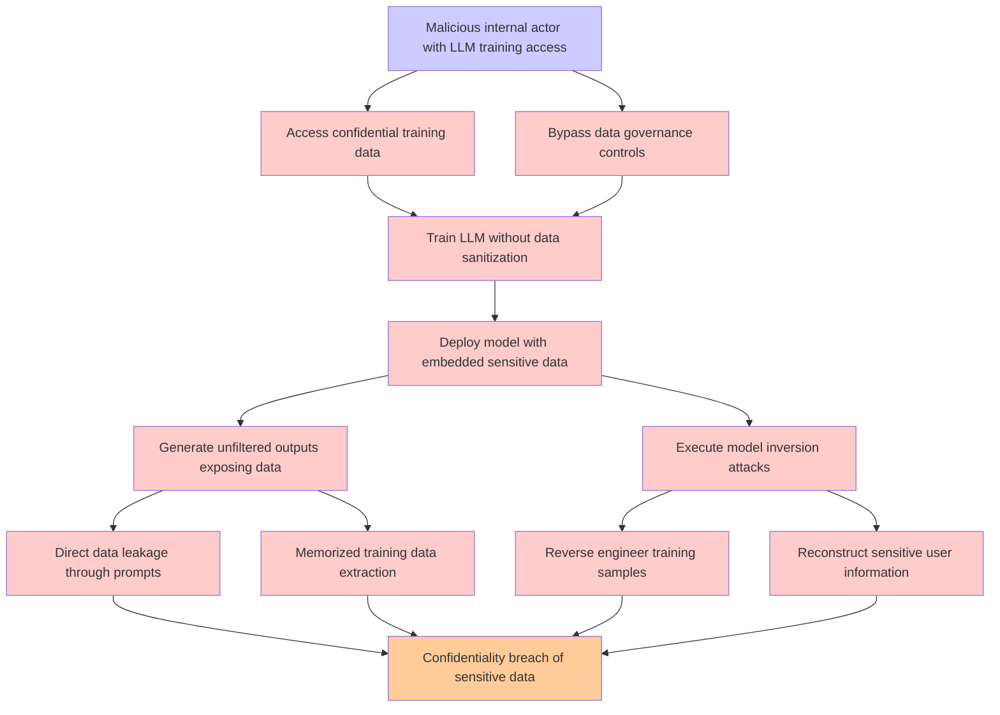

# Attack Tree: LLM02 SensitiveInfo Disclosure

**Threat ID**: f31ca02f-49a0-44df-8718-0e56d500ed4f  
**Associated threat statement**: A malicious internal actor who trains an LLM on confidential data without proper safeguards can expose that data, which leads to unfiltered model outputs or model inversion attacks, resulting in reduced confidentiality of sensitive user and training data

- **Threat Source**: malicious internal actor
- **Prerequisites**: who trains an LLM on confidential data without proper safeguards
- **Threat Action**: expose that data
- **Threat Impact**: unfiltered model outputs  or model inversion attacks
- **Reduced Goal**: confidentiality
- **Impacted Assets**: sensitive user and training data
- **Priority**: High
- **Category**: LLM02 SensitiveInfo Disclosure

---

## Attack Tree Diagram

## Attack Path Analysis

This attack tree represents the potential attack paths for the identified threat. Each node in the tree represents either:
- **Attack Goal** (orange): The ultimate objective
- **Attack Step** (red): Individual attack actions
- **Fact/Condition** (blue): Prerequisites or conditions
- **Mitigation** (green): Defensive measures

Review this attack tree to:
1. Identify critical attack paths
2. Implement appropriate security controls
3. Monitor for indicators of these attack patterns
4. Develop incident response procedures

---
*Generated by ThreatForest - Attack Tree Analysis*
