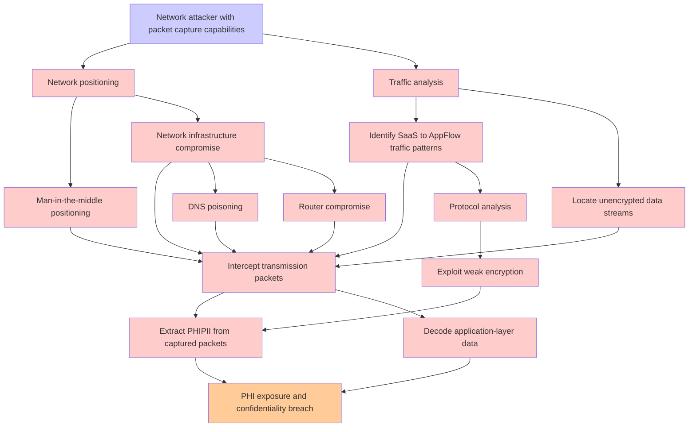

# Attack Tree: Data Transmission Interception

**Threat ID**: T001  
**Associated threat statement**: A network attacker with packet capture capabilities, can intercept healthcare data during transmission from SaaS applications to AWS AppFlow, which leads to PHI exposure, resulting in reduced confidentiality of PHI/PII Data.

- **Threat Source**: Network attacker
- **Prerequisites**: Packet capture capabilities
- **Threat Action**: Intercept healthcare data during transmission from SaaS applications to AWS AppFlow
- **Threat Impact**: PHI exposure
- **Reduced Goal**: Confidentiality
- **Impacted Assets**: PHI/PII Data
- **Priority**: High
- **Category**: Data Transmission Interception

---

## Attack Tree Diagram

## Attack Path Analysis

This attack tree represents the potential attack paths for the identified threat. Each node in the tree represents either:
- **Attack Goal** (orange): The ultimate objective
- **Attack Step** (red): Individual attack actions
- **Fact/Condition** (blue): Prerequisites or conditions
- **Mitigation** (green): Defensive measures

Review this attack tree to:
1. Identify critical attack paths
2. Implement appropriate security controls
3. Monitor for indicators of these attack patterns
4. Develop incident response procedures

---
*Generated by ThreatForest - Attack Tree Analysis*
