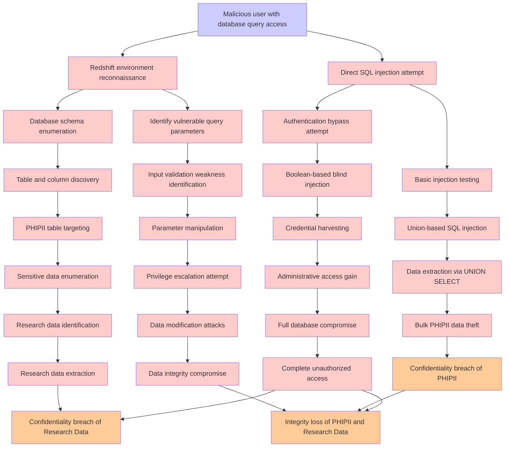

# Attack Tree: SQL Injection Attack

**Threat ID**: T004  
**Associated threat statement**: A malicious user with database query access, can perform SQL injection attacks against Redshift, which leads to unauthorized data access or modification, resulting in reduced confidentiality and integrity of PHI/PII Data and Research Data.

- **Threat Source**: Malicious user
- **Prerequisites**: Database query access
- **Threat Action**: Perform SQL injection attacks against Redshift
- **Threat Impact**: Unauthorized data access or modification
- **Reduced Goal**: Confidentiality, Integrity
- **Impacted Assets**: PHI/PII Data, Research Data
- **Priority**: High
- **Category**: SQL Injection Attack

---

## Attack Tree Diagram

## Attack Path Analysis

This attack tree represents the potential attack paths for the identified threat. Each node in the tree represents either:
- **Attack Goal** (orange): The ultimate objective
- **Attack Step** (red): Individual attack actions
- **Fact/Condition** (blue): Prerequisites or conditions
- **Mitigation** (green): Defensive measures

Review this attack tree to:
1. Identify critical attack paths
2. Implement appropriate security controls
3. Monitor for indicators of these attack patterns
4. Develop incident response procedures

---
*Generated by ThreatForest - Attack Tree Analysis*
