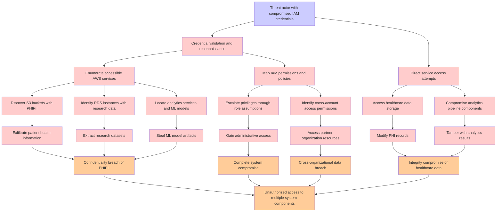

# Attack Tree: Credential Compromise

**Threat ID**: T005  
**Associated threat statement**: A threat actor with compromised IAM credentials, can gain broad access across the entire healthcare analytics pipeline, which leads to unauthorized access to multiple system components, resulting in reduced confidentiality and integrity of all system assets.

- **Threat Source**: Threat actor
- **Prerequisites**: Compromised IAM credentials
- **Threat Action**: Gain broad access across the entire healthcare analytics pipeline
- **Threat Impact**: Unauthorized access to multiple system components
- **Reduced Goal**: Confidentiality, Integrity
- **Impacted Assets**: PHI/PII Data, Research Data, Business Intelligence, ML Models, Infrastructure
- **Priority**: High
- **Category**: Credential Compromise

---

## Attack Tree Diagram

## Attack Path Analysis

This attack tree represents the potential attack paths for the identified threat. Each node in the tree represents either:
- **Attack Goal** (orange): The ultimate objective
- **Attack Step** (red): Individual attack actions
- **Fact/Condition** (blue): Prerequisites or conditions
- **Mitigation** (green): Defensive measures

Review this attack tree to:
1. Identify critical attack paths
2. Implement appropriate security controls
3. Monitor for indicators of these attack patterns
4. Develop incident response procedures

---
*Generated by ThreatForest - Attack Tree Analysis*
