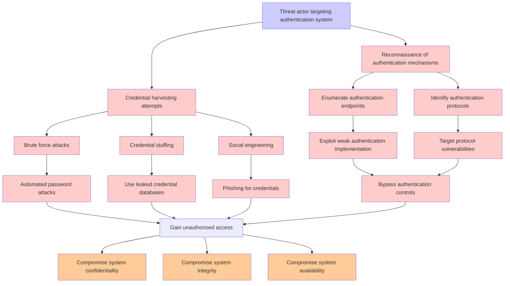

# Attack Tree: Authentication

**Threat ID**: T001  
**Associated threat statement**: **Threat Statement**: A malicious attacker with compromised X.509 certificates, can impersonate legitimate IoT devices, which leads to injection of malicious sensor data and unauthorized device commands, resulting in reduced integrity of device data and control systems.

- **Threat Source**: malicious attacker
- **Prerequisites**: compromised X.509 certificates
- **Threat Action**: impersonate legitimate IoT devices
- **Threat Impact**: injection of malicious sensor data and unauthorized device commands
- **Reduced Goal**: integrity
- **Impacted Assets**: device data and control systems
- **Priority**: High
- **Category**: Authentication

---

## Attack Tree Diagram

## Attack Path Analysis

This attack tree represents the potential attack paths for the identified threat. Each node in the tree represents either:
- **Attack Goal** (orange): The ultimate objective
- **Attack Step** (red): Individual attack actions
- **Fact/Condition** (blue): Prerequisites or conditions
- **Mitigation** (green): Defensive measures

Review this attack tree to:
1. Identify critical attack paths
2. Implement appropriate security controls
3. Monitor for indicators of these attack patterns
4. Develop incident response procedures

---
*Generated by ThreatForest - Attack Tree Analysis*
