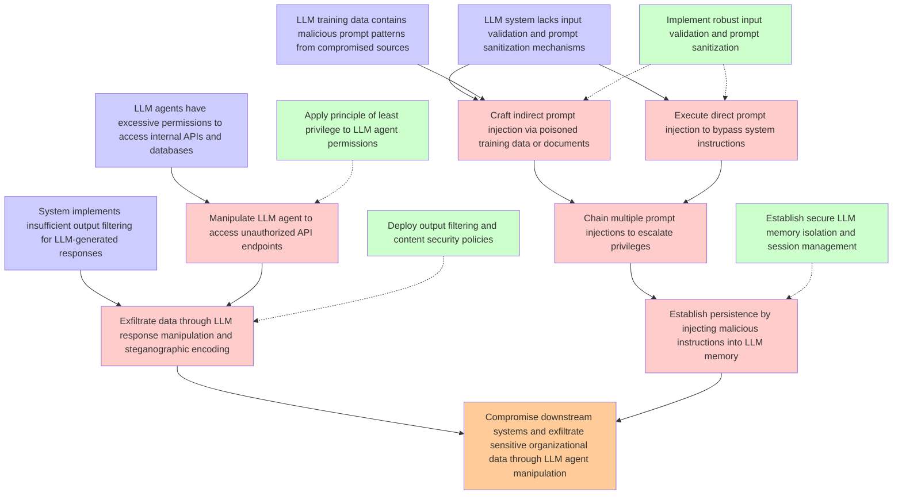

# Attack Tree: LLM01 Prompt Injection / LLM06 Excessive Agency

**Threat ID**: T3  
**Description**: An external threat actor who enables compromised LLM plugins or agents in an LLM system can manipulate it via indirect or direct prompt injection, which leads to access unauthorized functionality or d...

## Attack Tree Diagram

## MITRE ATT&CK Mappings

### compromise downstream systems and exfiltrate sensitive organizational data through llm agent manipulation
- **AT1027**: Transfer Data out of Cloud Account (Confidence: 0.70)
  - Tactics: exfiltration
- **T1189**: Drive-by Compromise (Confidence: 0.70)
  - Tactics: initial-access

### llm system lacks input validation and prompt sanitization mechanisms
- **T1049**: System Network Connections Discovery (Confidence: 0.30)
  - Tactics: discovery
- **T1082**: System Information Discovery (Confidence: 0.30)
  - Tactics: discovery

### llm agents have excessive permissions to access internal apis and databases
- **T1556.009**: Conditional Access Policies (Confidence: 0.60)
  - Tactics: credential-access, defense-evasion, persistence
- **T1108**: Redundant Access (Confidence: 0.50)
  - Tactics: defense-evasion, persistence

### system implements insufficient output filtering for llm-generated responses
- **T1049**: System Network Connections Discovery (Confidence: 0.30)
  - Tactics: discovery
- **T1082**: System Information Discovery (Confidence: 0.30)
  - Tactics: discovery

### llm training data contains malicious prompt patterns from compromised sources
- **T1552.005**: Cloud Instance Metadata API (Confidence: 0.40)
  - Tactics: credential-access
- **T1204.003**: Malicious Image (Confidence: 0.40)
  - Tactics: execution

### craft indirect prompt injection via poisoned training data or documents
- **T1190.A018**: API Gateway (Confidence: 0.50)
  - Tactics: initial-access
- **T1190.A010**: Redshift Cluster (Confidence: 0.50)
  - Tactics: initial-access

### execute direct prompt injection to bypass system instructions
- **T1556.007**: Hybrid Identity (Confidence: 0.60)
  - Tactics: credential-access, defense-evasion, persistence
- **T1539**: Steal Web Session Cookie (Confidence: 0.60)
  - Tactics: credential-access

### manipulate llm agent to access unauthorized api endpoints
- **T1556.009**: Conditional Access Policies (Confidence: 0.60)
  - Tactics: credential-access, defense-evasion, persistence
- **T1108**: Redundant Access (Confidence: 0.50)
  - Tactics: defense-evasion, persistence

### chain multiple prompt injections to escalate privileges
- **T1556.007**: Hybrid Identity (Confidence: 0.80)
  - Tactics: credential-access, defense-evasion, persistence
- **T1548.005**: Temporary Elevated Cloud Access (Confidence: 0.80)
  - Tactics: privilege-escalation, defense-evasion

### exfiltrate data through llm response manipulation and steganographic encoding
- **AT1027**: Transfer Data out of Cloud Account (Confidence: 0.70)
  - Tactics: exfiltration
- **T1537**: Transfer Data to Cloud Account (Confidence: 0.70)
  - Tactics: exfiltration

### establish persistence by injecting malicious instructions into llm memory
- **T1204.003**: Malicious Image (Confidence: 0.50)
  - Tactics: execution
- **T1556.007**: Hybrid Identity (Confidence: 0.40)
  - Tactics: credential-access, defense-evasion, persistence

### apply principle of least privilege to llm agent permissions
- **T1098.002**: Additional Email Delegate Permissions (Confidence: 0.50)
  - Tactics: persistence, privilege-escalation
- **T1649**: Steal or Forge Authentication Certificates (Confidence: 0.40)
  - Tactics: credential-access

### deploy output filtering and content security policies
- **T1518.001**: Security Software Discovery (Confidence: 0.30)
  - Tactics: discovery
- **T1072**: Software Deployment Tools (Confidence: 0.30)
  - Tactics: execution, lateral-movement

### establish secure llm memory isolation and session management
- **T1550.004**: Web Session Cookie (Confidence: 0.30)
  - Tactics: defense-evasion, lateral-movement
- **T1539**: Steal Web Session Cookie (Confidence: 0.30)
  - Tactics: credential-access

## Attack Steps Analysis

1. **goal**: Compromise downstream systems and exfiltrate sensitive organizational data through LLM agent manipulation
2. **fact1**: LLM system lacks input validation and prompt sanitization mechanisms
3. **fact2**: LLM agents have excessive permissions to access internal APIs and databases
4. **fact3**: System implements insufficient output filtering for LLM-generated responses
5. **fact4**: LLM training data contains malicious prompt patterns from compromised sources
6. **attack1**: Craft indirect prompt injection via poisoned training data or documents
7. **attack2**: Execute direct prompt injection to bypass system instructions
8. **attack3**: Manipulate LLM agent to access unauthorized API endpoints
9. **attack4**: Chain multiple prompt injections to escalate privileges
10. **attack5**: Exfiltrate data through LLM response manipulation and steganographic encoding
11. **attack6**: Establish persistence by injecting malicious instructions into LLM memory
12. **mitigation1**: Implement robust input validation and prompt sanitization
13. **mitigation2**: Apply principle of least privilege to LLM agent permissions
14. **mitigation3**: Deploy output filtering and content security policies
15. **mitigation4**: Establish secure LLM memory isolation and session management

---
*Generated by ThreatForest*
