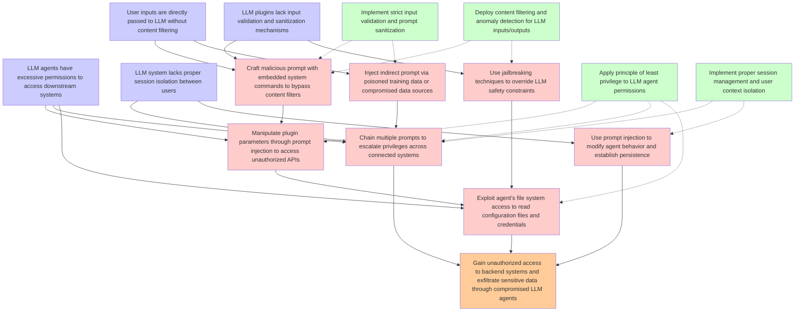

# Attack Tree: LLM01 Prompt Injection / LLM06 Excessive Agency

**Threat ID**: T3  
**Description**: An external threat actor who enables compromised LLM plugins or agents in an LLM system can manipulate it via indirect or direct prompt injection, which leads to access unauthorized functionality or d...

## Attack Tree Diagram

## MITRE ATT&CK Mappings

### Gain unauthorized access to backend systems and exfiltrate sensitive data through compromised LLM agents
- **T1199**: Trusted Relationship (Confidence: 0.90)
  - Tactics: lateral-movement, persistence, initial-access
- **T1537**: Transfer Data to Cloud Account (Confidence: 0.85)
  - Tactics: exfiltration

### LLM plugins lack input validation and sanitization mechanisms
- **T1212**: Exploitation for Credential Access (Confidence: 0.80)
  - Tactics: credential-access

### LLM agents have excessive permissions to access downstream systems
- **T1550.001**: Application Access Token (Confidence: 0.85)
  - Tactics: defense-evasion, lateral-movement
- **T1098.003**: Additional Cloud Roles (Confidence: 0.75)
  - Tactics: persistence, privilege-escalation

### User inputs are directly passed to LLM without content filtering
- **T1189**: Drive-by Compromise (Confidence: 0.75)
  - Tactics: initial-access

### LLM system lacks proper session isolation between users
- **T1080**: Taint Shared Content (Confidence: 0.90)
  - Tactics: lateral-movement

### Craft malicious prompt with embedded system commands to bypass content filters
- **T1564**: Hide Artifacts (Confidence: 0.85)
  - Tactics: defense-evasion
- **T1189**: Drive-by Compromise (Confidence: 0.80)
  - Tactics: initial-access

### Inject indirect prompt via poisoned training data or compromised data sources
- **T1080**: Taint Shared Content (Confidence: 0.90)
  - Tactics: lateral-movement
- **T1530**: Data from Cloud Storage (Confidence: 0.75)
  - Tactics: collection

### Use jailbreaking techniques to override LLM safety constraints
- **T1562.A001**: Disable or Modify GuardDuty (Confidence: 0.85)
  - Tactics: defense-evasion
- **T1059.009**: Cloud API (Confidence: 0.70)
  - Tactics: execution

### Manipulate plugin parameters through prompt injection to access unauthorized APIs
- **T1059.009**: Cloud API (Confidence: 0.90)
  - Tactics: execution
- **T1550.001**: Application Access Token (Confidence: 0.80)
  - Tactics: defense-evasion, lateral-movement

### Chain multiple prompts to escalate privileges across connected systems
- **T1078.004**: Valid Cloud Accounts (Confidence: 0.80)
  - Tactics: defense-evasion, persistence, privilege-escalation, initial-access
- **T1021**: Remote Services (Confidence: 0.75)
  - Tactics: lateral-movement

### Exploit agent's file system access to read configuration files and credentials
- **T1552.001**: Credentials In Files (Confidence: 0.95)
  - Tactics: credential-access

### Use prompt injection to modify agent behavior and establish persistence
- **T1546**: Event Triggered Execution (Confidence: 0.85)
  - Tactics: privilege-escalation, persistence
- **T1080**: Taint Shared Content (Confidence: 0.70)
  - Tactics: lateral-movement

### Implement strict input validation and prompt sanitization
- **T1499**: Endpoint Denial of Service (Confidence: 0.75)
  - Tactics: impact
- **T1072**: Software Deployment Tools (Confidence: 0.70)
  - Tactics: execution, lateral-movement

### Apply principle of least privilege to LLM agent permissions
- **T1098.003**: Additional Cloud Roles (Confidence: 0.90)
  - Tactics: persistence, privilege-escalation
- **T1548.005**: Temporary Elevated Cloud Access (Confidence: 0.85)
  - Tactics: privilege-escalation, defense-evasion

### Deploy content filtering and anomaly detection for LLM inputs/outputs
- **T1078.004**: Valid Cloud Accounts (Confidence: 0.80)
  - Tactics: defense-evasion, persistence, privilege-escalation, initial-access
- **T1528**: Steal Application Access Token (Confidence: 0.75)
  - Tactics: credential-access

### Implement proper session management and user context isolation
- **T1550.004**: Web Session Cookie (Confidence: 0.90)
  - Tactics: defense-evasion, lateral-movement
- **T1539**: Steal Web Session Cookie (Confidence: 0.85)
  - Tactics: credential-access

## Attack Steps Analysis

1. **goal**: Gain unauthorized access to backend systems and exfiltrate sensitive data through compromised LLM agents
2. **fact1**: LLM plugins lack input validation and sanitization mechanisms
3. **fact2**: LLM agents have excessive permissions to access downstream systems
4. **fact3**: User inputs are directly passed to LLM without content filtering
5. **fact4**: LLM system lacks proper session isolation between users
6. **attack1**: Craft malicious prompt with embedded system commands to bypass content filters
7. **attack2**: Inject indirect prompt via poisoned training data or compromised data sources
8. **attack3**: Use jailbreaking techniques to override LLM safety constraints
9. **attack4**: Manipulate plugin parameters through prompt injection to access unauthorized APIs
10. **attack5**: Chain multiple prompts to escalate privileges across connected systems
11. **attack6**: Exploit agent's file system access to read configuration files and credentials
12. **attack7**: Use prompt injection to modify agent behavior and establish persistence
13. **mitigation1**: Implement strict input validation and prompt sanitization
14. **mitigation2**: Apply principle of least privilege to LLM agent permissions
15. **mitigation3**: Deploy content filtering and anomaly detection for LLM inputs/outputs
16. **mitigation4**: Implement proper session management and user context isolation

---
*Generated by ThreatForest*
