# Attack Tree: LLM04 Data/Model Poisoning

**Threat ID**: T7  
**Description**: A malicious internal actor with access to upload training or fine tuning data can intentionally introduce manipulated, biased or malicious data, which leads to model poisoning or backdoors, resulting ...

## Attack Tree Diagram

```mermaid
graph TD
    goal["Compromise LLM model integrity to manipulate outputs and establish persistent backdoor access"]
    
    fact1["Training data pipeline lacks integrity verification and provenance tracking"]
    fact2["Insufficient access controls on model training and fine-tuning infrastructure"]
    fact3["Model validation processes do not detect subtle poisoning patterns"]
    fact4["Training data ingestion accepts files from multiple sources without sanitization"]
    
    attack1["Exploit privileged access to inject malicious training samples with trigger patterns"]
    attack2["Upload poisoned datasets containing backdoor triggers during fine-tuning phase"]
    attack3["Perform label flipping attacks on existing training data to bias model decisions"]
    attack4["Inject adversarial examples designed to create specific model vulnerabilities"]
    attack5["Gradually introduce biased data over multiple training cycles to avoid detection"]
    attack6["Manipulate data preprocessing pipelines to alter training inputs"]
    
    mitigation1["Implement cryptographic signing and hash verification for all training datasets"]
    mitigation2["Deploy multi-party approval workflows for training data modifications"]
    mitigation3["Establish continuous model behavior monitoring and anomaly detection"]
    mitigation4["Implement data provenance tracking and audit logging for all training inputs"]
    
    fact1 --> attack1
    fact1 --> attack3
    fact2 --> attack2
    fact2 --> attack6
    fact3 --> attack4
    fact3 --> attack5
    fact4 --> attack1
    fact4 --> attack2
    
    attack1 --> goal
    attack2 --> goal
    attack3 --> goal
    attack4 --> goal
    attack5 --> goal
    attack6 --> goal
    
    mitigation1 -.-> attack1
    mitigation1 -.-> attack2
    mitigation2 -.-> attack3
    mitigation2 -.-> attack6
    mitigation3 -.-> attack4
    mitigation3 -.-> attack5
    mitigation4 -.-> attack1
    mitigation4 -.-> attack2
    
    classDef attack fill:#ffcccc
    classDef mitigation fill:#ccffcc
    classDef goal fill:#ffcc99
    classDef fact fill:#ccccff
    
    class attack1,attack2,attack3,attack4,attack5,attack6 attack
    class mitigation1,mitigation2,mitigation3,mitigation4 mitigation
    class goal goal
    class fact1,fact2,fact3,fact4 fact
```

## MITRE ATT&CK Mappings

### compromise llm model integrity to manipulate outputs and establish persistent backdoor access
- **AT1024.002**: Additional Access Key (Confidence: 0.90)
  - Tactics: persistence
- **T1556.009**: Conditional Access Policies (Confidence: 0.80)
  - Tactics: credential-access, defense-evasion, persistence

### training data pipeline lacks integrity verification and provenance tracking
- **T1552.005**: Cloud Instance Metadata API (Confidence: 0.40)
  - Tactics: credential-access
- **T1070.008**: Clear Mailbox Data (Confidence: 0.40)
  - Tactics: defense-evasion

### insufficient access controls on model training and fine-tuning infrastructure
- **T1108**: Redundant Access (Confidence: 0.60)
  - Tactics: defense-evasion, persistence
- **T1556.009**: Conditional Access Policies (Confidence: 0.60)
  - Tactics: credential-access, defense-evasion, persistence

### training data ingestion accepts files from multiple sources without sanitization
- **T1552.001**: Credentials In Files (Confidence: 0.40)
  - Tactics: credential-access
- **T1552.005**: Cloud Instance Metadata API (Confidence: 0.40)
  - Tactics: credential-access

### exploit privileged access to inject malicious training samples with trigger patterns
- **T1548.005**: Temporary Elevated Cloud Access (Confidence: 1.00)
  - Tactics: privilege-escalation, defense-evasion
- **T1546**: Event Triggered Execution (Confidence: 0.90)
  - Tactics: privilege-escalation, persistence

### upload poisoned datasets containing backdoor triggers during fine-tuning phase
- **T1108**: Redundant Access (Confidence: 0.30)
  - Tactics: defense-evasion, persistence
- **AT1002**: AWS Systems Manager Run Command (Confidence: 0.30)
  - Tactics: execution

### perform label flipping attacks on existing training data to bias model decisions
- **T1552.005**: Cloud Instance Metadata API (Confidence: 0.40)
  - Tactics: credential-access
- **T1070.008**: Clear Mailbox Data (Confidence: 0.40)
  - Tactics: defense-evasion

### inject adversarial examples designed to create specific model vulnerabilities
- **AT1007**: Create or Modify AWS Service (Confidence: 0.30)
- **AT1028**: Create or Modify EC2 Key Pair (Confidence: 0.30)
  - Tactics: persistence

### gradually introduce biased data over multiple training cycles to avoid detection
- **T1074**: Data Staged (Confidence: 0.50)
  - Tactics: collection
- **T1074.002**: Remote Data Staging (Confidence: 0.50)
  - Tactics: collection

### manipulate data preprocessing pipelines to alter training inputs
- **T1552.005**: Cloud Instance Metadata API (Confidence: 0.40)
  - Tactics: credential-access
- **T1070.008**: Clear Mailbox Data (Confidence: 0.40)
  - Tactics: defense-evasion

### deploy multi-party approval workflows for training data modifications
- **T1552.005**: Cloud Instance Metadata API (Confidence: 0.40)
  - Tactics: credential-access
- **T1072**: Software Deployment Tools (Confidence: 0.40)
  - Tactics: execution, lateral-movement

### implement data provenance tracking and audit logging for all training inputs
- **T1552.005**: Cloud Instance Metadata API (Confidence: 0.40)
  - Tactics: credential-access
- **T1070.008**: Clear Mailbox Data (Confidence: 0.40)
  - Tactics: defense-evasion

## Attack Steps Analysis

1. **goal**: Compromise LLM model integrity to manipulate outputs and establish persistent backdoor access
2. **fact1**: Training data pipeline lacks integrity verification and provenance tracking
3. **fact2**: Insufficient access controls on model training and fine-tuning infrastructure
4. **fact3**: Model validation processes do not detect subtle poisoning patterns
5. **fact4**: Training data ingestion accepts files from multiple sources without sanitization
6. **attack1**: Exploit privileged access to inject malicious training samples with trigger patterns
7. **attack2**: Upload poisoned datasets containing backdoor triggers during fine-tuning phase
8. **attack3**: Perform label flipping attacks on existing training data to bias model decisions
9. **attack4**: Inject adversarial examples designed to create specific model vulnerabilities
10. **attack5**: Gradually introduce biased data over multiple training cycles to avoid detection
11. **attack6**: Manipulate data preprocessing pipelines to alter training inputs
12. **mitigation1**: Implement cryptographic signing and hash verification for all training datasets
13. **mitigation2**: Deploy multi-party approval workflows for training data modifications
14. **mitigation3**: Establish continuous model behavior monitoring and anomaly detection
15. **mitigation4**: Implement data provenance tracking and audit logging for all training inputs

---
*Generated by ThreatForest*
