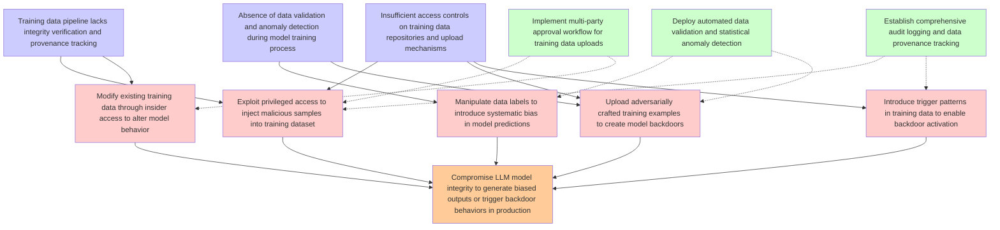

# Attack Tree: LLM04 Data/Model Poisoning

**Threat ID**: T7  
**Description**: A malicious internal actor with access to upload training or fine tuning data can intentionally introduce manipulated, biased or malicious data, which leads to model poisoning or backdoors, resulting ...

## Attack Tree Diagram

## MITRE ATT&CK Mappings

### Compromise LLM model integrity to generate biased outputs or trigger backdoor behaviors in production
- **T1565.001**: Stored Data Manipulation (Confidence: 0.95)
  - Tactics: impact
- **T1565**: Data Manipulation (Confidence: 0.85)
  - Tactics: impact

### Training data pipeline lacks integrity verification and provenance tracking
- **T1565.002**: Transmitted Data Manipulation (Confidence: 0.80)
  - Tactics: impact
- **T1565.001**: Stored Data Manipulation (Confidence: 0.75)
  - Tactics: impact

### Insufficient access controls on training data repositories and upload mechanisms
- **T1078.004**: Valid Cloud Accounts (Confidence: 0.85)
  - Tactics: defense-evasion, persistence, privilege-escalation, initial-access
- **T1213**: Data from Information Repositories (Confidence: 0.80)
  - Tactics: collection

### Absence of data validation and anomaly detection during model training process
- **T1562.008**: Disable Cloud Logs (Confidence: 0.75)
  - Tactics: defense-evasion

### Exploit privileged access to inject malicious samples into training dataset
- **T1080**: Taint Shared Content (Confidence: 0.90)
  - Tactics: lateral-movement
- **T1565**: Data Manipulation (Confidence: 0.85)
  - Tactics: impact

### Manipulate data labels to introduce systematic bias in model predictions
- **T1565**: Data Manipulation (Confidence: 0.95)
  - Tactics: impact
- **T1565.003**: Runtime Data Manipulation (Confidence: 0.80)
  - Tactics: impact

### Upload adversarially crafted training examples to create model backdoors
- **T1537**: Transfer Data to Cloud Account (Confidence: 0.80)
  - Tactics: exfiltration
- **T1565.002**: Transmitted Data Manipulation (Confidence: 0.75)
  - Tactics: impact

### Modify existing training data through insider access to alter model behavior
- **T1078.004**: Valid Cloud Accounts (Confidence: 0.85)
  - Tactics: defense-evasion, persistence, privilege-escalation, initial-access
- **T1565.003**: Runtime Data Manipulation (Confidence: 0.80)
  - Tactics: impact

### Introduce trigger patterns in training data to enable backdoor activation
- **T1565.002**: Transmitted Data Manipulation (Confidence: 0.85)
  - Tactics: impact
- **T1072**: Software Deployment Tools (Confidence: 0.70)
  - Tactics: execution, lateral-movement

### Implement multi-party approval workflow for training data uploads
- **T1565.002**: Transmitted Data Manipulation (Confidence: 0.90)
  - Tactics: impact
- **T1119**: Automated Collection (Confidence: 0.75)
  - Tactics: collection

### Deploy automated data validation and statistical anomaly detection
- **T1565.002**: Transmitted Data Manipulation (Confidence: 0.95)
  - Tactics: impact
- **T1119**: Automated Collection (Confidence: 0.80)
  - Tactics: collection

### Establish comprehensive audit logging and data provenance tracking
- **T1562.008**: Disable Cloud Logs (Confidence: 0.90)
  - Tactics: defense-evasion
- **T1562**: Impair Defenses (Confidence: 0.85)
  - Tactics: defense-evasion

## Attack Steps Analysis

1. **goal**: Compromise LLM model integrity to generate biased outputs or trigger backdoor behaviors in production
2. **fact1**: Training data pipeline lacks integrity verification and provenance tracking
3. **fact2**: Insufficient access controls on training data repositories and upload mechanisms
4. **fact3**: Absence of data validation and anomaly detection during model training process
5. **attack1**: Exploit privileged access to inject malicious samples into training dataset
6. **attack2**: Manipulate data labels to introduce systematic bias in model predictions
7. **attack3**: Upload adversarially crafted training examples to create model backdoors
8. **attack4**: Modify existing training data through insider access to alter model behavior
9. **attack5**: Introduce trigger patterns in training data to enable backdoor activation
10. **mitigation1**: Implement multi-party approval workflow for training data uploads
11. **mitigation2**: Deploy automated data validation and statistical anomaly detection
12. **mitigation3**: Establish comprehensive audit logging and data provenance tracking

---
*Generated by ThreatForest*
