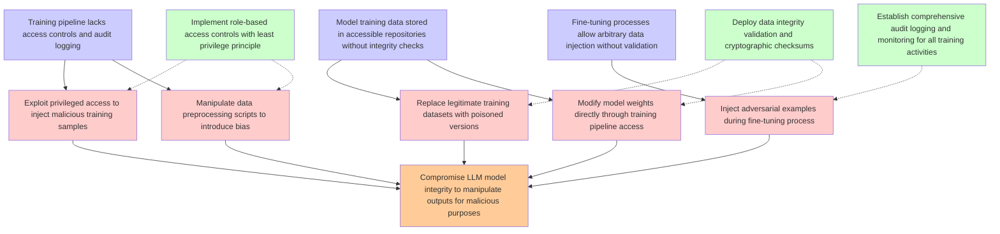

# Attack Tree: LLM04 Data/Model Poisoning

**Threat ID**: T9  
**Description**: A malicious internal actor with access to manage training or fine tuning pipelines can inject malicious tools or processes, which leads to tampering with training data, resulting in reduced integrity ...

## Attack Tree Diagram

## MITRE ATT&CK Mappings

### compromise llm model integrity to manipulate outputs for malicious purposes
- **T1189**: Drive-by Compromise (Confidence: 0.30)
  - Tactics: initial-access
- **T1204.003**: Malicious Image (Confidence: 0.30)
  - Tactics: execution

### training pipeline lacks access controls and audit logging
- **T1108**: Redundant Access (Confidence: 0.60)
  - Tactics: defense-evasion, persistence
- **T1556.009**: Conditional Access Policies (Confidence: 0.60)
  - Tactics: credential-access, defense-evasion, persistence

### model training data stored in accessible repositories without integrity checks
- **T1552.005**: Cloud Instance Metadata API (Confidence: 0.60)
  - Tactics: credential-access
- **T1530**: Data from Cloud Storage (Confidence: 0.60)
  - Tactics: collection

### fine-tuning processes allow arbitrary data injection without validation
- **T1190.A018**: API Gateway (Confidence: 0.50)
  - Tactics: initial-access
- **T1190.A010**: Redshift Cluster (Confidence: 0.50)
  - Tactics: initial-access

### exploit privileged access to inject malicious training samples
- **T1548.005**: Temporary Elevated Cloud Access (Confidence: 1.00)
  - Tactics: privilege-escalation, defense-evasion
- **T1212**: Exploitation for Credential Access (Confidence: 0.90)
  - Tactics: credential-access

### manipulate data preprocessing scripts to introduce bias
- **T1552.005**: Cloud Instance Metadata API (Confidence: 0.30)
  - Tactics: credential-access
- **AT1027**: Transfer Data out of Cloud Account (Confidence: 0.30)
  - Tactics: exfiltration

### inject adversarial examples during fine-tuning process
- **T1556**: Modify Authentication Process (Confidence: 0.30)
  - Tactics: credential-access, defense-evasion, persistence
- **T1189**: Drive-by Compromise (Confidence: 0.20)
  - Tactics: initial-access

### modify model weights directly through training pipeline access
- **T1108**: Redundant Access (Confidence: 0.60)
  - Tactics: defense-evasion, persistence
- **T1556**: Modify Authentication Process (Confidence: 0.60)
  - Tactics: credential-access, defense-evasion, persistence

### implement role-based access controls with least privilege principle
- **T1212**: Exploitation for Credential Access (Confidence: 0.80)
  - Tactics: credential-access
- **T1528**: Steal Application Access Token (Confidence: 0.80)
  - Tactics: credential-access

### deploy data integrity validation and cryptographic checksums
- **T1552.005**: Cloud Instance Metadata API (Confidence: 0.30)
  - Tactics: credential-access
- **AT1027**: Transfer Data out of Cloud Account (Confidence: 0.30)
  - Tactics: exfiltration

## Attack Steps Analysis

1. **goal**: Compromise LLM model integrity to manipulate outputs for malicious purposes
2. **fact1**: Training pipeline lacks access controls and audit logging
3. **fact2**: Model training data stored in accessible repositories without integrity checks
4. **fact3**: Fine-tuning processes allow arbitrary data injection without validation
5. **attack1**: Exploit privileged access to inject malicious training samples
6. **attack2**: Manipulate data preprocessing scripts to introduce bias
7. **attack3**: Replace legitimate training datasets with poisoned versions
8. **attack4**: Inject adversarial examples during fine-tuning process
9. **attack5**: Modify model weights directly through training pipeline access
10. **mitigation1**: Implement role-based access controls with least privilege principle
11. **mitigation2**: Deploy data integrity validation and cryptographic checksums
12. **mitigation3**: Establish comprehensive audit logging and monitoring for all training activities

---
*Generated by ThreatForest*
