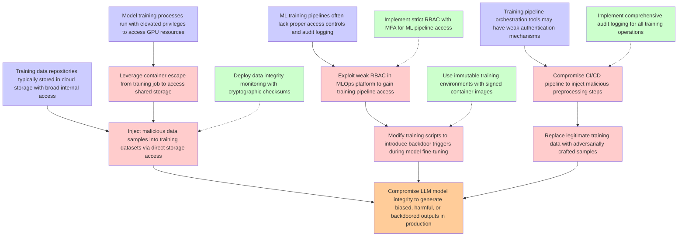

# Attack Tree: LLM04 Data/Model Poisoning

**Threat ID**: T9  
**Description**: A malicious internal actor with access to manage training or fine tuning pipelines can inject malicious tools or processes, which leads to tampering with training data, resulting in reduced integrity ...

## Attack Tree Diagram

## MITRE ATT&CK Mappings

### Compromise LLM model integrity to generate biased, harmful, or backdoored outputs in production
- **T1080**: Taint Shared Content (Confidence: 0.90)
  - Tactics: lateral-movement
- **T1578.004**: Revert Cloud Instance (Confidence: 0.75)
  - Tactics: execution, defense-evasion, impact

### ML training pipelines often lack proper access controls and audit logging
- **T1078.004**: Valid Cloud Accounts (Confidence: 0.85)
  - Tactics: defense-evasion, persistence, privilege-escalation, initial-access
- **T1070**: Indicator Removal (Confidence: 0.80)
  - Tactics: defense-evasion

### Training data repositories typically stored in cloud storage with broad internal access
- **T1530**: Data from Cloud Storage (Confidence: 0.95)
  - Tactics: collection
- **T1119**: Automated Collection (Confidence: 0.75)
  - Tactics: collection

### Model training processes run with elevated privileges to access GPU resources
- **T1548.005**: Temporary Elevated Cloud Access (Confidence: 0.90)
  - Tactics: privilege-escalation, defense-evasion

### Training pipeline orchestration tools may have weak authentication mechanisms
- **T1072**: Software Deployment Tools (Confidence: 0.85)
  - Tactics: execution, lateral-movement
- **T1550.001**: Application Access Token (Confidence: 0.75)
  - Tactics: defense-evasion, lateral-movement

### Exploit weak RBAC in MLOps platform to gain training pipeline access
- **T1078.004**: Valid Cloud Accounts (Confidence: 0.92)
  - Tactics: defense-evasion, persistence, privilege-escalation, initial-access

### Inject malicious data samples into training datasets via direct storage access
- **T1080**: Taint Shared Content (Confidence: 0.90)
  - Tactics: lateral-movement
- **T1021.008**: Direct Cloud VM Connections (Confidence: 0.75)
  - Tactics: lateral-movement

### Modify training scripts to introduce backdoor triggers during model fine-tuning
- **T1546**: Event Triggered Execution (Confidence: 0.85)
  - Tactics: privilege-escalation, persistence
- **T1072**: Software Deployment Tools (Confidence: 0.80)
  - Tactics: execution, lateral-movement

### Replace legitimate training data with adversarially crafted samples
- **T1080**: Taint Shared Content (Confidence: 0.95)
  - Tactics: lateral-movement
- **T1537**: Transfer Data to Cloud Account (Confidence: 0.70)
  - Tactics: exfiltration

### Compromise CI/CD pipeline to inject malicious preprocessing steps
- **T1080**: Taint Shared Content (Confidence: 0.90)
  - Tactics: lateral-movement
- **T1190**: Exploit Public-Facing Application (Confidence: 0.75)
  - Tactics: initial-access

### Leverage container escape from training job to access shared storage
- **T1213**: Data from Information Repositories (Confidence: 0.85)
  - Tactics: collection
- **T1080**: Taint Shared Content (Confidence: 0.70)
  - Tactics: lateral-movement

### Implement strict RBAC with MFA for ML pipeline access
- **T1078.004**: Valid Cloud Accounts (Confidence: 0.95)
  - Tactics: defense-evasion, persistence, privilege-escalation, initial-access
- **T1550.001**: Application Access Token (Confidence: 0.80)
  - Tactics: defense-evasion, lateral-movement

### Deploy data integrity monitoring with cryptographic checksums
- **T1530**: Data from Cloud Storage (Confidence: 0.80)
  - Tactics: collection
- **T1485.001**: Lifecycle-Triggered Deletion (Confidence: 0.75)
  - Tactics: impact

### Use immutable training environments with signed container images
- **T1648**: Serverless Execution (Confidence: 0.85)
  - Tactics: execution, persistence
- **T1059.009**: Cloud API (Confidence: 0.70)
  - Tactics: execution

### Implement comprehensive audit logging for all training operations
- **T1562.008**: Disable Cloud Logs (Confidence: 0.90)
  - Tactics: defense-evasion
- **T1078.004**: Valid Cloud Accounts (Confidence: 0.75)
  - Tactics: defense-evasion, persistence, privilege-escalation, initial-access

## Attack Steps Analysis

1. **goal**: Compromise LLM model integrity to generate biased, harmful, or backdoored outputs in production
2. **fact1**: ML training pipelines often lack proper access controls and audit logging
3. **fact2**: Training data repositories typically stored in cloud storage with broad internal access
4. **fact3**: Model training processes run with elevated privileges to access GPU resources
5. **fact4**: Training pipeline orchestration tools may have weak authentication mechanisms
6. **attack1**: Exploit weak RBAC in MLOps platform to gain training pipeline access
7. **attack2**: Inject malicious data samples into training datasets via direct storage access
8. **attack3**: Modify training scripts to introduce backdoor triggers during model fine-tuning
9. **attack4**: Replace legitimate training data with adversarially crafted samples
10. **attack5**: Compromise CI/CD pipeline to inject malicious preprocessing steps
11. **attack6**: Leverage container escape from training job to access shared storage
12. **mitigation1**: Implement strict RBAC with MFA for ML pipeline access
13. **mitigation2**: Deploy data integrity monitoring with cryptographic checksums
14. **mitigation3**: Use immutable training environments with signed container images
15. **mitigation4**: Implement comprehensive audit logging for all training operations

---
*Generated by ThreatForest*
