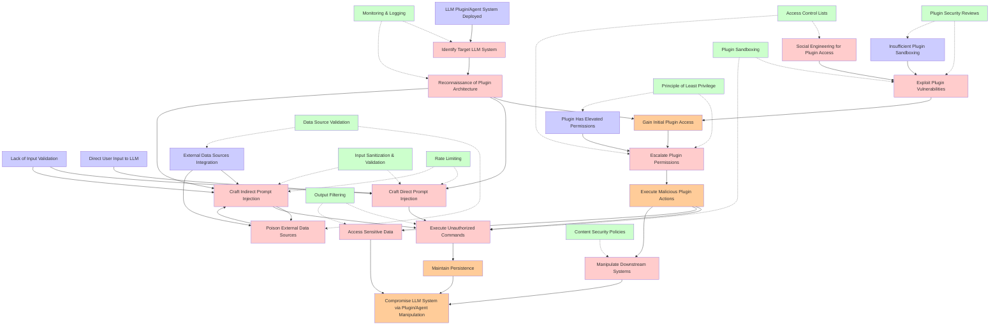

# Attack Tree: LLM01 Prompt Injection / LLM06 Excessive Agency

```mermaid
graph TD
    goal["Compromise LLM System via Plugin/Agent Manipulation"]
    
    fact1["LLM Plugin/Agent System Deployed"]
    fact2["Plugin Has Elevated Permissions"]
    fact3["Lack of Input Validation"]
    fact4["Insufficient Plugin Sandboxing"]
    fact5["Direct User Input to LLM"]
    fact6["External Data Sources Integration"]
    
    attack1["Identify Target LLM System"]
    attack2["Reconnaissance of Plugin Architecture"]
    attack3["Craft Direct Prompt Injection"]
    attack4["Craft Indirect Prompt Injection"]
    attack5["Poison External Data Sources"]
    attack6["Social Engineering for Plugin Access"]
    attack7["Exploit Plugin Vulnerabilities"]
    attack8["Escalate Plugin Permissions"]
    attack9["Execute Unauthorized Commands"]
    attack10["Access Sensitive Data"]
    attack11["Manipulate Downstream Systems"]
    
    mitigation1["Input Sanitization & Validation"]
    mitigation2["Plugin Sandboxing"]
    mitigation3["Principle of Least Privilege"]
    mitigation4["Output Filtering"]
    mitigation5["Plugin Security Reviews"]
    mitigation6["Access Control Lists"]
    mitigation7["Data Source Validation"]
    mitigation8["Monitoring & Logging"]
    mitigation9["Rate Limiting"]
    mitigation10["Content Security Policies"]
    
    subgoal1["Gain Initial Plugin Access"]
    subgoal2["Execute Malicious Plugin Actions"]
    subgoal3["Maintain Persistence"]
    
    fact1 --> attack1
    fact2 --> attack8
    fact3 --> attack3
    fact3 --> attack4
    fact4 --> attack7
    fact5 --> attack3
    fact6 --> attack4
    fact6 --> attack5
    
    attack1 --> attack2
    attack2 --> subgoal1
    attack2 --> attack3
    attack2 --> attack4
    
    attack3 --> attack9
    attack4 --> attack5
    attack4 --> attack9
    attack5 --> attack4
    attack6 --> attack7
    attack7 --> subgoal1
    
    subgoal1 --> attack8
    attack8 --> subgoal2
    subgoal2 --> attack9
    subgoal2 --> attack10
    subgoal2 --> attack11
    
    attack9 --> subgoal3
    attack10 --> goal
    attack11 --> goal
    subgoal3 --> goal
    
    mitigation1 -.-> attack3
    mitigation1 -.-> attack4
    mitigation2 -.-> attack7
    mitigation2 -.-> attack9
    mitigation3 -.-> attack8
    mitigation3 -.-> fact2
    mitigation4 -.-> attack9
    mitigation4 -.-> attack10
    mitigation5 -.-> attack7
    mitigation5 -.-> fact4
    mitigation6 -.-> attack6
    mitigation6 -.-> attack8
    mitigation7 -.-> attack5
    mitigation7 -.-> fact6
    mitigation8 -.-> attack1
    mitigation8 -.-> attack2
    mitigation9 -.-> attack3
    mitigation9 -.-> attack4
    mitigation10 -.-> attack11
    
    classDef attack fill:#ffcccc
    classDef mitigation fill:#ccffcc
    classDef goal fill:#ffcc99
    classDef fact fill:#ccccff
    
    class attack1,attack2,attack3,attack4,attack5,attack6,attack7,attack8,attack9,attack10,attack11 attack
    class mitigation1,mitigation2,mitigation3,mitigation4,mitigation5,mitigation6,mitigation7,mitigation8,mitigation9,mitigation10 mitigation
    class goal,subgoal1,subgoal2,subgoal3 goal
    class fact1,fact2,fact3,fact4,fact5,fact6 fact
```