# Attack Tree: Data Breach

**Threat ID**: T005  
**Description**: An external threat actor who uses carefully crafted queries to call inference model APIs can retrieve sensitive information that they were not intended to access, which leads to to exfiltration of pro...

## Attack Tree Diagram

```mermaid
graph TD
    goal1["Exfiltrate Proprietary Knowledge via ML API"]
    attack1["Craft Adversarial Queries"]
    attack2["Perform Model Inversion Attack"]
    attack3["Execute Membership Inference Attack"]
    attack4["Conduct Prompt Injection Attack"]
    attack5["Extract Training Data via Queries"]
    attack6["Perform Model Extraction Attack"]
    attack7["Exploit API Response Patterns"]
    attack8["Use Side-Channel Information"]
    fact1["ML API Publicly Accessible"]
    fact2["Model Contains Sensitive Training Data"]
    fact3["API Returns Detailed Responses"]
    fact4["Insufficient Input Validation"]
    fact5["No Rate Limiting Implemented"]
    fact6["Model Architecture Exposed"]
    fact7["Verbose Error Messages"]
    fact8["No Query Monitoring"]
    mitigation1["Implement Query Sanitization"]
    mitigation2["Apply Differential Privacy"]
    mitigation3["Deploy Rate Limiting"]
    mitigation4["Enable Query Monitoring"]
    mitigation5["Implement Response Filtering"]
    mitigation6["Add Input Validation"]
    mitigation7["Use Federated Learning"]
    mitigation8["Deploy Anomaly Detection"]
    mitigation9["Implement Access Controls"]
    mitigation10["Add Output Perturbation"]
    goal2["Compromise Model Confidentiality"]
    goal3["Extract Sensitive Information"]
    goal4["Reverse Engineer Model Logic"]
    goal1 --> attack1
    goal1 --> attack2
    goal1 --> attack3
    goal1 --> attack4
    attack1 --> attack5
    attack1 --> attack6
    attack2 --> goal2
    attack3 --> goal3
    attack4 --> attack7
    attack5 --> attack8
    attack6 --> goal4
    fact1 --> attack1
    fact2 --> attack2
    fact3 --> attack3
    fact4 --> attack4
    fact5 --> attack5
    fact6 --> attack6
    fact7 --> attack7
    fact8 --> attack8
    mitigation1 --> fact4
    mitigation2 --> fact2
    mitigation3 --> fact5
    mitigation4 --> fact8
    mitigation5 --> fact3
    mitigation6 --> fact4
    mitigation7 --> fact2
    mitigation8 --> attack1
    mitigation9 --> fact1
    mitigation10 --> fact3
    classDef attack fill:#ffcccc
    classDef mitigation fill:#ccffcc
    classDef goal fill:#ffcc99
    classDef fact fill:#ccccff
    class attack1,attack2,attack3,attack4,attack5,attack6,attack7,attack8 attack
    class mitigation1,mitigation2,mitigation3,mitigation4,mitigation5,mitigation6,mitigation7,mitigation8,mitigation9,mitigation10 mitigation
    class goal1,goal2,goal3,goal4 goal
    class fact1,fact2,fact3,fact4,fact5,fact6,fact7,fact8 fact
```

## Attack Path Analysis

This attack tree represents the potential attack paths for the identified threat. Each node in the tree represents either:
- **Attack Goal** (orange): The ultimate objective
- **Attack Step** (red): Individual attack actions
- **Fact/Condition** (blue): Prerequisites or conditions
- **Mitigation** (green): Defensive measures

Review this attack tree to:
1. Identify critical attack paths
2. Implement appropriate security controls
3. Monitor for indicators of these attack patterns
4. Develop incident response procedures

---
*Generated by ThreatForest - Attack Tree Analysis*
