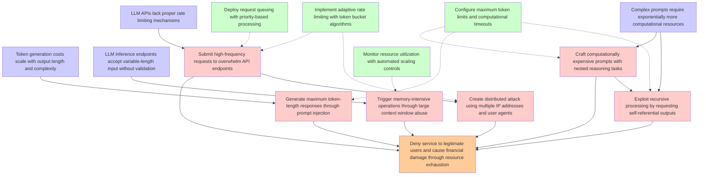

# Attack Tree: LLM10 Unbounded Consumption

**Threat ID**: T10  
**Description**: An external threat actor able to submit requests to an LLM API can overwhelm it with expensive computing operations, which leads to denying service to legitimate users, resulting in reduced availabili...

## Attack Tree Diagram

## MITRE ATT&CK Mappings

### Deny service to legitimate users and cause financial damage through resource exhaustion
- **T1499.003**: Application Exhaustion Flood (Confidence: 0.95)
  - Tactics: impact
- **T1496**: Resource Hijacking (Confidence: 0.80)
  - Tactics: impact

### LLM APIs lack proper rate limiting mechanisms
- **T1499.003**: Application Exhaustion Flood (Confidence: 0.90)
  - Tactics: impact

### Complex prompts require exponentially more computational resources
- **T1499.003**: Application Exhaustion Flood (Confidence: 0.85)
  - Tactics: impact
- **T1496**: Resource Hijacking (Confidence: 0.75)
  - Tactics: impact

### Token generation costs scale with output length and complexity
- **T1499**: Endpoint Denial of Service (Confidence: 0.75)
  - Tactics: impact

### LLM inference endpoints accept variable-length input without validation
- **T1499**: Endpoint Denial of Service (Confidence: 0.80)
  - Tactics: impact

### Submit high-frequency requests to overwhelm API endpoints
- **T1499**: Endpoint Denial of Service (Confidence: 0.95)
  - Tactics: impact

### Craft computationally expensive prompts with nested reasoning tasks
- **T1496.A007**: Cloud Service Hijacking - Bedrock Usage (Confidence: 0.90)
  - Tactics: impact
- **T1499**: Endpoint Denial of Service (Confidence: 0.75)
  - Tactics: impact

### Generate maximum token-length responses through prompt injection
- **T1496.A007**: Cloud Service Hijacking - Bedrock Usage (Confidence: 0.95)
  - Tactics: impact
- **T1499**: Endpoint Denial of Service (Confidence: 0.70)
  - Tactics: impact

### Create distributed attack using multiple IP addresses and user agents
- **T1498**: Network Denial of Service (Confidence: 0.85)
  - Tactics: impact
- **T1583.001**: Domains (Confidence: 0.65)
  - Tactics: resource-development

### Exploit recursive processing by requesting self-referential outputs
- **T1546**: Event Triggered Execution (Confidence: 0.75)
  - Tactics: privilege-escalation, persistence

### Trigger memory-intensive operations through large context window abuse
- **T1485**: Data Destruction (Confidence: 0.70)
  - Tactics: impact

### Implement adaptive rate limiting with token bucket algorithms
- **T1550.001**: Application Access Token (Confidence: 0.65)
  - Tactics: defense-evasion, lateral-movement

### Deploy request queuing with priority-based processing
- **T1496**: Resource Hijacking (Confidence: 0.90)
  - Tactics: impact
- **T1578.005**: Modify Cloud Compute Configurations (Confidence: 0.75)
  - Tactics: execution, defense-evasion

### Configure maximum token limits and computational timeouts
- **T1550.001**: Application Access Token (Confidence: 0.85)
  - Tactics: defense-evasion, lateral-movement
- **T1496**: Resource Hijacking (Confidence: 0.80)
  - Tactics: impact

### Monitor resource utilization with automated scaling controls
- **T1496**: Resource Hijacking (Confidence: 0.95)
  - Tactics: impact
- **T1578.005**: Modify Cloud Compute Configurations (Confidence: 0.80)
  - Tactics: execution, defense-evasion

## Attack Steps Analysis

1. **goal**: Deny service to legitimate users and cause financial damage through resource exhaustion
2. **fact1**: LLM APIs lack proper rate limiting mechanisms
3. **fact2**: Complex prompts require exponentially more computational resources
4. **fact3**: Token generation costs scale with output length and complexity
5. **fact4**: LLM inference endpoints accept variable-length input without validation
6. **attack1**: Submit high-frequency requests to overwhelm API endpoints
7. **attack2**: Craft computationally expensive prompts with nested reasoning tasks
8. **attack3**: Generate maximum token-length responses through prompt injection
9. **attack4**: Create distributed attack using multiple IP addresses and user agents
10. **attack5**: Exploit recursive processing by requesting self-referential outputs
11. **attack6**: Trigger memory-intensive operations through large context window abuse
12. **mitigation1**: Implement adaptive rate limiting with token bucket algorithms
13. **mitigation2**: Deploy request queuing with priority-based processing
14. **mitigation3**: Configure maximum token limits and computational timeouts
15. **mitigation4**: Monitor resource utilization with automated scaling controls

---
*Generated by ThreatForest*
