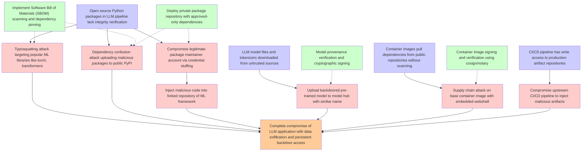

# Attack Tree: LLM03 Supply Chain

**Threat ID**: T13  
**Description**: An external or internal threat actor who has access to an LLM powered application using compromised upstream open source dependencies can enable exploits through vulnerabilities, which leads to unauth...

## Attack Tree Diagram

## MITRE ATT&CK Mappings

### Open source Python packages in LLM pipeline lack integrity verification
- **T1190**: Exploit Public-Facing Application (Confidence: 0.90)
  - Tactics: initial-access

### Container images pull dependencies from public repositories without scanning
- **T1190**: Exploit Public-Facing Application (Confidence: 0.88)
  - Tactics: initial-access

### Complete compromise of LLM application with data exfiltration and persistent backdoor access
- **T1530**: Data from Cloud Storage (Confidence: 0.85)
  - Tactics: collection
- **T1098.001**: Additional Cloud Credentials (Confidence: 0.82)
  - Tactics: persistence, privilege-escalation

### LLM model files and tokenizers downloaded from untrusted sources
- **T1189**: Drive-by Compromise (Confidence: 0.80)
  - Tactics: initial-access

### CI/CD pipeline has write access to production artifact repositories
- **T1072**: Software Deployment Tools (Confidence: 0.90)
  - Tactics: execution, lateral-movement

### Typosquatting attack targeting popular ML libraries like torch, transformers
- **T1189**: Drive-by Compromise (Confidence: 0.85)
  - Tactics: initial-access
- **T1525**: Implant Internal Image (Confidence: 0.75)
  - Tactics: persistence

### Dependency confusion attack uploading malicious packages to public PyPI
- **T1080**: Taint Shared Content (Confidence: 0.95)
  - Tactics: lateral-movement

### Compromise legitimate package maintainer account via credential stuffing
- **T1110.004**: Credential Stuffing (Confidence: 0.98)
  - Tactics: credential-access

### Inject malicious code into forked repository of ML framework
- **T1080**: Taint Shared Content (Confidence: 0.90)
  - Tactics: lateral-movement

### Upload backdoored pre-trained model to model hub with similar name
- **T1080**: Taint Shared Content (Confidence: 0.90)
  - Tactics: lateral-movement
- **T1656**: Impersonation (Confidence: 0.85)
  - Tactics: defense-evasion

### Supply chain attack on base container image with embedded webshell
- **T1525**: Implant Internal Image (Confidence: 0.95)
  - Tactics: persistence
- **T1080**: Taint Shared Content (Confidence: 0.80)
  - Tactics: lateral-movement

### Compromise upstream CI/CD pipeline to inject malicious artifacts
- **T1080**: Taint Shared Content (Confidence: 0.90)
  - Tactics: lateral-movement
- **T1525**: Implant Internal Image (Confidence: 0.75)
  - Tactics: persistence

### Implement Software Bill of Materials (SBOM) scanning and dependency pinning
- **T1204.003**: Malicious Image (Confidence: 0.80)
  - Tactics: execution
- **T1213.003**: Code Repositories (Confidence: 0.75)
  - Tactics: collection

### Deploy private package repository with approved-only dependencies
- **T1213.003**: Code Repositories (Confidence: 0.85)
  - Tactics: collection
- **T1204.003**: Malicious Image (Confidence: 0.70)
  - Tactics: execution

### Container image signing and verification using cosign/notary
- **T1204.003**: Malicious Image (Confidence: 0.90)
  - Tactics: execution
- **T1562.001**: Disable or Modify Tools (Confidence: 0.65)
  - Tactics: defense-evasion

### Model provenance verification and cryptographic signing
- **T1484.002**: Trust Modification (Confidence: 0.75)
  - Tactics: defense-evasion, privilege-escalation

## Attack Steps Analysis

1. **goal**: Complete compromise of LLM application with data exfiltration and persistent backdoor access
2. **fact1**: Open source Python packages in LLM pipeline lack integrity verification
3. **fact2**: Container images pull dependencies from public repositories without scanning
4. **fact3**: LLM model files and tokenizers downloaded from untrusted sources
5. **fact4**: CI/CD pipeline has write access to production artifact repositories
6. **attack1**: Typosquatting attack targeting popular ML libraries like torch, transformers
7. **attack2**: Dependency confusion attack uploading malicious packages to public PyPI
8. **attack3**: Compromise legitimate package maintainer account via credential stuffing
9. **attack4**: Inject malicious code into forked repository of ML framework
10. **attack5**: Upload backdoored pre-trained model to model hub with similar name
11. **attack6**: Supply chain attack on base container image with embedded webshell
12. **attack7**: Compromise upstream CI/CD pipeline to inject malicious artifacts
13. **mitigation1**: Implement Software Bill of Materials (SBOM) scanning and dependency pinning
14. **mitigation2**: Deploy private package repository with approved-only dependencies
15. **mitigation3**: Container image signing and verification using cosign/notary
16. **mitigation4**: Model provenance verification and cryptographic signing

---
*Generated by ThreatForest*
