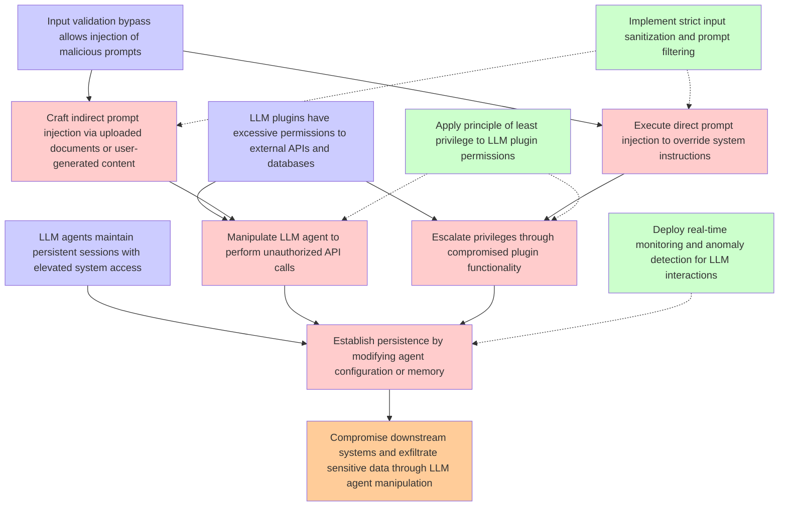

# Attack Tree: LLM01 Prompt Injection / LLM06 Excessive Agency

**Threat ID**: T3  
**Description**: An external threat actor who enables compromised LLM plugins or agents in an LLM system can manipulate it via indirect or direct prompt injection, which leads to access unauthorized functionality or d...

## Attack Tree Diagram

## MITRE ATT&CK Mappings

### LLM plugins have excessive permissions to external APIs and databases
- **T1550.001**: Application Access Token (Confidence: 0.90)
  - Tactics: defense-evasion, lateral-movement
- **T1078.004**: Valid Cloud Accounts (Confidence: 0.75)
  - Tactics: defense-evasion, persistence, privilege-escalation, initial-access

### Input validation bypass allows injection of malicious prompts
- **T1080**: Taint Shared Content (Confidence: 0.85)
  - Tactics: lateral-movement
- **T1565.002**: Transmitted Data Manipulation (Confidence: 0.80)
  - Tactics: impact

### Compromise downstream systems and exfiltrate sensitive data through LLM agent manipulation
- **T1537**: Transfer Data to Cloud Account (Confidence: 0.88)
  - Tactics: exfiltration
- **T1072**: Software Deployment Tools (Confidence: 0.82)
  - Tactics: execution, lateral-movement

### LLM agents maintain persistent sessions with elevated system access
- **T1546**: Event Triggered Execution (Confidence: 0.80)
  - Tactics: privilege-escalation, persistence

### Craft indirect prompt injection via uploaded documents or user-generated content
- **T1080**: Taint Shared Content (Confidence: 0.90)
  - Tactics: lateral-movement
- **T1189**: Drive-by Compromise (Confidence: 0.75)
  - Tactics: initial-access

### Execute direct prompt injection to override system instructions
- **AT1002**: AWS Systems Manager Run Command (Confidence: 0.85)
  - Tactics: execution
- **T1072**: Software Deployment Tools (Confidence: 0.70)
  - Tactics: execution, lateral-movement

### Manipulate LLM agent to perform unauthorized API calls
- **AT1667**: Application API Abuse (Confidence: 0.95)
  - Tactics: persistence
- **T1550.001**: Application Access Token (Confidence: 0.75)
  - Tactics: defense-evasion, lateral-movement

### Escalate privileges through compromised plugin functionality
- **T1078.004**: Valid Cloud Accounts (Confidence: 0.80)
  - Tactics: defense-evasion, persistence, privilege-escalation, initial-access
- **T1484**: Domain or Tenant Policy Modification (Confidence: 0.70)
  - Tactics: privilege-escalation, defense-evasion, lateral-movement

### Establish persistence by modifying agent configuration or memory
- **T1546**: Event Triggered Execution (Confidence: 0.85)
  - Tactics: privilege-escalation, persistence
- **T1098.001**: Additional Cloud Credentials (Confidence: 0.75)
  - Tactics: persistence, privilege-escalation

### Implement strict input sanitization and prompt filtering
- **T1484**: Domain or Tenant Policy Modification (Confidence: 0.75)
  - Tactics: privilege-escalation, defense-evasion, lateral-movement

### Apply principle of least privilege to LLM plugin permissions
- **T1098.003**: Additional Cloud Roles (Confidence: 0.90)
  - Tactics: persistence, privilege-escalation
- **T1548.005**: Temporary Elevated Cloud Access (Confidence: 0.80)
  - Tactics: privilege-escalation, defense-evasion

### Deploy real-time monitoring and anomaly detection for LLM interactions
- **T1528**: Steal Application Access Token (Confidence: 0.85)
  - Tactics: credential-access
- **T1562.A001**: Disable or Modify GuardDuty (Confidence: 0.80)
  - Tactics: defense-evasion

## Attack Steps Analysis

1. **goal**: Compromise downstream systems and exfiltrate sensitive data through LLM agent manipulation
2. **fact1**: LLM plugins have excessive permissions to external APIs and databases
3. **fact2**: Input validation bypass allows injection of malicious prompts
4. **fact3**: LLM agents maintain persistent sessions with elevated system access
5. **attack1**: Craft indirect prompt injection via uploaded documents or user-generated content
6. **attack2**: Execute direct prompt injection to override system instructions
7. **attack3**: Manipulate LLM agent to perform unauthorized API calls
8. **attack4**: Escalate privileges through compromised plugin functionality
9. **attack5**: Establish persistence by modifying agent configuration or memory
10. **mitigation1**: Implement strict input sanitization and prompt filtering
11. **mitigation2**: Apply principle of least privilege to LLM plugin permissions
12. **mitigation3**: Deploy real-time monitoring and anomaly detection for LLM interactions

---
*Generated by ThreatForest*
