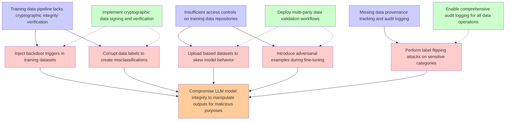

# Attack Tree: LLM04 Data/Model Poisoning

**Threat ID**: T7  
**Description**: A malicious internal actor with access to upload training or fine tuning data can intentionally introduce manipulated, biased or malicious data, which leads to model poisoning or backdoors, resulting ...

## Attack Tree Diagram

## MITRE ATT&CK Mappings

### Training data pipeline lacks cryptographic integrity verification
- **T1565.001**: Stored Data Manipulation (Confidence: 0.90)
  - Tactics: impact
- **T1565.002**: Transmitted Data Manipulation (Confidence: 0.75)
  - Tactics: impact

### Insufficient access controls on training data repositories
- **T1213**: Data from Information Repositories (Confidence: 0.85)
  - Tactics: collection
- **T1078.004**: Valid Cloud Accounts (Confidence: 0.80)
  - Tactics: defense-evasion, persistence, privilege-escalation, initial-access

### Missing data provenance tracking and audit logging
- **T1562.008**: Disable Cloud Logs (Confidence: 0.90)
  - Tactics: defense-evasion
- **T1562**: Impair Defenses (Confidence: 0.85)
  - Tactics: defense-evasion

### Inject backdoor triggers in training datasets
- **T1546**: Event Triggered Execution (Confidence: 0.88)
  - Tactics: privilege-escalation, persistence
- **T1189**: Drive-by Compromise (Confidence: 0.75)
  - Tactics: initial-access

### Upload biased datasets to skew model behavior
- **T1485**: Data Destruction (Confidence: 0.80)
  - Tactics: impact
- **T1189**: Drive-by Compromise (Confidence: 0.70)
  - Tactics: initial-access

### Corrupt data labels to create misclassifications
- **T1211**: Exploitation for Defense Evasion (Confidence: 0.75)
  - Tactics: defense-evasion

### Introduce adversarial examples during fine-tuning
- **T1211**: Exploitation for Defense Evasion (Confidence: 0.80)
  - Tactics: defense-evasion

### Perform label flipping attacks on sensitive categories
- **T1211**: Exploitation for Defense Evasion (Confidence: 0.78)
  - Tactics: defense-evasion

### Implement cryptographic data signing and verification
- **T1565.002**: Transmitted Data Manipulation (Confidence: 0.90)
  - Tactics: impact
- **T1484.002**: Trust Modification (Confidence: 0.75)
  - Tactics: defense-evasion, privilege-escalation

### Deploy multi-party data validation workflows
- **T1565.002**: Transmitted Data Manipulation (Confidence: 0.85)
  - Tactics: impact
- **T1485**: Data Destruction (Confidence: 0.70)
  - Tactics: impact

### Enable comprehensive audit logging for all data operations
- **T1562.008**: Disable Cloud Logs (Confidence: 0.95)
  - Tactics: defense-evasion
- **T1530**: Data from Cloud Storage (Confidence: 0.80)
  - Tactics: collection

## Attack Steps Analysis

1. **goal**: Compromise LLM model integrity to manipulate outputs for malicious purposes
2. **fact1**: Training data pipeline lacks cryptographic integrity verification
3. **fact2**: Insufficient access controls on training data repositories
4. **fact3**: Missing data provenance tracking and audit logging
5. **attack1**: Inject backdoor triggers in training datasets
6. **attack2**: Upload biased datasets to skew model behavior
7. **attack3**: Corrupt data labels to create misclassifications
8. **attack4**: Introduce adversarial examples during fine-tuning
9. **attack5**: Perform label flipping attacks on sensitive categories
10. **mitigation1**: Implement cryptographic data signing and verification
11. **mitigation2**: Deploy multi-party data validation workflows
12. **mitigation3**: Enable comprehensive audit logging for all data operations

---
*Generated by ThreatForest*
