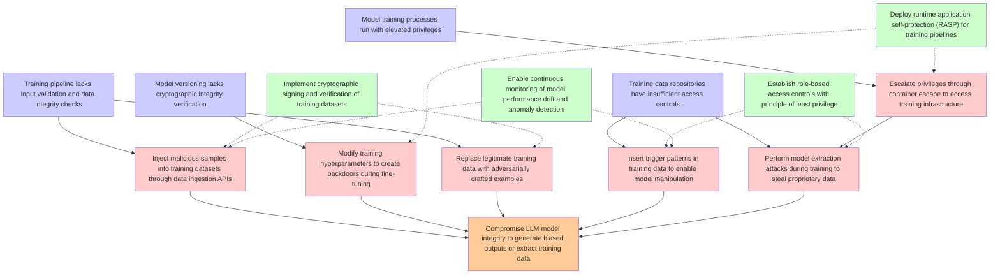

# Attack Tree: LLM04 Data/Model Poisoning

**Threat ID**: T9  
**Description**: A malicious internal actor with access to manage training or fine tuning pipelines can inject malicious tools or processes, which leads to tampering with training data, resulting in reduced integrity ...

## Attack Tree Diagram

## MITRE ATT&CK Mappings

### Training pipeline lacks input validation and data integrity checks
- **T1080**: Taint Shared Content (Confidence: 0.90)
  - Tactics: lateral-movement
- **T1565.002**: Transmitted Data Manipulation (Confidence: 0.85)
  - Tactics: impact

### Model training processes run with elevated privileges
- **T1548.005**: Temporary Elevated Cloud Access (Confidence: 0.88)
  - Tactics: privilege-escalation, defense-evasion
- **T1098.001**: Additional Cloud Credentials (Confidence: 0.82)
  - Tactics: persistence, privilege-escalation

### Compromise LLM model integrity to generate biased outputs or extract training data
- **T1565.002**: Transmitted Data Manipulation (Confidence: 0.92)
  - Tactics: impact
- **T1080**: Taint Shared Content (Confidence: 0.87)
  - Tactics: lateral-movement

### Training data repositories have insufficient access controls
- **T1530**: Data from Cloud Storage (Confidence: 0.90)
  - Tactics: collection

### Model versioning lacks cryptographic integrity verification
- **T1565.001**: Stored Data Manipulation (Confidence: 0.85)
  - Tactics: impact

### Inject malicious samples into training datasets through data ingestion APIs
- **T1565.001**: Stored Data Manipulation (Confidence: 0.95)
  - Tactics: impact
- **T1565.002**: Transmitted Data Manipulation (Confidence: 0.80)
  - Tactics: impact

### Modify training hyperparameters to create backdoors during fine-tuning
- **T1565.003**: Runtime Data Manipulation (Confidence: 0.90)
  - Tactics: impact
- **T1546**: Event Triggered Execution (Confidence: 0.75)
  - Tactics: privilege-escalation, persistence

### Replace legitimate training data with adversarially crafted examples
- **T1080**: Taint Shared Content (Confidence: 0.85)
  - Tactics: lateral-movement
- **T1565.003**: Runtime Data Manipulation (Confidence: 0.80)
  - Tactics: impact

### Insert trigger patterns in training data to enable model manipulation
- **T1546**: Event Triggered Execution (Confidence: 0.88)
  - Tactics: privilege-escalation, persistence
- **T1080**: Taint Shared Content (Confidence: 0.82)
  - Tactics: lateral-movement

### Escalate privileges through container escape to access training infrastructure
- **T1190**: Exploit Public-Facing Application (Confidence: 0.80)
  - Tactics: initial-access
- **T1078.004**: Valid Cloud Accounts (Confidence: 0.75)
  - Tactics: defense-evasion, persistence, privilege-escalation, initial-access

### Perform model extraction attacks during training to steal proprietary data
- **T1040**: Network Sniffing (Confidence: 0.85)
  - Tactics: credential-access, discovery
- **T1082**: System Information Discovery (Confidence: 0.70)
  - Tactics: discovery

### Implement cryptographic signing and verification of training datasets
- **T1484.002**: Trust Modification (Confidence: 0.75)
  - Tactics: defense-evasion, privilege-escalation

### Deploy runtime application self-protection (RASP) for training pipelines
- **T1072**: Software Deployment Tools (Confidence: 0.80)
  - Tactics: execution, lateral-movement
- **T1648**: Serverless Execution (Confidence: 0.75)
  - Tactics: execution, persistence

### Establish role-based access controls with principle of least privilege
- **T1078.004**: Valid Cloud Accounts (Confidence: 0.90)
  - Tactics: defense-evasion, persistence, privilege-escalation, initial-access
- **T1098.001**: Additional Cloud Credentials (Confidence: 0.85)
  - Tactics: persistence, privilege-escalation

### Enable continuous monitoring of model performance drift and anomaly detection
- **T1562.A001**: Disable or Modify GuardDuty (Confidence: 0.80)
  - Tactics: defense-evasion
- **T1562.007**: Disable or Modify Cloud Firewall (Confidence: 0.75)
  - Tactics: defense-evasion

## Attack Steps Analysis

1. **goal**: Compromise LLM model integrity to generate biased outputs or extract training data
2. **fact1**: Training pipeline lacks input validation and data integrity checks
3. **fact2**: Model training processes run with elevated privileges
4. **fact3**: Training data repositories have insufficient access controls
5. **fact4**: Model versioning lacks cryptographic integrity verification
6. **attack1**: Inject malicious samples into training datasets through data ingestion APIs
7. **attack2**: Modify training hyperparameters to create backdoors during fine-tuning
8. **attack3**: Replace legitimate training data with adversarially crafted examples
9. **attack4**: Insert trigger patterns in training data to enable model manipulation
10. **attack5**: Escalate privileges through container escape to access training infrastructure
11. **attack6**: Perform model extraction attacks during training to steal proprietary data
12. **mitigation1**: Implement cryptographic signing and verification of training datasets
13. **mitigation2**: Deploy runtime application self-protection (RASP) for training pipelines
14. **mitigation3**: Establish role-based access controls with principle of least privilege
15. **mitigation4**: Enable continuous monitoring of model performance drift and anomaly detection

---
*Generated by ThreatForest*
