# Attack Tree: Insider Threat

**Threat ID**: T005  
**Description**: A malicious insider with privileged user access, can perform unauthorized PHI access or data exfiltration, which leads to large-scale data breach, resulting in reduced confidentiality of patient healt...

## Attack Tree Diagram

```mermaid
graph TD
    root["Large-scale PHI Data Breach"]
    path1["Direct Database Access"]
    path2["API Exploitation"]
    path3["File System Access"]
    path4["Backup System Compromise"]
    fact1["Privileged User Credentials"]
    fact2["Access to Production Systems"]
    fact3["Knowledge of System Architecture"]
    fact4["Legitimate Business Access"]
    attack1["Query Patient Database Directly"]
    attack2["Extract PHI via SQL Queries"]
    attack3["Exploit Administrative API Endpoints"]
    attack4["Bypass API Rate Limiting"]
    attack5["Access Network File Shares"]
    attack6["Download Research Data Files"]
    attack7["Access Backup Storage"]
    attack8["Restore Historical Data"]
    attack9["Use External Storage Devices"]
    attack10["Transmit Data via Email"]
    attack11["Upload to Cloud Services"]
    attack12["Cover Tracks in Audit Logs"]
    mit1["Implement Zero Trust Architecture"]
    mit2["Deploy Data Loss Prevention (DLP)"]
    mit3["Enable Database Activity Monitoring"]
    mit4["Enforce Least Privilege Access"]
    mit5["Implement Multi-Factor Authentication"]
    mit6["Deploy User Behavior Analytics"]
    mit7["Enable Real-time Audit Logging"]
    mit8["Implement Data Encryption at Rest"]
    mit9["Deploy Network Segmentation"]
    mit10["Regular Access Reviews"]
    goal1["Unauthorized PHI Access"]
    goal2["Data Exfiltration"]
    goal3["Avoid Detection"]
    root --> goal1
    root --> goal2
    root --> goal3
    goal1 --> path1
    goal1 --> path2
    goal1 --> path3
    goal2 --> path4
    goal2 --> attack9
    goal2 --> attack10
    goal2 --> attack11
    goal3 --> attack12
    fact1 --> path1
    fact1 --> path2
    fact1 --> path3
    fact1 --> path4
    fact2 --> attack1
    fact2 --> attack3
    fact2 --> attack5
    fact2 --> attack7
    fact3 --> attack2
    fact3 --> attack4
    fact3 --> attack6
    fact3 --> attack8
    fact4 --> attack12
    path1 --> attack1
    attack1 --> attack2
    path2 --> attack3
    attack3 --> attack4
    path3 --> attack5
    attack5 --> attack6
    path4 --> attack7
    attack7 --> attack8
    mit1 -.-> fact2
    mit2 -.-> goal2
    mit3 -.-> path1
    mit4 -.-> fact1
    mit5 -.-> fact1
    mit6 -.-> goal3
    mit7 -.-> attack12
    mit8 -.-> goal2
    mit9 -.-> fact2
    mit10 -.-> fact4
    classDef attack fill:#ffcccc
    classDef mitigation fill:#ccffcc
    classDef goal fill:#ffcc99
    classDef fact fill:#ccccff
    class path1,path2,path3,path4,attack1,attack2,attack3,attack4,attack5,attack6,attack7,attack8,attack9,attack10,attack11,attack12 attack
    class mit1,mit2,mit3,mit4,mit5,mit6,mit7,mit8,mit9,mit10 mitigation
    class root,goal1,goal2,goal3 goal
    class fact1,fact2,fact3,fact4 fact
```

## Attack Path Analysis

This attack tree represents the potential attack paths for the identified threat. Each node in the tree represents either:
- **Attack Goal** (orange): The ultimate objective
- **Attack Step** (red): Individual attack actions
- **Fact/Condition** (blue): Prerequisites or conditions
- **Mitigation** (green): Defensive measures

Review this attack tree to:
1. Identify critical attack paths
2. Implement appropriate security controls
3. Monitor for indicators of these attack patterns
4. Develop incident response procedures

---
*Generated by ThreatForest - Attack Tree Analysis*
