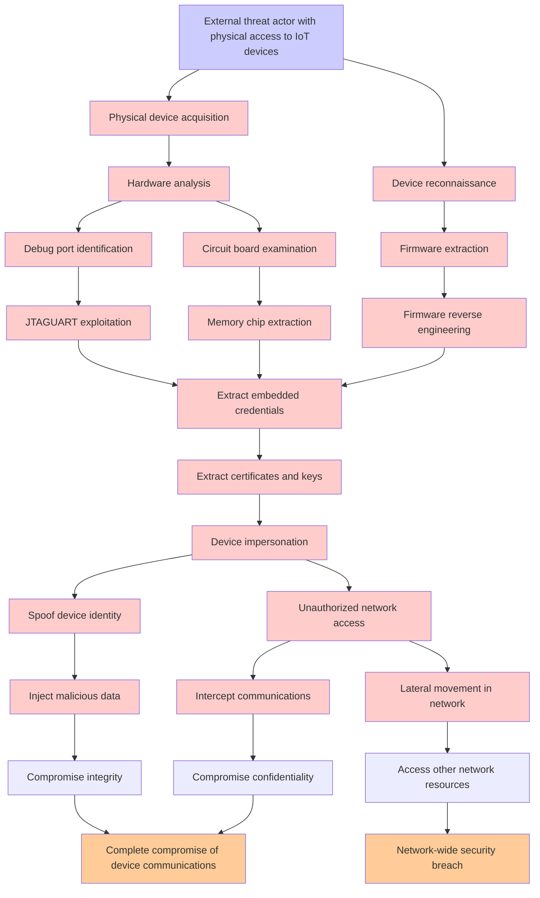

# Attack Tree: Device Credential Compromise

**Threat ID**: T001  
**Associated threat statement**: A external threat actor with physical access to IoT devices, can extract embedded credentials and certificates, which leads to unauthorized device impersonation and network access, resulting in reduced confidentiality and integrity of device communications and potential lateral movement.

## Attack Tree Diagram

## Attack Path Analysis

This attack tree represents the potential attack paths for the identified threat. Each node in the tree represents either:
- **Attack Goal** (orange): The ultimate objective
- **Attack Step** (red): Individual attack actions
- **Fact/Condition** (blue): Prerequisites or conditions
- **Mitigation** (green): Defensive measures

Review this attack tree to:
1. Identify critical attack paths
2. Implement appropriate security controls
3. Monitor for indicators of these attack patterns
4. Develop incident response procedures

---
*Generated by ThreatForest - Attack Tree Analysis*
