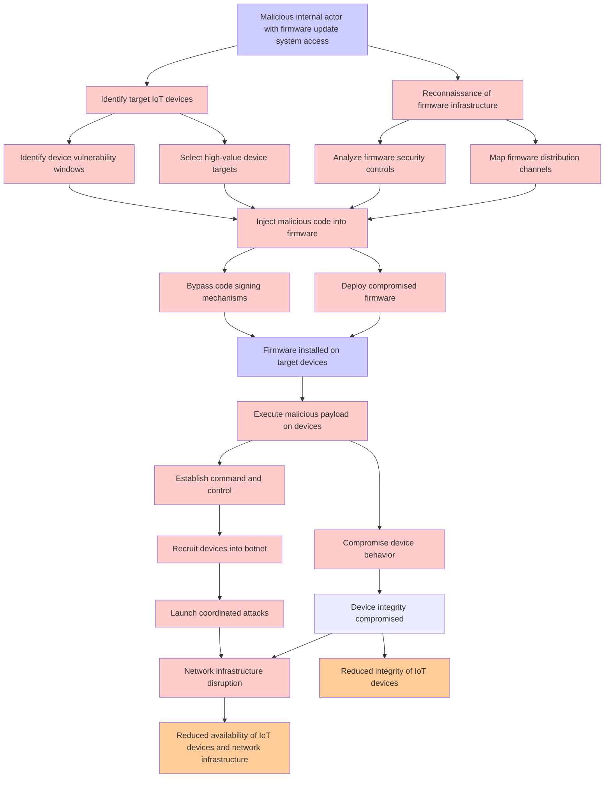

# Attack Tree: Firmware Tampering

**Threat ID**: T002  
**Associated threat statement**: A malicious internal actor with access to firmware update systems, can inject malicious code into device firmware, which leads to compromised device behavior and potential botnet recruitment, resulting in reduced integrity and availability of IoT devices and network infrastructure.

## Attack Tree Diagram

## Attack Path Analysis

This attack tree represents the potential attack paths for the identified threat. Each node in the tree represents either:
- **Attack Goal** (orange): The ultimate objective
- **Attack Step** (red): Individual attack actions
- **Fact/Condition** (blue): Prerequisites or conditions
- **Mitigation** (green): Defensive measures

Review this attack tree to:
1. Identify critical attack paths
2. Implement appropriate security controls
3. Monitor for indicators of these attack patterns
4. Develop incident response procedures

---
*Generated by ThreatForest - Attack Tree Analysis*
