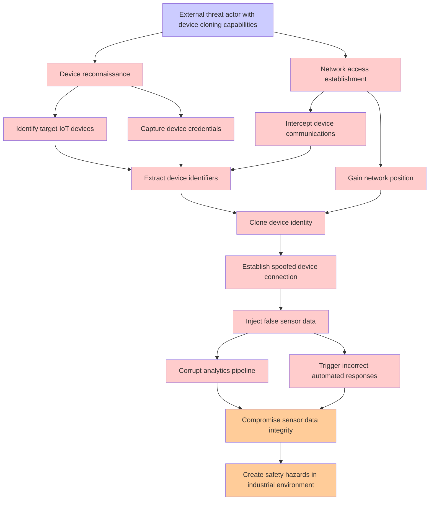

# Attack Tree: Device Identity Spoofing

**Threat ID**: T004  
**Associated threat statement**: A external threat actor with ability to clone device identities, can inject false sensor data into the platform, which leads to incorrect analytics and automated responses, resulting in reduced integrity of sensor data and potential safety hazards in industrial environments.

## Attack Tree Diagram

## Attack Path Analysis

This attack tree represents the potential attack paths for the identified threat. Each node in the tree represents either:
- **Attack Goal** (orange): The ultimate objective
- **Attack Step** (red): Individual attack actions
- **Fact/Condition** (blue): Prerequisites or conditions
- **Mitigation** (green): Defensive measures

Review this attack tree to:
1. Identify critical attack paths
2. Implement appropriate security controls
3. Monitor for indicators of these attack patterns
4. Develop incident response procedures

---
*Generated by ThreatForest - Attack Tree Analysis*
