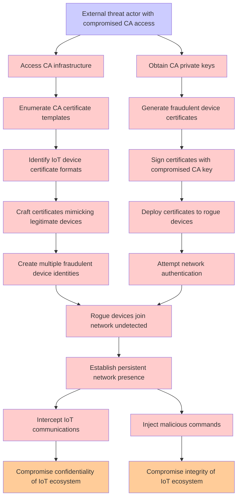

# Attack Tree: Certificate Authority Compromise

**Threat ID**: T005  
**Associated threat statement**: A external threat actor with compromised device certificate authority access, can issue fraudulent certificates for unauthorized devices, which leads to rogue devices joining the network undetected, resulting in reduced confidentiality and integrity of the entire IoT ecosystem.

## Attack Tree Diagram

## Attack Path Analysis

This attack tree represents the potential attack paths for the identified threat. Each node in the tree represents either:
- **Attack Goal** (orange): The ultimate objective
- **Attack Step** (red): Individual attack actions
- **Fact/Condition** (blue): Prerequisites or conditions
- **Mitigation** (green): Defensive measures

Review this attack tree to:
1. Identify critical attack paths
2. Implement appropriate security controls
3. Monitor for indicators of these attack patterns
4. Develop incident response procedures

---
*Generated by ThreatForest - Attack Tree Analysis*
