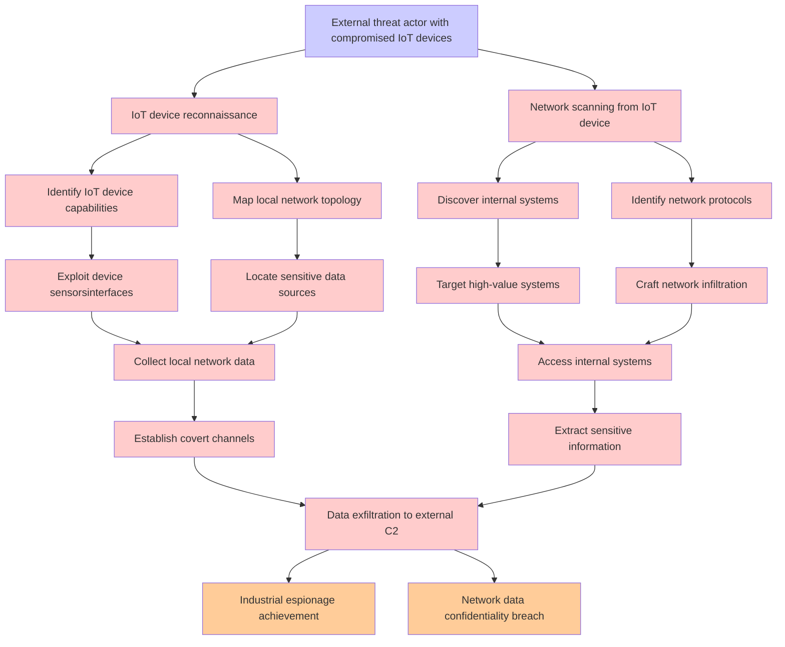

# Attack Tree: Data Exfiltration via Compromised Device

**Threat ID**: T007  
**Associated threat statement**: A external threat actor with compromised IoT devices, can use them as data collection points to exfiltrate sensitive information from the local network, which leads to unauthorized access to internal systems, resulting in reduced confidentiality of network data and potential industrial espionage.

## Attack Tree Diagram

## Attack Path Analysis

This attack tree represents the potential attack paths for the identified threat. Each node in the tree represents either:
- **Attack Goal** (orange): The ultimate objective
- **Attack Step** (red): Individual attack actions
- **Fact/Condition** (blue): Prerequisites or conditions
- **Mitigation** (green): Defensive measures

Review this attack tree to:
1. Identify critical attack paths
2. Implement appropriate security controls
3. Monitor for indicators of these attack patterns
4. Develop incident response procedures

---
*Generated by ThreatForest - Attack Tree Analysis*
