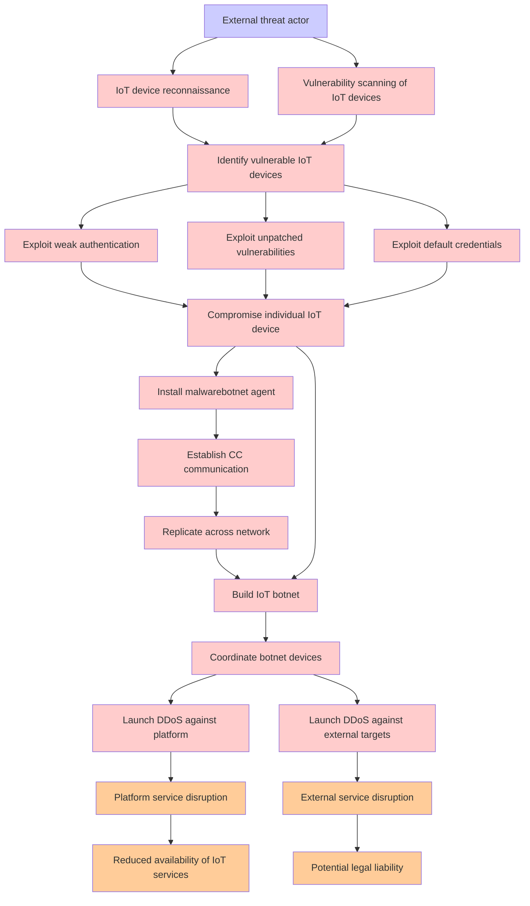

# Attack Tree: DDoS via IoT Botnet

**Threat ID**: T008  
**Associated threat statement**: A external threat actor with compromised multiple IoT devices, can coordinate them in distributed denial of service attacks, which leads to service disruption for the platform and external targets, resulting in reduced availability of IoT services and potential legal liability.

## Attack Tree Diagram

## Attack Path Analysis

This attack tree represents the potential attack paths for the identified threat. Each node in the tree represents either:
- **Attack Goal** (orange): The ultimate objective
- **Attack Step** (red): Individual attack actions
- **Fact/Condition** (blue): Prerequisites or conditions
- **Mitigation** (green): Defensive measures

Review this attack tree to:
1. Identify critical attack paths
2. Implement appropriate security controls
3. Monitor for indicators of these attack patterns
4. Develop incident response procedures

---
*Generated by ThreatForest - Attack Tree Analysis*
