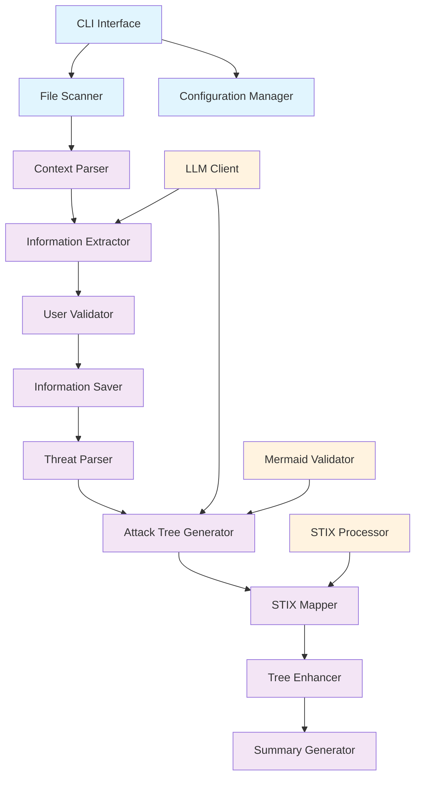

# Design Document

## Overview

ThreatForest (TF) is a Python command-line application that automates the generation of attack trees from threat statements found in application documentation. The application follows a pipeline architecture that processes context files, extracts key information with user validation, generates Mermaid-formatted attack trees for high-severity threats, and enhances them with MITRE ATT&CK technique mappings from STIX data.

The system is designed as a modular, extensible CLI tool that can be easily integrated into security analysis workflows and development pipelines.

## Architecture

### High-Level Architecture



### Component Architecture

The application follows a modular design with clear separation of concerns:

1. **CLI Layer**: Handles user interaction and command-line interface
2. **Processing Layer**: Core business logic for file processing and tree generation
3. **Integration Layer**: External service integrations (LLM, STIX processing)
4. **Data Layer**: File I/O and data persistence

## Components and Interfaces

### Core Components

#### 1. CLI Interface (`cli.py`)
- **Purpose**: Main entry point and user interaction
- **Responsibilities**:
  - Parse command-line arguments
  - Orchestrate the processing pipeline
  - Handle user input/output
  - Display progress and status information

#### 2. File Scanner (`file_scanner.py`)
- **Purpose**: Discover and validate context files
- **Responsibilities**:
  - Scan directory for required files (README, architecture diagrams, DFDs, threat statements)
  - Validate file formats and accessibility
  - Return file inventory with metadata

#### 3. Context Parser (`context_parser.py`)
- **Purpose**: Parse different file formats and extract raw content
- **Responsibilities**:
  - Parse markdown files (README, threat statements)
  - Extract text from diagrams (if applicable)
  - Handle JSON/YAML configuration files
  - Normalize content for processing

#### 4. Information Extractor (`info_extractor.py`)
- **Purpose**: Use LLM to extract structured information from context
- **Responsibilities**:
  - Send context to LLM with structured prompts
  - Parse LLM responses into structured data
  - Handle extraction errors and retries

#### 5. User Validator (`user_validator.py`)
- **Purpose**: Present extracted information to user for validation
- **Responsibilities**:
  - Display extracted information in readable format
  - Collect user feedback and corrections
  - Allow iterative refinement of extracted data

#### 6. Threat Parser (`threat_parser.py`)
- **Purpose**: Parse and filter threat statements
- **Responsibilities**:
  - Extract individual threat statements from documents
  - Identify threat severity levels
  - Filter for high-severity threats only
  - Structure threat data for processing

#### 7. Attack Tree Generator (`attack_tree_generator.py`)
- **Purpose**: Generate Mermaid attack trees using LLM
- **Responsibilities**:
  - Send threat statements to LLM with attack tree prompts
  - Validate generated Mermaid syntax
  - Apply proper formatting and styling
  - Handle generation errors and retries

#### 8. STIX Mapper (`stix_mapper.py`)
- **Purpose**: Map attack steps to MITRE ATT&CK techniques
- **Responsibilities**:
  - Parse STIX bundle for available techniques
  - Analyze attack steps for technique alignment
  - Calculate semantic similarity scores
  - Apply mappings only when >80% alignment

#### 9. Tree Enhancer (`tree_enhancer.py`)
- **Purpose**: Enhance attack trees with MITRE ATT&CK data
- **Responsibilities**:
  - Integrate STIX mappings into attack trees
  - Update Mermaid diagrams with technique references
  - Maintain diagram structure and formatting

#### 10. Summary Generator (`summary_generator.py`)
- **Purpose**: Generate final summary report
- **Responsibilities**:
  - Compile list of processed threats
  - Create links to generated attack trees
  - Format summary in markdown
  - Handle cases with no generated trees

### Supporting Components

#### LLM Client (`llm_client.py`)
- **Purpose**: Abstract LLM API interactions
- **Responsibilities**:
  - Handle API authentication and configuration
  - Implement retry logic with exponential backoff
  - Manage rate limiting and error handling
  - Support multiple LLM providers (OpenAI, Anthropic, etc.)

#### STIX Processor (`stix_processor.py`)
- **Purpose**: Process STIX bundle data
- **Responsibilities**:
  - Parse STIX JSON format using python-stix2
  - Extract attack patterns and techniques
  - Build searchable technique database
  - Handle STIX format variations

#### Mermaid Validator (`mermaid_validator.py`)
- **Purpose**: Validate and fix Mermaid syntax
- **Responsibilities**:
  - Parse Mermaid diagram syntax
  - Validate node and edge definitions
  - Apply required styling classes
  - Fix common syntax errors

## Data Models

### Core Data Structures

```python
@dataclass
class ApplicationInfo:
    name: str
    description: str
    technologies: List[str]
    programming_languages: List[str]
    sector: str
    security_objectives: List[str]  # CIA triad priorities
    additional_context: Dict[str, Any]

@dataclass
class ThreatStatement:
    id: str
    title: str
    description: str
    severity: str  # low, medium, high
    category: str
    impact: str
    likelihood: str
    source_file: str
    line_number: int

@dataclass
class AttackStep:
    id: str
    description: str
    node_type: str  # attack, mitigation, goal, fact
    mitre_techniques: List[str]
    confidence_score: float

@dataclass
class AttackTree:
    threat_id: str
    title: str
    mermaid_content: str
    attack_steps: List[AttackStep]
    file_path: str
    generated_at: datetime

@dataclass
class STIXTechnique:
    id: str
    name: str
    description: str
    tactic: str
    technique_id: str  # T1234
    sub_technique_id: Optional[str]  # T1234.001
```

### File Structure

```
project_directory/
├── threat_forest_output/
│   ├── extracted_info.md
│   ├── attack_trees/
│   │   ├── threat-001-attack-tree.md
│   │   ├── threat-002-attack-tree.md
│   │   └── ...
│   ├── summary.md
│   └── logs/
│       └── threat_forest.log
├── README.md
├── architecture_diagram.png
├── data_flow_diagram.mmd
└── threat_statements.md
```

## Error Handling

### Error Categories and Strategies

#### 1. File System Errors
- **Missing Files**: Graceful degradation with clear user guidance
- **Permission Errors**: Detailed error messages with resolution steps
- **Invalid Formats**: Attempt parsing with fallback strategies

#### 2. LLM API Errors
- **Rate Limiting**: Exponential backoff with jitter (1s, 2s, 4s delays)
- **API Failures**: Retry up to 3 times with different strategies
- **Invalid Responses**: Validation and re-prompting with corrections
- **Quota Exceeded**: Clear error message with usage recommendations

#### 3. STIX Processing Errors
- **Invalid STIX Format**: Continue processing without MITRE mappings
- **Missing Techniques**: Log warnings but continue processing
- **Parsing Failures**: Fallback to basic technique matching

#### 4. Mermaid Generation Errors
- **Syntax Errors**: Automatic correction using validation rules
- **Invalid Structure**: Re-generation with simplified prompts
- **Formatting Issues**: Apply standard formatting templates

### Logging Strategy

```python
# Structured logging with different levels
logging.basicConfig(
    level=logging.INFO,
    format='%(asctime)s - %(name)s - %(levelname)s - %(message)s',
    handlers=[
        logging.FileHandler('threat_forest_output/logs/threat_forest.log'),
        logging.StreamHandler()
    ]
)

# Log categories:
# - INFO: Progress updates and successful operations
# - WARNING: Non-critical issues (missing MITRE mappings, etc.)
# - ERROR: Recoverable errors with fallback strategies
# - CRITICAL: Fatal errors that stop processing
```

## Testing Strategy

### Unit Testing
- **Component Isolation**: Mock external dependencies (LLM APIs, file system)
- **Data Validation**: Test parsing and validation logic with various inputs
- **Error Handling**: Verify proper error handling and recovery mechanisms
- **STIX Processing**: Test technique matching algorithms with known data

### Integration Testing
- **End-to-End Workflows**: Test complete pipeline with sample data
- **LLM Integration**: Test with actual LLM APIs using test accounts
- **File Processing**: Test with various file formats and structures
- **STIX Integration**: Test with real STIX bundles

### Test Data
- **Sample Applications**: Create test directories with various context files
- **Threat Statements**: Curated set of threats with known severities
- **Expected Outputs**: Golden files for attack tree generation
- **STIX Test Data**: Subset of MITRE ATT&CK data for testing

### Performance Testing
- **Large File Handling**: Test with large documentation sets
- **LLM Response Times**: Monitor and optimize API call patterns
- **Memory Usage**: Profile memory consumption with large STIX bundles
- **Concurrent Processing**: Test parallel processing capabilities

### Validation Testing
- **Mermaid Syntax**: Automated validation of generated diagrams
- **MITRE Mapping Accuracy**: Manual review of technique alignments
- **User Experience**: Usability testing of CLI interface
- **Output Quality**: Review generated attack trees for completeness and accuracy