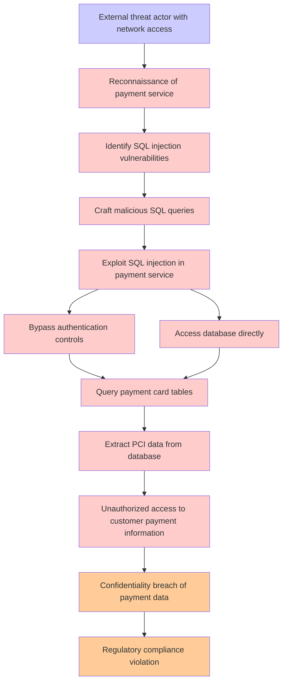

# Attack Tree: Payment Data Breach

**Threat ID**: T001
**Statement**: T001 - Payment Data Breach

## Attack Tree Diagram

## MITRE ATT&CK Mapping

This attack tree has been mapped to MITRE ATT&CK techniques:

### External threat actor with network access

- **Technique**: [T1654](https://attack.mitre.org/techniques/T1654/) - Log Enumeration
- **Tactic**: Discovery
- **Confidence Score**: 1028.39
- **Mitigations (1):**
  - 🛡️ **User Account Management**
    User Account Management involves implementing and enforcing policies for the lifecycle of user accounts, including creat...

### Confidentiality breach of payment data

- **Technique**: [T1070.008](https://attack.mitre.org/techniques/T1070/008/) - Clear Mailbox Data
- **Tactic**: Defense Evasion
- **Confidence Score**: 1107.21
- **Mitigations (3):**
  - 🛡️ **Restrict File and Directory Permissions**
    Restricting file and directory permissions involves setting access controls at the file system level to limit which user...
  - 🛡️ **Audit**
    Auditing is the process of recording activity and systematically reviewing and analyzing the activity and system configu...
  - 🛡️ **Remote Data Storage**
    Remote Data Storage focuses on moving critical data, such as security logs and sensitive files, to secure, off-host loca...

### Reconnaissance of payment service

- **Technique**: [T1496.003](https://attack.mitre.org/techniques/T1496/003/) - SMS Pumping
- **Tactic**: Impact
- **Confidence Score**: 1254.10
- **Mitigations (1):**
  - 🛡️ **Application Developer Guidance**
    Application Developer Guidance focuses on providing developers with the knowledge, tools, and best practices needed to w...

### Exploit SQL injection in payment service

- **Technique**: [T1190](https://attack.mitre.org/techniques/T1190/) - Exploit Public-Facing Application
- **Tactic**: Initial Access
- **Confidence Score**: 1415.82
- **Mitigations (8):**
  - 🛡️ **Application Isolation and Sandboxing**
    Application Isolation and Sandboxing refers to the technique of restricting the execution of code to a controlled and is...
  - 🛡️ **Filter Network Traffic**
    Employ network appliances and endpoint software to filter ingress, egress, and lateral network traffic. This includes pr...
  - 🛡️ **Network Segmentation**
    Network segmentation involves dividing a network into smaller, isolated segments to control and limit the flow of traffi...
  - *5 more mitigation(s) available*

### Extract PCI data from database

- **Technique**: [T1496.001](https://attack.mitre.org/techniques/T1496/001/) - Compute Hijacking
- **Tactic**: Impact
- **Confidence Score**: 1544.87

### Unauthorized access to customer payment information

- **Technique**: [T1070.008](https://attack.mitre.org/techniques/T1070/008/) - Clear Mailbox Data
- **Tactic**: Defense Evasion
- **Confidence Score**: 1424.24
- **Mitigations (3):**
  - 🛡️ **Restrict File and Directory Permissions**
    Restricting file and directory permissions involves setting access controls at the file system level to limit which user...
  - 🛡️ **Audit**
    Auditing is the process of recording activity and systematically reviewing and analyzing the activity and system configu...
  - 🛡️ **Remote Data Storage**
    Remote Data Storage focuses on moving critical data, such as security logs and sensitive files, to secure, off-host loca...

### Access database directly

- **Technique**: [AT1023](https://attack.mitre.org/techniques/AT1023/) - Cloud Database Discovery
- **Tactic**: Discovery
- **Confidence Score**: 938.54

### Regulatory compliance violation

- **Technique**: [T1070.008](https://attack.mitre.org/techniques/T1070/008/) - Clear Mailbox Data
- **Tactic**: Defense Evasion
- **Confidence Score**: 1290.06
- **Mitigations (3):**
  - 🛡️ **Restrict File and Directory Permissions**
    Restricting file and directory permissions involves setting access controls at the file system level to limit which user...
  - 🛡️ **Audit**
    Auditing is the process of recording activity and systematically reviewing and analyzing the activity and system configu...
  - 🛡️ **Remote Data Storage**
    Remote Data Storage focuses on moving critical data, such as security logs and sensitive files, to secure, off-host loca...

### Identify SQL injection vulnerabilities

- **Technique**: [AT1013](https://attack.mitre.org/techniques/AT1013/) - User Agent Spoofing and Randomization
- **Confidence Score**: 1458.68

### Bypass authentication controls

- **Technique**: [T1606.002](https://attack.mitre.org/techniques/T1606/002/) - SAML Tokens
- **Tactic**: Credential Access
- **Confidence Score**: 1373.62
- **Mitigations (4):**
  - 🛡️ **Active Directory Configuration**
    Implement robust Active Directory (AD) configurations using group policies to secure user accounts, control access, and ...
  - 🛡️ **Audit**
    Auditing is the process of recording activity and systematically reviewing and analyzing the activity and system configu...
  - 🛡️ **User Account Management**
    User Account Management involves implementing and enforcing policies for the lifecycle of user accounts, including creat...
  - *1 more mitigation(s) available*

### Craft malicious SQL queries

- **Technique**: [AT1023](https://attack.mitre.org/techniques/AT1023/) - Cloud Database Discovery
- **Tactic**: Discovery
- **Confidence Score**: 1351.40

### Query payment card tables

- **Technique**: [T1654](https://attack.mitre.org/techniques/T1654/) - Log Enumeration
- **Tactic**: Discovery
- **Confidence Score**: 1383.76
- **Mitigations (1):**
  - 🛡️ **User Account Management**
    User Account Management involves implementing and enforcing policies for the lifecycle of user accounts, including creat...

*Total technique mappings: 12 | Mitigations found: 24*

## Attack Path Analysis

Review this attack tree to:
1. Identify critical attack paths
2. Implement appropriate security controls
3. Monitor for indicators
4. Develop incident response procedures

---
*Generated by ThreatForest*
