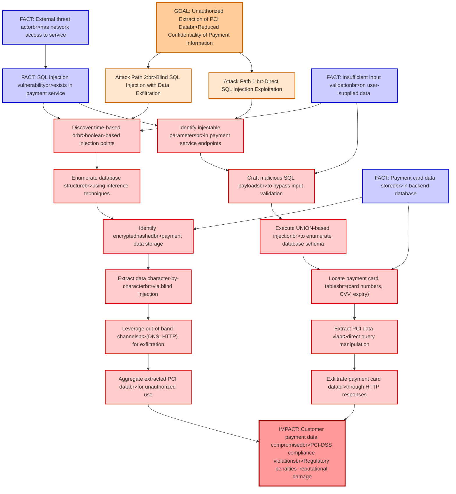

# Attack Tree: Payment Data Breach

**Threat ID**: T001
**Statement**: A external threat actor with SQL injection vulnerabilities in the payment service, can access stored payment card data, which leads to unauthorized extraction of PCI data, resulting in reduced confidentiality of customer payment information and regulatory compliance violations.

## Attack Tree Diagram

## MITRE ATT&CK Mapping

This attack tree has been mapped to MITRE ATT&CK techniques:

### Discover time-based orbr>boolean-based injection points

- **Technique**: [T1497.003](https://attack.mitre.org/techniques/T1497/003/) - Time Based Checks
- **Tactic**: Defense Evasion, Discovery
- **Similarity Score**: 65.83%

### FACT: Insufficient input validationbr>on user-supplied data

- **Technique**: [T1174](https://attack.mitre.org/techniques/T1174/) - Password Filter DLL
- **Tactic**: Credential Access
- **Similarity Score**: 37.84%

### IMPACT: Customer payment data compromisedbr>PCI-DSS compliance violationsbr>Regulatory penalties  reputational damage

- **Technique**: [T1565](https://attack.mitre.org/techniques/T1565/) - Data Manipulation
- **Tactic**: Impact
- **Similarity Score**: 52.43%
- **Mitigations (4):**
  - 🛡️ **Encrypt Sensitive Information**
    Protect sensitive information at rest, in transit, and during processing by using strong encryption algorithms. Encrypti...
  - 🛡️ **Remote Data Storage**
    Remote Data Storage focuses on moving critical data, such as security logs and sensitive files, to secure, off-host loca...
  - 🛡️ **Network Segmentation**
    Network segmentation involves dividing a network into smaller, isolated segments to control and limit the flow of traffi...
  - *1 more mitigation(s) available*

### Identify encryptedhashedbr>payment data storage

- **Technique**: [T1022](https://attack.mitre.org/techniques/T1022/) - Data Encrypted
- **Tactic**: Exfiltration
- **Similarity Score**: 68.58%

### Extract data character-by-characterbr>via blind injection

- **Technique**: [T1132](https://attack.mitre.org/techniques/T1132/) - Data Encoding
- **Tactic**: Command And Control
- **Similarity Score**: 44.60%
- **Mitigations (1):**
  - 🛡️ **Network Intrusion Prevention**
    Use intrusion detection signatures to block traffic at network boundaries.

### Execute UNION-based injectionbr>to enumerate database schema

- **Technique**: [T1602](https://attack.mitre.org/techniques/T1602/) - Data from Configuration Repository
- **Tactic**: Collection
- **Similarity Score**: 42.47%
- **Mitigations (6):**
  - 🛡️ **Update Software**
    Software updates ensure systems are protected against known vulnerabilities by applying patches and upgrades provided by...
  - 🛡️ **Software Configuration**
    Software configuration refers to making security-focused adjustments to the settings of applications, middleware, databa...
  - 🛡️ **Network Segmentation**
    Network segmentation involves dividing a network into smaller, isolated segments to control and limit the flow of traffi...
  - *3 more mitigation(s) available*

### Craft malicious SQL payloadsbr>to bypass input validation

- **Technique**: [T1174](https://attack.mitre.org/techniques/T1174/) - Password Filter DLL
- **Tactic**: Credential Access
- **Similarity Score**: 37.20%

### FACT: Payment card data storedbr>in backend database

- **Technique**: [T1213.006](https://attack.mitre.org/techniques/T1213/006/) - Databases
- **Tactic**: Collection
- **Similarity Score**: 46.24%
- **Mitigations (5):**
  - 🛡️ **User Training**
    User Training involves educating employees and contractors on recognizing, reporting, and preventing cyber threats that ...
  - 🛡️ **Encrypt Sensitive Information**
    Protect sensitive information at rest, in transit, and during processing by using strong encryption algorithms. Encrypti...
  - 🛡️ **Software Configuration**
    Software configuration refers to making security-focused adjustments to the settings of applications, middleware, databa...
  - *2 more mitigation(s) available*

### FACT: External threat actorbr>has network access to service

- **Technique**: [T1133](https://attack.mitre.org/techniques/T1133/) - External Remote Services
- **Tactic**: Persistence, Initial Access
- **Similarity Score**: 64.83%
- **Mitigations (5):**
  - 🛡️ **Restrict Web-Based Content**
    Restricting web-based content involves enforcing policies and technologies that limit access to potentially malicious we...
  - 🛡️ **Network Segmentation**
    Network segmentation involves dividing a network into smaller, isolated segments to control and limit the flow of traffi...
  - 🛡️ **Disable or Remove Feature or Program**
    Disable or remove unnecessary and potentially vulnerable software, features, or services to reduce the attack surface an...
  - *2 more mitigation(s) available*

### FACT: SQL injection vulnerabilitybr>exists in payment service

- **Technique**: [T1583.006](https://attack.mitre.org/techniques/T1583/006/) - Web Services
- **Tactic**: Resource Development
- **Similarity Score**: 31.65%
- **Mitigations (1):**
  - 🛡️ **Pre-compromise**
    Pre-compromise mitigations involve proactive measures and defenses implemented to prevent adversaries from successfully ...

### GOAL: Unauthorized Extraction of PCI Databr>Reduced Confidentiality of Payment Information

- **Technique**: [T1048.003](https://attack.mitre.org/techniques/T1048/003/) - Exfiltration Over Unencrypted Non-C2 Protocol
- **Tactic**: Exfiltration
- **Similarity Score**: 48.70%
- **Mitigations (4):**
  - 🛡️ **Network Intrusion Prevention**
    Use intrusion detection signatures to block traffic at network boundaries.
  - 🛡️ **Data Loss Prevention**
    Data Loss Prevention (DLP) involves implementing strategies and technologies to identify, categorize, monitor, and contr...
  - 🛡️ **Filter Network Traffic**
    Employ network appliances and endpoint software to filter ingress, egress, and lateral network traffic. This includes pr...
  - *1 more mitigation(s) available*

### Attack Path 1:br>Direct SQL Injection Exploitation

- **Technique**: [T1659](https://attack.mitre.org/techniques/T1659/) - Content Injection
- **Tactic**: Initial Access, Command And Control
- **Similarity Score**: 44.03%
- **Mitigations (2):**
  - 🛡️ **Restrict Web-Based Content**
    Restricting web-based content involves enforcing policies and technologies that limit access to potentially malicious we...
  - 🛡️ **Encrypt Sensitive Information**
    Protect sensitive information at rest, in transit, and during processing by using strong encryption algorithms. Encrypti...

### Aggregate extracted PCI databr>for unauthorized use

- **Technique**: [T1005](https://attack.mitre.org/techniques/T1005/) - Data from Local System
- **Tactic**: Collection
- **Similarity Score**: 53.05%
- **Mitigations (1):**
  - 🛡️ **Data Loss Prevention**
    Data Loss Prevention (DLP) involves implementing strategies and technologies to identify, categorize, monitor, and contr...

### Leverage out-of-band channelsbr>(DNS, HTTP) for exfiltration

- **Technique**: [T1041](https://attack.mitre.org/techniques/T1041/) - Exfiltration Over C2 Channel
- **Tactic**: Exfiltration
- **Similarity Score**: 69.30%
- **Mitigations (2):**
  - 🛡️ **Network Intrusion Prevention**
    Use intrusion detection signatures to block traffic at network boundaries.
  - 🛡️ **Data Loss Prevention**
    Data Loss Prevention (DLP) involves implementing strategies and technologies to identify, categorize, monitor, and contr...

### Locate payment card tablesbr>(card numbers, CVV, expiry)

- **Technique**: [T1005](https://attack.mitre.org/techniques/T1005/) - Data from Local System
- **Tactic**: Collection
- **Similarity Score**: 37.77%
- **Mitigations (1):**
  - 🛡️ **Data Loss Prevention**
    Data Loss Prevention (DLP) involves implementing strategies and technologies to identify, categorize, monitor, and contr...

### Attack Path 2:br>Blind SQL Injection with Data Exfiltration

- **Technique**: [T1659](https://attack.mitre.org/techniques/T1659/) - Content Injection
- **Tactic**: Initial Access, Command And Control
- **Similarity Score**: 48.41%
- **Mitigations (2):**
  - 🛡️ **Restrict Web-Based Content**
    Restricting web-based content involves enforcing policies and technologies that limit access to potentially malicious we...
  - 🛡️ **Encrypt Sensitive Information**
    Protect sensitive information at rest, in transit, and during processing by using strong encryption algorithms. Encrypti...

### Extract PCI data viabr>direct query manipulation

- **Technique**: [T1602.001](https://attack.mitre.org/techniques/T1602/001/) - SNMP (MIB Dump)
- **Tactic**: Collection
- **Similarity Score**: 47.48%
- **Mitigations (6):**
  - 🛡️ **Software Configuration**
    Software configuration refers to making security-focused adjustments to the settings of applications, middleware, databa...
  - 🛡️ **Update Software**
    Software updates ensure systems are protected against known vulnerabilities by applying patches and upgrades provided by...
  - 🛡️ **Encrypt Sensitive Information**
    Protect sensitive information at rest, in transit, and during processing by using strong encryption algorithms. Encrypti...
  - *3 more mitigation(s) available*

### Enumerate database structurebr>using inference techniques

- **Technique**: [T1005](https://attack.mitre.org/techniques/T1005/) - Data from Local System
- **Tactic**: Collection
- **Similarity Score**: 65.60%
- **Mitigations (1):**
  - 🛡️ **Data Loss Prevention**
    Data Loss Prevention (DLP) involves implementing strategies and technologies to identify, categorize, monitor, and contr...

### Exfiltrate payment card databr>through HTTP responses

- **Technique**: [T1048](https://attack.mitre.org/techniques/T1048/) - Exfiltration Over Alternative Protocol
- **Tactic**: Exfiltration
- **Similarity Score**: 75.20%
- **Mitigations (6):**
  - 🛡️ **Network Segmentation**
    Network segmentation involves dividing a network into smaller, isolated segments to control and limit the flow of traffi...
  - 🛡️ **Data Loss Prevention**
    Data Loss Prevention (DLP) involves implementing strategies and technologies to identify, categorize, monitor, and contr...
  - 🛡️ **Filter Network Traffic**
    Employ network appliances and endpoint software to filter ingress, egress, and lateral network traffic. This includes pr...
  - *3 more mitigation(s) available*

*Total technique mappings: 19 | Mitigations found: 47*

## Attack Path Analysis

Review this attack tree to:
1. Identify critical attack paths
2. Implement appropriate security controls
3. Monitor for indicators
4. Develop incident response procedures

---
*Generated by ThreatForest*
