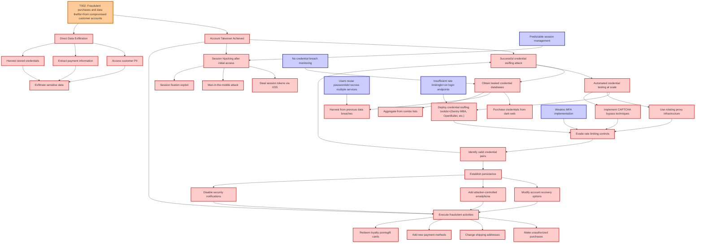

# Attack Tree: Account Takeover

**Threat ID**: T002
**Statement**: A external threat actor with user credentials through credential stuffing attacks, can gain unauthorized access to customer accounts, which leads to fraudulent purchases and data theft, resulting in reduced confidentiality and integrity of customer accounts and financial loss.

## Attack Tree Diagram

## MITRE ATT&CK Mapping

This attack tree has been mapped to MITRE ATT&CK techniques:

### Direct Data Exfiltration

- **Technique**: [T1020](https://attack.mitre.org/techniques/T1020/) - Automated Exfiltration
- **Tactic**: Exfiltration
- **Similarity Score**: 85.94%

### Insufficient rate limitingbr>on login endpoints

- **Technique**: [T1499.001](https://attack.mitre.org/techniques/T1499/001/) - OS Exhaustion Flood
- **Tactic**: Impact
- **Similarity Score**: 52.16%
- **Mitigations (1):**
  - 🛡️ **Filter Network Traffic**
    Employ network appliances and endpoint software to filter ingress, egress, and lateral network traffic. This includes pr...

### Make unauthorized purchases

- **Technique**: [T1195](https://attack.mitre.org/techniques/T1195/) - Supply Chain Compromise
- **Tactic**: Initial Access
- **Similarity Score**: 42.47%
- **Mitigations (6):**
  - 🛡️ **Boot Integrity**
    Boot Integrity ensures that a system starts securely by verifying the integrity of its boot process, operating system, a...
  - 🛡️ **Application Developer Guidance**
    Application Developer Guidance focuses on providing developers with the knowledge, tools, and best practices needed to w...
  - 🛡️ **Update Software**
    Software updates ensure systems are protected against known vulnerabilities by applying patches and upgrades provided by...
  - *3 more mitigation(s) available*

### Harvest from previous data breaches

- **Technique**: [T1213.006](https://attack.mitre.org/techniques/T1213/006/) - Databases
- **Tactic**: Collection
- **Similarity Score**: 76.26%
- **Mitigations (5):**
  - 🛡️ **User Training**
    User Training involves educating employees and contractors on recognizing, reporting, and preventing cyber threats that ...
  - 🛡️ **Encrypt Sensitive Information**
    Protect sensitive information at rest, in transit, and during processing by using strong encryption algorithms. Encrypti...
  - 🛡️ **Software Configuration**
    Software configuration refers to making security-focused adjustments to the settings of applications, middleware, databa...
  - *2 more mitigation(s) available*

### Users reuse passwordsbr>across multiple services

- **Technique**: [T1550](https://attack.mitre.org/techniques/T1550/) - Use Alternate Authentication Material
- **Tactic**: Defense Evasion, Lateral Movement
- **Similarity Score**: 73.44%
- **Mitigations (7):**
  - 🛡️ **Audit**
    Auditing is the process of recording activity and systematically reviewing and analyzing the activity and system configu...
  - 🛡️ **Password Policies**
    Set and enforce secure password policies for accounts to reduce the likelihood of unauthorized access. Strong password p...
  - 🛡️ **Account Use Policies**
    Account Use Policies help mitigate unauthorized access by configuring and enforcing rules that govern how and when accou...
  - *4 more mitigation(s) available*

### Session hijacking after initial access

- **Technique**: [T1563.002](https://attack.mitre.org/techniques/T1563/002/) - RDP Hijacking
- **Tactic**: Lateral Movement
- **Similarity Score**: 77.04%
- **Mitigations (7):**
  - 🛡️ **Limit Access to Resource Over Network**
    Restrict access to network resources, such as file shares, remote systems, and services, to only those users, accounts, ...
  - 🛡️ **Network Segmentation**
    Network segmentation involves dividing a network into smaller, isolated segments to control and limit the flow of traffi...
  - 🛡️ **Operating System Configuration**
    Operating System Configuration involves adjusting system settings and hardening the default configurations of an operati...
  - *4 more mitigation(s) available*

### Establish persistence

- **Technique**: [T1037.005](https://attack.mitre.org/techniques/T1037/005/) - Startup Items
- **Tactic**: Persistence, Privilege Escalation
- **Similarity Score**: 76.85%
- **Mitigations (1):**
  - 🛡️ **Restrict File and Directory Permissions**
    Restricting file and directory permissions involves setting access controls at the file system level to limit which user...

### Evade rate limiting controls

- **Technique**: [T1499.003](https://attack.mitre.org/techniques/T1499/003/) - Application Exhaustion Flood
- **Tactic**: Impact
- **Similarity Score**: 43.72%
- **Mitigations (1):**
  - 🛡️ **Filter Network Traffic**
    Employ network appliances and endpoint software to filter ingress, egress, and lateral network traffic. This includes pr...

### No credential breach monitoring

- **Technique**: [T1003](https://attack.mitre.org/techniques/T1003/) - OS Credential Dumping
- **Tactic**: Credential Access
- **Similarity Score**: 59.71%
- **Mitigations (9):**
  - 🛡️ **Encrypt Sensitive Information**
    Protect sensitive information at rest, in transit, and during processing by using strong encryption algorithms. Encrypti...
  - 🛡️ **Behavior Prevention on Endpoint**
    Behavior Prevention on Endpoint refers to the use of technologies and strategies to detect and block potentially malicio...
  - 🛡️ **Password Policies**
    Set and enforce secure password policies for accounts to reduce the likelihood of unauthorized access. Strong password p...
  - *6 more mitigation(s) available*

### Automated credential testing at scale

- **Technique**: [T1550](https://attack.mitre.org/techniques/T1550/) - Use Alternate Authentication Material
- **Tactic**: Defense Evasion, Lateral Movement
- **Similarity Score**: 69.50%
- **Mitigations (7):**
  - 🛡️ **Audit**
    Auditing is the process of recording activity and systematically reviewing and analyzing the activity and system configu...
  - 🛡️ **Password Policies**
    Set and enforce secure password policies for accounts to reduce the likelihood of unauthorized access. Strong password p...
  - 🛡️ **Account Use Policies**
    Account Use Policies help mitigate unauthorized access by configuring and enforcing rules that govern how and when accou...
  - *4 more mitigation(s) available*

### Deploy credential stuffing toolsbr>(Sentry MBA, OpenBullet, etc.)

- **Technique**: [T1556](https://attack.mitre.org/techniques/T1556/) - Modify Authentication Process
- **Tactic**: Credential Access, Defense Evasion, Persistence
- **Similarity Score**: 79.08%
- **Mitigations (9):**
  - 🛡️ **Restrict Registry Permissions**
    Restricting registry permissions involves configuring access control settings for sensitive registry keys and hives to e...
  - 🛡️ **Multi-factor Authentication**
    Multi-Factor Authentication (MFA) enhances security by requiring users to provide at least two forms of verification to ...
  - 🛡️ **Password Policies**
    Set and enforce secure password policies for accounts to reduce the likelihood of unauthorized access. Strong password p...
  - *6 more mitigation(s) available*

### Harvest stored credentials

- **Technique**: [T1555](https://attack.mitre.org/techniques/T1555/) - Credentials from Password Stores
- **Tactic**: Credential Access
- **Similarity Score**: 81.62%
- **Mitigations (3):**
  - 🛡️ **Privileged Account Management**
    Privileged Account Management focuses on implementing policies, controls, and tools to securely manage privileged accoun...
  - 🛡️ **Update Software**
    Software updates ensure systems are protected against known vulnerabilities by applying patches and upgrades provided by...
  - 🛡️ **Password Policies**
    Set and enforce secure password policies for accounts to reduce the likelihood of unauthorized access. Strong password p...

### Add new payment methods

- **Technique**: [T1657](https://attack.mitre.org/techniques/T1657/) - Financial Theft
- **Tactic**: Impact
- **Similarity Score**: 33.77%
- **Mitigations (2):**
  - 🛡️ **User Training**
    User Training involves educating employees and contractors on recognizing, reporting, and preventing cyber threats that ...
  - 🛡️ **User Account Management**
    User Account Management involves implementing and enforcing policies for the lifecycle of user accounts, including creat...

### Purchase credentials from dark web

- **Technique**: [T1589.001](https://attack.mitre.org/techniques/T1589/001/) - Credentials
- **Tactic**: Reconnaissance
- **Similarity Score**: 79.48%
- **Mitigations (1):**
  - 🛡️ **Pre-compromise**
    Pre-compromise mitigations involve proactive measures and defenses implemented to prevent adversaries from successfully ...

### Session fixation exploit

- **Technique**: [T1563.002](https://attack.mitre.org/techniques/T1563/002/) - RDP Hijacking
- **Tactic**: Lateral Movement
- **Similarity Score**: 72.88%
- **Mitigations (7):**
  - 🛡️ **Limit Access to Resource Over Network**
    Restrict access to network resources, such as file shares, remote systems, and services, to only those users, accounts, ...
  - 🛡️ **Network Segmentation**
    Network segmentation involves dividing a network into smaller, isolated segments to control and limit the flow of traffi...
  - 🛡️ **Operating System Configuration**
    Operating System Configuration involves adjusting system settings and hardening the default configurations of an operati...
  - *4 more mitigation(s) available*

### Modify account recovery options

- **Technique**: [T1531](https://attack.mitre.org/techniques/T1531/) - Account Access Removal
- **Tactic**: Impact
- **Similarity Score**: 77.14%

### Successful credential stuffing attack

- **Technique**: [T1110.004](https://attack.mitre.org/techniques/T1110/004/) - Credential Stuffing
- **Tactic**: Credential Access
- **Similarity Score**: 75.51%
- **Mitigations (4):**
  - 🛡️ **Account Use Policies**
    Account Use Policies help mitigate unauthorized access by configuring and enforcing rules that govern how and when accou...
  - 🛡️ **Password Policies**
    Set and enforce secure password policies for accounts to reduce the likelihood of unauthorized access. Strong password p...
  - 🛡️ **User Account Management**
    User Account Management involves implementing and enforcing policies for the lifecycle of user accounts, including creat...
  - *1 more mitigation(s) available*

### T002: Fraudulent purchases and data theftbr>from compromised customer accounts

- **Technique**: [T1657](https://attack.mitre.org/techniques/T1657/) - Financial Theft
- **Tactic**: Impact
- **Similarity Score**: 63.40%
- **Mitigations (2):**
  - 🛡️ **User Training**
    User Training involves educating employees and contractors on recognizing, reporting, and preventing cyber threats that ...
  - 🛡️ **User Account Management**
    User Account Management involves implementing and enforcing policies for the lifecycle of user accounts, including creat...

### Implement CAPTCHA bypass techniques

- **Technique**: [T1056](https://attack.mitre.org/techniques/T1056/) - Input Capture
- **Tactic**: Collection, Credential Access
- **Similarity Score**: 56.54%

### Identify valid credential pairs

- **Technique**: [T1556.003](https://attack.mitre.org/techniques/T1556/003/) - Pluggable Authentication Modules
- **Tactic**: Credential Access, Defense Evasion, Persistence
- **Similarity Score**: 71.42%
- **Mitigations (2):**
  - 🛡️ **Multi-factor Authentication**
    Multi-Factor Authentication (MFA) enhances security by requiring users to provide at least two forms of verification to ...
  - 🛡️ **Privileged Account Management**
    Privileged Account Management focuses on implementing policies, controls, and tools to securely manage privileged accoun...

### Use rotating proxy infrastructure

- **Technique**: [T1090.002](https://attack.mitre.org/techniques/T1090/002/) - External Proxy
- **Tactic**: Command And Control
- **Similarity Score**: 84.83%
- **Mitigations (1):**
  - 🛡️ **Network Intrusion Prevention**
    Use intrusion detection signatures to block traffic at network boundaries.

### Obtain leaked credential databases

- **Technique**: [T1003](https://attack.mitre.org/techniques/T1003/) - OS Credential Dumping
- **Tactic**: Credential Access
- **Similarity Score**: 83.12%
- **Mitigations (9):**
  - 🛡️ **Encrypt Sensitive Information**
    Protect sensitive information at rest, in transit, and during processing by using strong encryption algorithms. Encrypti...
  - 🛡️ **Behavior Prevention on Endpoint**
    Behavior Prevention on Endpoint refers to the use of technologies and strategies to detect and block potentially malicio...
  - 🛡️ **Password Policies**
    Set and enforce secure password policies for accounts to reduce the likelihood of unauthorized access. Strong password p...
  - *6 more mitigation(s) available*

### Change shipping addresses

- **Technique**: [T1114.003](https://attack.mitre.org/techniques/T1114/003/) - Email Forwarding Rule
- **Tactic**: Collection
- **Similarity Score**: 43.77%
- **Mitigations (4):**
  - 🛡️ **Disable or Remove Feature or Program**
    Disable or remove unnecessary and potentially vulnerable software, features, or services to reduce the attack surface an...
  - 🛡️ **Encrypt Sensitive Information**
    Protect sensitive information at rest, in transit, and during processing by using strong encryption algorithms. Encrypti...
  - 🛡️ **Audit**
    Auditing is the process of recording activity and systematically reviewing and analyzing the activity and system configu...
  - *1 more mitigation(s) available*

### Exfiltrate sensitive data

- **Technique**: [T1560.001](https://attack.mitre.org/techniques/T1560/001/) - Archive via Utility
- **Tactic**: Collection
- **Similarity Score**: 78.47%
- **Mitigations (1):**
  - 🛡️ **Audit**
    Auditing is the process of recording activity and systematically reviewing and analyzing the activity and system configu...

### Account Takeover Achieved

- **Technique**: [T1098](https://attack.mitre.org/techniques/T1098/) - Account Manipulation
- **Tactic**: Persistence, Privilege Escalation
- **Similarity Score**: 75.76%
- **Mitigations (7):**
  - 🛡️ **Network Segmentation**
    Network segmentation involves dividing a network into smaller, isolated segments to control and limit the flow of traffi...
  - 🛡️ **Disable or Remove Feature or Program**
    Disable or remove unnecessary and potentially vulnerable software, features, or services to reduce the attack surface an...
  - 🛡️ **User Account Management**
    User Account Management involves implementing and enforcing policies for the lifecycle of user accounts, including creat...
  - *4 more mitigation(s) available*

### Predictable session management

- **Technique**: [T1563.002](https://attack.mitre.org/techniques/T1563/002/) - RDP Hijacking
- **Tactic**: Lateral Movement
- **Similarity Score**: 70.00%
- **Mitigations (7):**
  - 🛡️ **Limit Access to Resource Over Network**
    Restrict access to network resources, such as file shares, remote systems, and services, to only those users, accounts, ...
  - 🛡️ **Network Segmentation**
    Network segmentation involves dividing a network into smaller, isolated segments to control and limit the flow of traffi...
  - 🛡️ **Operating System Configuration**
    Operating System Configuration involves adjusting system settings and hardening the default configurations of an operati...
  - *4 more mitigation(s) available*

### Aggregate from combo lists

- **Technique**: [T1595](https://attack.mitre.org/techniques/T1595/) - Active Scanning
- **Tactic**: Reconnaissance
- **Similarity Score**: 31.42%
- **Mitigations (1):**
  - 🛡️ **Pre-compromise**
    Pre-compromise mitigations involve proactive measures and defenses implemented to prevent adversaries from successfully ...

### Add attacker-controlled emailphone

- **Technique**: [T1586.002](https://attack.mitre.org/techniques/T1586/002/) - Email Accounts
- **Tactic**: Resource Development
- **Similarity Score**: 65.94%
- **Mitigations (1):**
  - 🛡️ **Pre-compromise**
    Pre-compromise mitigations involve proactive measures and defenses implemented to prevent adversaries from successfully ...

### Execute fraudulent activities

- **Technique**: [T1204](https://attack.mitre.org/techniques/T1204/) - User Execution
- **Tactic**: Execution
- **Similarity Score**: 50.63%
- **Mitigations (6):**
  - 🛡️ **User Training**
    User Training involves educating employees and contractors on recognizing, reporting, and preventing cyber threats that ...
  - 🛡️ **Execution Prevention**
    Prevent the execution of unauthorized or malicious code on systems by implementing application control, script blocking,...
  - 🛡️ **Behavior Prevention on Endpoint**
    Behavior Prevention on Endpoint refers to the use of technologies and strategies to detect and block potentially malicio...
  - *3 more mitigation(s) available*

### Steal session tokens via XSS

- **Technique**: [T1506](https://attack.mitre.org/techniques/T1506/) - Web Session Cookie
- **Tactic**: Defense Evasion, Lateral Movement
- **Similarity Score**: 62.61%

### Weakno MFA implementation

- **Technique**: [T1550](https://attack.mitre.org/techniques/T1550/) - Use Alternate Authentication Material
- **Tactic**: Defense Evasion, Lateral Movement
- **Similarity Score**: 75.30%
- **Mitigations (7):**
  - 🛡️ **Audit**
    Auditing is the process of recording activity and systematically reviewing and analyzing the activity and system configu...
  - 🛡️ **Password Policies**
    Set and enforce secure password policies for accounts to reduce the likelihood of unauthorized access. Strong password p...
  - 🛡️ **Account Use Policies**
    Account Use Policies help mitigate unauthorized access by configuring and enforcing rules that govern how and when accou...
  - *4 more mitigation(s) available*

### Disable security notifications

- **Technique**: [T1562.011](https://attack.mitre.org/techniques/T1562/011/) - Spoof Security Alerting
- **Tactic**: Defense Evasion
- **Similarity Score**: 76.39%
- **Mitigations (1):**
  - 🛡️ **Execution Prevention**
    Prevent the execution of unauthorized or malicious code on systems by implementing application control, script blocking,...

### Redeem loyalty pointsgift cards

- **Technique**: [T1550.003](https://attack.mitre.org/techniques/T1550/003/) - Pass the Ticket
- **Tactic**: Defense Evasion, Lateral Movement
- **Similarity Score**: 36.68%
- **Mitigations (4):**
  - 🛡️ **Privileged Account Management**
    Privileged Account Management focuses on implementing policies, controls, and tools to securely manage privileged accoun...
  - 🛡️ **Password Policies**
    Set and enforce secure password policies for accounts to reduce the likelihood of unauthorized access. Strong password p...
  - 🛡️ **User Account Management**
    User Account Management involves implementing and enforcing policies for the lifecycle of user accounts, including creat...
  - *1 more mitigation(s) available*

### Access customer PII

- **Technique**: [T1033](https://attack.mitre.org/techniques/T1033/) - System Owner/User Discovery
- **Tactic**: Discovery
- **Similarity Score**: 52.91%

### Man-in-the-middle attack

- **Technique**: [T1102.003](https://attack.mitre.org/techniques/T1102/003/) - One-Way Communication
- **Tactic**: Command And Control
- **Similarity Score**: 53.90%
- **Mitigations (2):**
  - 🛡️ **Restrict Web-Based Content**
    Restricting web-based content involves enforcing policies and technologies that limit access to potentially malicious we...
  - 🛡️ **Network Intrusion Prevention**
    Use intrusion detection signatures to block traffic at network boundaries.

*Total technique mappings: 35 | Mitigations found: 125*

## Attack Path Analysis

Review this attack tree to:
1. Identify critical attack paths
2. Implement appropriate security controls
3. Monitor for indicators
4. Develop incident response procedures

---
*Generated by ThreatForest*
