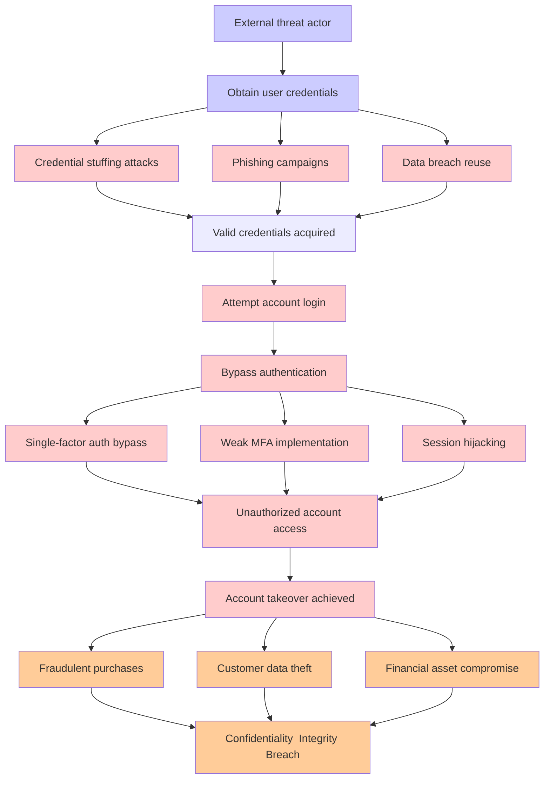

# Attack Tree: Account Takeover

**Threat ID**: T002
**Statement**: T002 - Account Takeover

## Attack Tree Diagram

## MITRE ATT&CK Mapping

This attack tree has been mapped to MITRE ATT&CK techniques:

### Attempt account login

- **Technique**: [T1654](https://attack.mitre.org/techniques/T1654/) - Log Enumeration
- **Tactic**: Discovery
- **Confidence Score**: 1249.03
- **Mitigations (1):**
  - 🛡️ **User Account Management**
    User Account Management involves implementing and enforcing policies for the lifecycle of user accounts, including creat...

### Valid credentials acquired

- **Technique**: [AT1028](https://attack.mitre.org/techniques/AT1028/) - Create or Modify EC2 Key Pair
- **Tactic**: Persistence
- **Confidence Score**: 1092.24

### Obtain user credentials

- **Technique**: [T1119](https://attack.mitre.org/techniques/T1119/) - Automated Collection
- **Tactic**: Collection
- **Confidence Score**: 1181.61
- **Mitigations (2):**
  - 🛡️ **Remote Data Storage**
    Remote Data Storage focuses on moving critical data, such as security logs and sensitive files, to secure, off-host loca...
  - 🛡️ **Encrypt Sensitive Information**
    Protect sensitive information at rest, in transit, and during processing by using strong encryption algorithms. Encrypti...

### Session hijacking

- **Technique**: [T1190.A010](https://attack.mitre.org/techniques/T1190/A010/) - Redshift Cluster
- **Tactic**: Initial Access
- **Confidence Score**: 1243.10

### Phishing campaigns

- **Technique**: [T1534](https://attack.mitre.org/techniques/T1534/) - Internal Spearphishing
- **Tactic**: Lateral Movement
- **Confidence Score**: 1045.73

### Credential stuffing attacks

- **Technique**: [T1201](https://attack.mitre.org/techniques/T1201/) - Password Policy Discovery
- **Tactic**: Discovery
- **Confidence Score**: 1203.28
- **Mitigations (1):**
  - 🛡️ **Password Policies**
    Set and enforce secure password policies for accounts to reduce the likelihood of unauthorized access. Strong password p...

### Fraudulent purchases

- **Technique**: [T1070.008](https://attack.mitre.org/techniques/T1070/008/) - Clear Mailbox Data
- **Tactic**: Defense Evasion
- **Confidence Score**: 1302.57
- **Mitigations (3):**
  - 🛡️ **Restrict File and Directory Permissions**
    Restricting file and directory permissions involves setting access controls at the file system level to limit which user...
  - 🛡️ **Audit**
    Auditing is the process of recording activity and systematically reviewing and analyzing the activity and system configu...
  - 🛡️ **Remote Data Storage**
    Remote Data Storage focuses on moving critical data, such as security logs and sensitive files, to secure, off-host loca...

### Bypass authentication

- **Technique**: [T1556.006](https://attack.mitre.org/techniques/T1556/006/) - Multi-Factor Authentication
- **Tactic**: Credential Access, Defense Evasion, Persistence
- **Confidence Score**: 1324.02
- **Mitigations (3):**
  - 🛡️ **User Account Management**
    User Account Management involves implementing and enforcing policies for the lifecycle of user accounts, including creat...
  - 🛡️ **Audit**
    Auditing is the process of recording activity and systematically reviewing and analyzing the activity and system configu...
  - 🛡️ **Multi-factor Authentication**
    Multi-Factor Authentication (MFA) enhances security by requiring users to provide at least two forms of verification to ...

### Unauthorized account access

- **Technique**: [T1078.A002](https://attack.mitre.org/techniques/T1078/A002/) - Account Root User
- **Tactic**: Defense Evasion, Persistence, Privilege Escalation, Initial Access
- **Confidence Score**: 1358.83

### Weak MFA implementation

- **Technique**: [T1606.002](https://attack.mitre.org/techniques/T1606/002/) - SAML Tokens
- **Tactic**: Credential Access
- **Confidence Score**: 1260.95
- **Mitigations (4):**
  - 🛡️ **Active Directory Configuration**
    Implement robust Active Directory (AD) configurations using group policies to secure user accounts, control access, and ...
  - 🛡️ **Audit**
    Auditing is the process of recording activity and systematically reviewing and analyzing the activity and system configu...
  - 🛡️ **User Account Management**
    User Account Management involves implementing and enforcing policies for the lifecycle of user accounts, including creat...
  - *1 more mitigation(s) available*

### Single-factor auth bypass

- **Technique**: [T1556.006](https://attack.mitre.org/techniques/T1556/006/) - Multi-Factor Authentication
- **Tactic**: Credential Access, Defense Evasion, Persistence
- **Confidence Score**: 956.69
- **Mitigations (3):**
  - 🛡️ **User Account Management**
    User Account Management involves implementing and enforcing policies for the lifecycle of user accounts, including creat...
  - 🛡️ **Audit**
    Auditing is the process of recording activity and systematically reviewing and analyzing the activity and system configu...
  - 🛡️ **Multi-factor Authentication**
    Multi-Factor Authentication (MFA) enhances security by requiring users to provide at least two forms of verification to ...

### Account takeover achieved

- **Technique**: [T1190.A013.A005](https://attack.mitre.org/techniques/T1190/A013/A005/) - RDS Instance Manipulation - RDS Snapshot
- **Tactic**: Initial Access
- **Confidence Score**: 1074.22

### Customer data theft

- **Technique**: [T1530.A002](https://attack.mitre.org/techniques/T1530/A002/) - S3 Glacier
- **Tactic**: Collection
- **Confidence Score**: 1157.14

### Confidentiality  Integrity Breach

- **Technique**: [T1490](https://attack.mitre.org/techniques/T1490/) - Inhibit System Recovery
- **Tactic**: Impact
- **Confidence Score**: 1383.18
- **Mitigations (4):**
  - 🛡️ **Execution Prevention**
    Prevent the execution of unauthorized or malicious code on systems by implementing application control, script blocking,...
  - 🛡️ **Operating System Configuration**
    Operating System Configuration involves adjusting system settings and hardening the default configurations of an operati...
  - 🛡️ **User Account Management**
    User Account Management involves implementing and enforcing policies for the lifecycle of user accounts, including creat...
  - *1 more mitigation(s) available*

### Financial asset compromise

- **Technique**: [T1654](https://attack.mitre.org/techniques/T1654/) - Log Enumeration
- **Tactic**: Discovery
- **Confidence Score**: 1274.75
- **Mitigations (1):**
  - 🛡️ **User Account Management**
    User Account Management involves implementing and enforcing policies for the lifecycle of user accounts, including creat...

### External threat actor

- **Technique**: [T1654](https://attack.mitre.org/techniques/T1654/) - Log Enumeration
- **Tactic**: Discovery
- **Confidence Score**: 1017.75
- **Mitigations (1):**
  - 🛡️ **User Account Management**
    User Account Management involves implementing and enforcing policies for the lifecycle of user accounts, including creat...

### Data breach reuse

- **Technique**: [T1490](https://attack.mitre.org/techniques/T1490/) - Inhibit System Recovery
- **Tactic**: Impact
- **Confidence Score**: 1208.99
- **Mitigations (4):**
  - 🛡️ **Execution Prevention**
    Prevent the execution of unauthorized or malicious code on systems by implementing application control, script blocking,...
  - 🛡️ **Operating System Configuration**
    Operating System Configuration involves adjusting system settings and hardening the default configurations of an operati...
  - 🛡️ **User Account Management**
    User Account Management involves implementing and enforcing policies for the lifecycle of user accounts, including creat...
  - *1 more mitigation(s) available*

*Total technique mappings: 17 | Mitigations found: 27*

## Attack Path Analysis

Review this attack tree to:
1. Identify critical attack paths
2. Implement appropriate security controls
3. Monitor for indicators
4. Develop incident response procedures

---
*Generated by ThreatForest*
