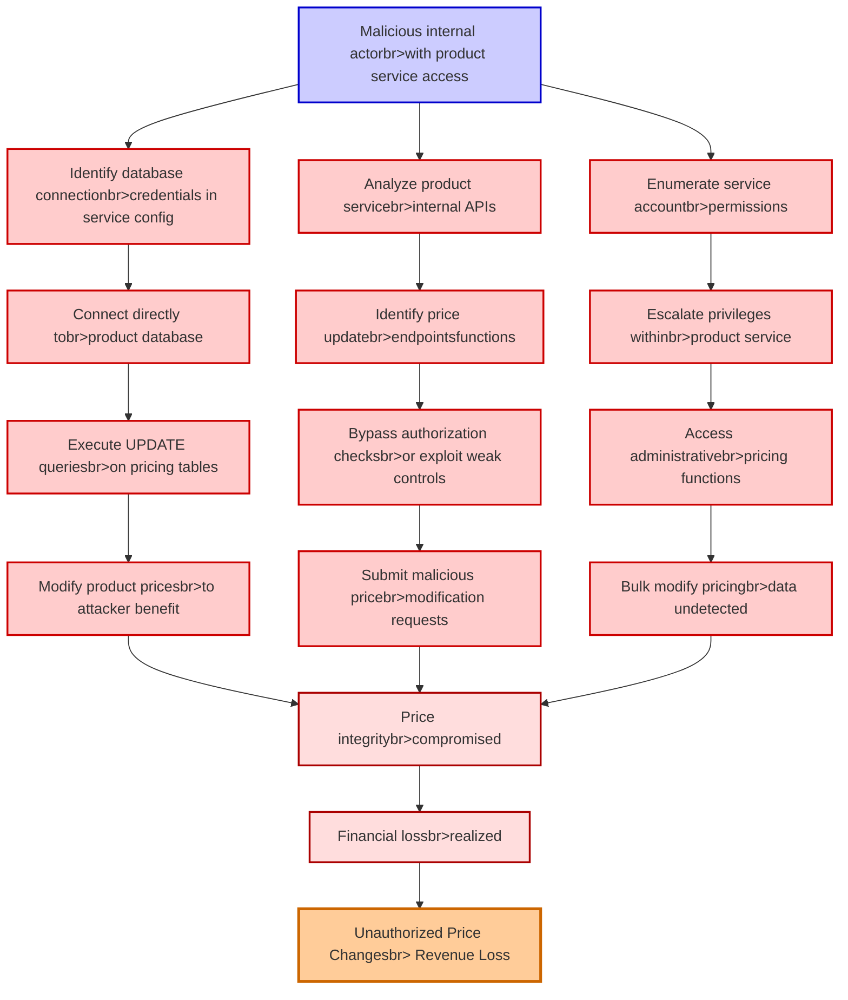

# Attack Tree: Price Manipulation

**Threat ID**: T003
**Statement**: A malicious internal actor with access to the product service, can modify product pricing in the database, which leads to unauthorized price changes and revenue loss, resulting in reduced integrity of product data and financial impact.

## Attack Tree Diagram

## MITRE ATT&CK Mapping

This attack tree has been mapped to MITRE ATT&CK techniques:

### Modify product pricesbr>to attacker benefit

- **Technique**: [T1195](https://attack.mitre.org/techniques/T1195/) - Supply Chain Compromise
- **Tactic**: Initial Access
- **Similarity Score**: 43.64%
- **Mitigations (6):**
  - 🛡️ **Boot Integrity**
    Boot Integrity ensures that a system starts securely by verifying the integrity of its boot process, operating system, a...
  - 🛡️ **Application Developer Guidance**
    Application Developer Guidance focuses on providing developers with the knowledge, tools, and best practices needed to w...
  - 🛡️ **Update Software**
    Software updates ensure systems are protected against known vulnerabilities by applying patches and upgrades provided by...
  - *3 more mitigation(s) available*

### Enumerate service accountbr>permissions

- **Technique**: [T1069.003](https://attack.mitre.org/techniques/T1069/003/) - Cloud Groups
- **Tactic**: Discovery
- **Similarity Score**: 65.05%

### Malicious internal actorbr>with product service access

- **Technique**: [T1072](https://attack.mitre.org/techniques/T1072/) - Software Deployment Tools
- **Tactic**: Execution, Lateral Movement
- **Similarity Score**: 47.19%
- **Mitigations (10):**
  - 🛡️ **User Account Management**
    User Account Management involves implementing and enforcing policies for the lifecycle of user accounts, including creat...
  - 🛡️ **Active Directory Configuration**
    Implement robust Active Directory (AD) configurations using group policies to secure user accounts, control access, and ...
  - 🛡️ **Update Software**
    Software updates ensure systems are protected against known vulnerabilities by applying patches and upgrades provided by...
  - *7 more mitigation(s) available*

### Submit malicious pricebr>modification requests

- **Technique**: [T1565](https://attack.mitre.org/techniques/T1565/) - Data Manipulation
- **Tactic**: Impact
- **Similarity Score**: 46.69%
- **Mitigations (4):**
  - 🛡️ **Encrypt Sensitive Information**
    Protect sensitive information at rest, in transit, and during processing by using strong encryption algorithms. Encrypti...
  - 🛡️ **Remote Data Storage**
    Remote Data Storage focuses on moving critical data, such as security logs and sensitive files, to secure, off-host loca...
  - 🛡️ **Network Segmentation**
    Network segmentation involves dividing a network into smaller, isolated segments to control and limit the flow of traffi...
  - *1 more mitigation(s) available*

### Financial lossbr>realized

- **Technique**: [T1657](https://attack.mitre.org/techniques/T1657/) - Financial Theft
- **Tactic**: Impact
- **Similarity Score**: 37.86%
- **Mitigations (2):**
  - 🛡️ **User Training**
    User Training involves educating employees and contractors on recognizing, reporting, and preventing cyber threats that ...
  - 🛡️ **User Account Management**
    User Account Management involves implementing and enforcing policies for the lifecycle of user accounts, including creat...

### Unauthorized Price Changesbr> Revenue Loss

- **Technique**: [T1565](https://attack.mitre.org/techniques/T1565/) - Data Manipulation
- **Tactic**: Impact
- **Similarity Score**: 46.68%
- **Mitigations (4):**
  - 🛡️ **Encrypt Sensitive Information**
    Protect sensitive information at rest, in transit, and during processing by using strong encryption algorithms. Encrypti...
  - 🛡️ **Remote Data Storage**
    Remote Data Storage focuses on moving critical data, such as security logs and sensitive files, to secure, off-host loca...
  - 🛡️ **Network Segmentation**
    Network segmentation involves dividing a network into smaller, isolated segments to control and limit the flow of traffi...
  - *1 more mitigation(s) available*

### Execute UPDATE queriesbr>on pricing tables

- **Technique**: [T1565](https://attack.mitre.org/techniques/T1565/) - Data Manipulation
- **Tactic**: Impact
- **Similarity Score**: 34.51%
- **Mitigations (4):**
  - 🛡️ **Encrypt Sensitive Information**
    Protect sensitive information at rest, in transit, and during processing by using strong encryption algorithms. Encrypti...
  - 🛡️ **Remote Data Storage**
    Remote Data Storage focuses on moving critical data, such as security logs and sensitive files, to secure, off-host loca...
  - 🛡️ **Network Segmentation**
    Network segmentation involves dividing a network into smaller, isolated segments to control and limit the flow of traffi...
  - *1 more mitigation(s) available*

### Connect directly tobr>product database

- **Technique**: [T1602](https://attack.mitre.org/techniques/T1602/) - Data from Configuration Repository
- **Tactic**: Collection
- **Similarity Score**: 47.27%
- **Mitigations (6):**
  - 🛡️ **Update Software**
    Software updates ensure systems are protected against known vulnerabilities by applying patches and upgrades provided by...
  - 🛡️ **Software Configuration**
    Software configuration refers to making security-focused adjustments to the settings of applications, middleware, databa...
  - 🛡️ **Network Segmentation**
    Network segmentation involves dividing a network into smaller, isolated segments to control and limit the flow of traffi...
  - *3 more mitigation(s) available*

### Identify database connectionbr>credentials in service config

- **Technique**: [T1214](https://attack.mitre.org/techniques/T1214/) - Credentials in Registry
- **Tactic**: Credential Access
- **Similarity Score**: 68.25%

### Analyze product servicebr>internal APIs

- **Technique**: [T1007](https://attack.mitre.org/techniques/T1007/) - System Service Discovery
- **Tactic**: Discovery
- **Similarity Score**: 52.95%

### Bulk modify pricingbr>data undetected

- **Technique**: [T1565](https://attack.mitre.org/techniques/T1565/) - Data Manipulation
- **Tactic**: Impact
- **Similarity Score**: 54.51%
- **Mitigations (4):**
  - 🛡️ **Encrypt Sensitive Information**
    Protect sensitive information at rest, in transit, and during processing by using strong encryption algorithms. Encrypti...
  - 🛡️ **Remote Data Storage**
    Remote Data Storage focuses on moving critical data, such as security logs and sensitive files, to secure, off-host loca...
  - 🛡️ **Network Segmentation**
    Network segmentation involves dividing a network into smaller, isolated segments to control and limit the flow of traffi...
  - *1 more mitigation(s) available*

### Price integritybr>compromised

- **Technique**: [T1565.003](https://attack.mitre.org/techniques/T1565/003/) - Runtime Data Manipulation
- **Tactic**: Impact
- **Similarity Score**: 37.54%
- **Mitigations (2):**
  - 🛡️ **Network Segmentation**
    Network segmentation involves dividing a network into smaller, isolated segments to control and limit the flow of traffi...
  - 🛡️ **Restrict File and Directory Permissions**
    Restricting file and directory permissions involves setting access controls at the file system level to limit which user...

### Bypass authorization checksbr>or exploit weak controls

- **Technique**: [T1514](https://attack.mitre.org/techniques/T1514/) - Elevated Execution with Prompt
- **Tactic**: Privilege Escalation
- **Similarity Score**: 64.11%

### Escalate privileges withinbr>product service

- **Technique**: [T1548](https://attack.mitre.org/techniques/T1548/) - Abuse Elevation Control Mechanism
- **Tactic**: Privilege Escalation, Defense Evasion
- **Similarity Score**: 66.36%
- **Mitigations (8):**
  - 🛡️ **Execution Prevention**
    Prevent the execution of unauthorized or malicious code on systems by implementing application control, script blocking,...
  - 🛡️ **Operating System Configuration**
    Operating System Configuration involves adjusting system settings and hardening the default configurations of an operati...
  - 🛡️ **Update Software**
    Software updates ensure systems are protected against known vulnerabilities by applying patches and upgrades provided by...
  - *5 more mitigation(s) available*

*Total technique mappings: 14 | Mitigations found: 50*

## Attack Path Analysis

Review this attack tree to:
1. Identify critical attack paths
2. Implement appropriate security controls
3. Monitor for indicators
4. Develop incident response procedures

---
*Generated by ThreatForest*
