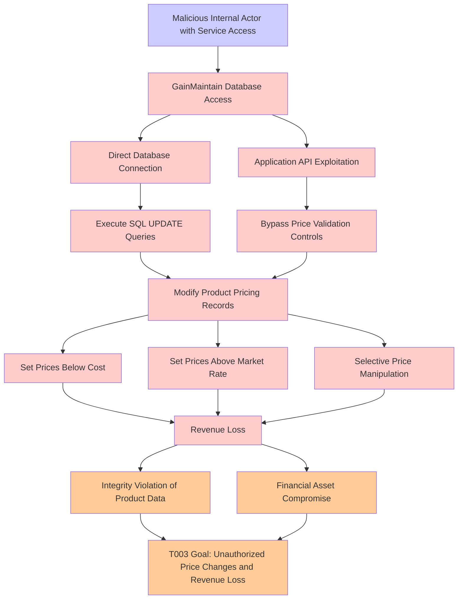

# Attack Tree: Price Manipulation

**Threat ID**: T003
**Statement**: T003 - Price Manipulation

## Attack Tree Diagram

## MITRE ATT&CK Mapping

This attack tree has been mapped to MITRE ATT&CK techniques:

### Malicious Internal Actor with Service Access

- **Technique**: [T1654](https://attack.mitre.org/techniques/T1654/) - Log Enumeration
- **Tactic**: Discovery
- **Confidence Score**: 1284.66
- **Mitigations (1):**
  - 🛡️ **User Account Management**
    User Account Management involves implementing and enforcing policies for the lifecycle of user accounts, including creat...

### Execute SQL UPDATE Queries

- **Technique**: [AT1029.001](https://attack.mitre.org/techniques/AT1029/001/) - DynamoDB
- **Tactic**: Collection
- **Confidence Score**: 1283.49

### Set Prices Above Market Rate

- **Technique**: [AT1002](https://attack.mitre.org/techniques/AT1002/) - AWS Systems Manager Run Command
- **Tactic**: Execution
- **Confidence Score**: 1355.93

### GainMaintain Database Access

- **Technique**: [T1078.A002](https://attack.mitre.org/techniques/T1078/A002/) - Account Root User
- **Tactic**: Defense Evasion, Persistence, Privilege Escalation, Initial Access
- **Confidence Score**: 987.61

### Bypass Price Validation Controls

- **Technique**: [T1654](https://attack.mitre.org/techniques/T1654/) - Log Enumeration
- **Tactic**: Discovery
- **Confidence Score**: 1043.14
- **Mitigations (1):**
  - 🛡️ **User Account Management**
    User Account Management involves implementing and enforcing policies for the lifecycle of user accounts, including creat...

### Financial Asset Compromise

- **Technique**: [T1490](https://attack.mitre.org/techniques/T1490/) - Inhibit System Recovery
- **Tactic**: Impact
- **Confidence Score**: 1396.14
- **Mitigations (4):**
  - 🛡️ **Execution Prevention**
    Prevent the execution of unauthorized or malicious code on systems by implementing application control, script blocking,...
  - 🛡️ **Operating System Configuration**
    Operating System Configuration involves adjusting system settings and hardening the default configurations of an operati...
  - 🛡️ **User Account Management**
    User Account Management involves implementing and enforcing policies for the lifecycle of user accounts, including creat...
  - *1 more mitigation(s) available*

### Direct Database Connection

- **Technique**: [AT1023](https://attack.mitre.org/techniques/AT1023/) - Cloud Database Discovery
- **Tactic**: Discovery
- **Confidence Score**: 1009.84

### Set Prices Below Cost

- **Technique**: [T1614](https://attack.mitre.org/techniques/T1614/) - System Location Discovery
- **Tactic**: Discovery
- **Confidence Score**: 1409.20

### T003 Goal: Unauthorized Price Changes and Revenue Loss

- **Technique**: [T1490](https://attack.mitre.org/techniques/T1490/) - Inhibit System Recovery
- **Tactic**: Impact
- **Confidence Score**: 1629.54
- **Mitigations (4):**
  - 🛡️ **Execution Prevention**
    Prevent the execution of unauthorized or malicious code on systems by implementing application control, script blocking,...
  - 🛡️ **Operating System Configuration**
    Operating System Configuration involves adjusting system settings and hardening the default configurations of an operati...
  - 🛡️ **User Account Management**
    User Account Management involves implementing and enforcing policies for the lifecycle of user accounts, including creat...
  - *1 more mitigation(s) available*

### Revenue Loss

- **Technique**: [T1654](https://attack.mitre.org/techniques/T1654/) - Log Enumeration
- **Tactic**: Discovery
- **Confidence Score**: 1263.51
- **Mitigations (1):**
  - 🛡️ **User Account Management**
    User Account Management involves implementing and enforcing policies for the lifecycle of user accounts, including creat...

### Modify Product Pricing Records

- **Technique**: [T1490](https://attack.mitre.org/techniques/T1490/) - Inhibit System Recovery
- **Tactic**: Impact
- **Confidence Score**: 1683.17
- **Mitigations (4):**
  - 🛡️ **Execution Prevention**
    Prevent the execution of unauthorized or malicious code on systems by implementing application control, script blocking,...
  - 🛡️ **Operating System Configuration**
    Operating System Configuration involves adjusting system settings and hardening the default configurations of an operati...
  - 🛡️ **User Account Management**
    User Account Management involves implementing and enforcing policies for the lifecycle of user accounts, including creat...
  - *1 more mitigation(s) available*

### Integrity Violation of Product Data

- **Technique**: [T1496.001](https://attack.mitre.org/techniques/T1496/001/) - Compute Hijacking
- **Tactic**: Impact
- **Confidence Score**: 1304.71

### Selective Price Manipulation

- **Technique**: [AT1011](https://attack.mitre.org/techniques/AT1011/) - Operation Rate Control
- **Confidence Score**: 1432.65

### Application API Exploitation

- **Technique**: [T1190](https://attack.mitre.org/techniques/T1190/) - Exploit Public-Facing Application
- **Tactic**: Initial Access
- **Confidence Score**: 1372.22
- **Mitigations (8):**
  - 🛡️ **Application Isolation and Sandboxing**
    Application Isolation and Sandboxing refers to the technique of restricting the execution of code to a controlled and is...
  - 🛡️ **Filter Network Traffic**
    Employ network appliances and endpoint software to filter ingress, egress, and lateral network traffic. This includes pr...
  - 🛡️ **Network Segmentation**
    Network segmentation involves dividing a network into smaller, isolated segments to control and limit the flow of traffi...
  - *5 more mitigation(s) available*

*Total technique mappings: 14 | Mitigations found: 23*

## Attack Path Analysis

Review this attack tree to:
1. Identify critical attack paths
2. Implement appropriate security controls
3. Monitor for indicators
4. Develop incident response procedures

---
*Generated by ThreatForest*
