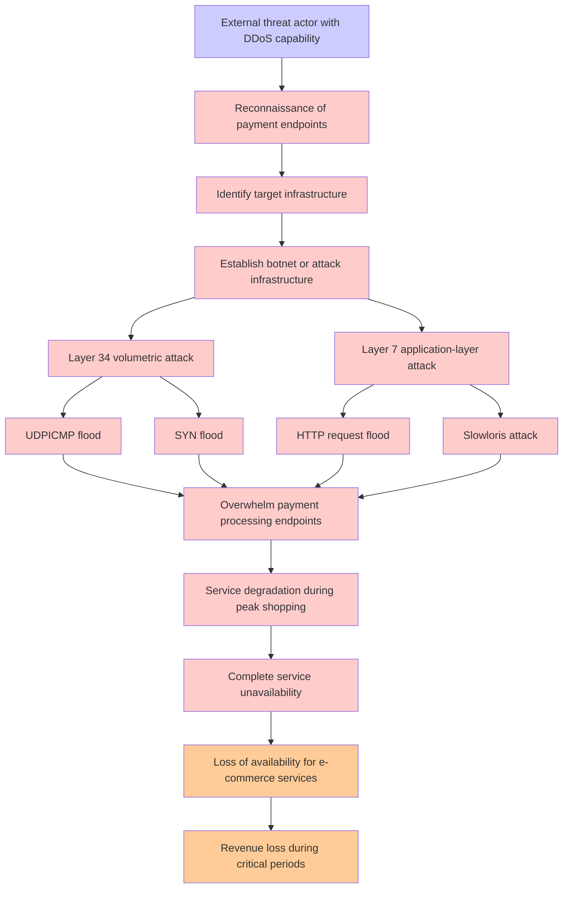

# Attack Tree: DDoS Attack

**Threat ID**: T004
**Statement**: T004 - DDoS Attack

## Attack Tree Diagram

## MITRE ATT&CK Mapping

This attack tree has been mapped to MITRE ATT&CK techniques:

### Slowloris attack

- **Technique**: [T1499.002](https://attack.mitre.org/techniques/T1499/002/) - Service Exhaustion Flood
- **Tactic**: Impact
- **Confidence Score**: 1139.98
- **Mitigations (1):**
  - 🛡️ **Filter Network Traffic**
    Employ network appliances and endpoint software to filter ingress, egress, and lateral network traffic. This includes pr...

### Layer 7 application-layer attack

- **Technique**: [T1654](https://attack.mitre.org/techniques/T1654/) - Log Enumeration
- **Tactic**: Discovery
- **Confidence Score**: 1171.02
- **Mitigations (1):**
  - 🛡️ **User Account Management**
    User Account Management involves implementing and enforcing policies for the lifecycle of user accounts, including creat...

### Service degradation during peak shopping

- **Technique**: [AT1012](https://attack.mitre.org/techniques/AT1012/) - Region Selection and Hopping
- **Confidence Score**: 1237.49

### Complete service unavailability

- **Technique**: [T1190.A010](https://attack.mitre.org/techniques/T1190/A010/) - Redshift Cluster
- **Tactic**: Initial Access
- **Confidence Score**: 1163.45

### HTTP request flood

- **Technique**: [T1498](https://attack.mitre.org/techniques/T1498/) - Network Denial of Service
- **Tactic**: Impact
- **Confidence Score**: 969.90
- **Mitigations (1):**
  - 🛡️ **Filter Network Traffic**
    Employ network appliances and endpoint software to filter ingress, egress, and lateral network traffic. This includes pr...

### Identify target infrastructure

- **Technique**: [T1583](https://attack.mitre.org/techniques/T1583/) - Acquire Infrastructure
- **Tactic**: Resource Development
- **Confidence Score**: 1293.56
- **Mitigations (1):**
  - 🛡️ **Pre-compromise**
    Pre-compromise mitigations involve proactive measures and defenses implemented to prevent adversaries from successfully ...

### Overwhelm payment processing endpoints

- **Technique**: [T1490](https://attack.mitre.org/techniques/T1490/) - Inhibit System Recovery
- **Tactic**: Impact
- **Confidence Score**: 1073.34
- **Mitigations (4):**
  - 🛡️ **Execution Prevention**
    Prevent the execution of unauthorized or malicious code on systems by implementing application control, script blocking,...
  - 🛡️ **Operating System Configuration**
    Operating System Configuration involves adjusting system settings and hardening the default configurations of an operati...
  - 🛡️ **User Account Management**
    User Account Management involves implementing and enforcing policies for the lifecycle of user accounts, including creat...
  - *1 more mitigation(s) available*

### External threat actor with DDoS capability

- **Technique**: [T1654](https://attack.mitre.org/techniques/T1654/) - Log Enumeration
- **Tactic**: Discovery
- **Confidence Score**: 1202.98
- **Mitigations (1):**
  - 🛡️ **User Account Management**
    User Account Management involves implementing and enforcing policies for the lifecycle of user accounts, including creat...

### SYN flood

- **Technique**: [T1498](https://attack.mitre.org/techniques/T1498/) - Network Denial of Service
- **Tactic**: Impact
- **Confidence Score**: 1156.99
- **Mitigations (1):**
  - 🛡️ **Filter Network Traffic**
    Employ network appliances and endpoint software to filter ingress, egress, and lateral network traffic. This includes pr...

### Revenue loss during critical periods

- **Technique**: [T1654](https://attack.mitre.org/techniques/T1654/) - Log Enumeration
- **Tactic**: Discovery
- **Confidence Score**: 1414.96
- **Mitigations (1):**
  - 🛡️ **User Account Management**
    User Account Management involves implementing and enforcing policies for the lifecycle of user accounts, including creat...

### Establish botnet or attack infrastructure

- **Technique**: [T1518](https://attack.mitre.org/techniques/T1518/) - Software Discovery
- **Tactic**: Discovery
- **Confidence Score**: 1335.04

### Layer 34 volumetric attack

- **Technique**: [T1499.002](https://attack.mitre.org/techniques/T1499/002/) - Service Exhaustion Flood
- **Tactic**: Impact
- **Confidence Score**: 1226.02
- **Mitigations (1):**
  - 🛡️ **Filter Network Traffic**
    Employ network appliances and endpoint software to filter ingress, egress, and lateral network traffic. This includes pr...

### UDPICMP flood

- **Technique**: [T1490](https://attack.mitre.org/techniques/T1490/) - Inhibit System Recovery
- **Tactic**: Impact
- **Confidence Score**: 1323.32
- **Mitigations (4):**
  - 🛡️ **Execution Prevention**
    Prevent the execution of unauthorized or malicious code on systems by implementing application control, script blocking,...
  - 🛡️ **Operating System Configuration**
    Operating System Configuration involves adjusting system settings and hardening the default configurations of an operati...
  - 🛡️ **User Account Management**
    User Account Management involves implementing and enforcing policies for the lifecycle of user accounts, including creat...
  - *1 more mitigation(s) available*

### Loss of availability for e-commerce services

- **Technique**: [AT1012](https://attack.mitre.org/techniques/AT1012/) - Region Selection and Hopping
- **Confidence Score**: 969.77

### Reconnaissance of payment endpoints

- **Technique**: [T1654](https://attack.mitre.org/techniques/T1654/) - Log Enumeration
- **Tactic**: Discovery
- **Confidence Score**: 1077.86
- **Mitigations (1):**
  - 🛡️ **User Account Management**
    User Account Management involves implementing and enforcing policies for the lifecycle of user accounts, including creat...

*Total technique mappings: 15 | Mitigations found: 17*

## Attack Path Analysis

Review this attack tree to:
1. Identify critical attack paths
2. Implement appropriate security controls
3. Monitor for indicators
4. Develop incident response procedures

---
*Generated by ThreatForest*
