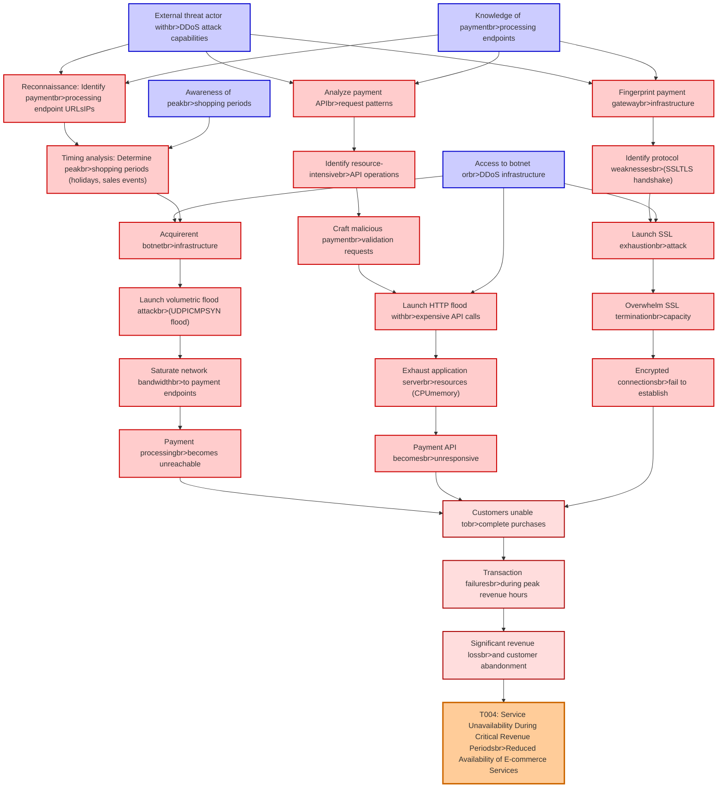

# Attack Tree: DDoS Attack

**Threat ID**: T004
**Statement**: A external threat actor who launches distributed denial of service attacks against payment processing endpoints, can overwhelm the system during peak shopping periods, which leads to service unavailability during critical revenue periods, resulting in reduced availability of e-commerce services and significant revenue loss.

## Attack Tree Diagram

## MITRE ATT&CK Mapping

This attack tree has been mapped to MITRE ATT&CK techniques:

### Reconnaissance: Identify paymentbr>processing endpoint URLsIPs

- **Technique**: [T1016.001](https://attack.mitre.org/techniques/T1016/001/) - Internet Connection Discovery
- **Tactic**: Discovery
- **Similarity Score**: 43.51%

### Craft malicious paymentbr>validation requests

- **Technique**: [T1672](https://attack.mitre.org/techniques/T1672/) - Email Spoofing
- **Tactic**: Defense Evasion
- **Similarity Score**: 37.15%
- **Mitigations (1):**
  - 🛡️ **Software Configuration**
    Software configuration refers to making security-focused adjustments to the settings of applications, middleware, databa...

### Saturate network bandwidthbr>to payment endpoints

- **Technique**: [T1496.002](https://attack.mitre.org/techniques/T1496/002/) - Bandwidth Hijacking
- **Tactic**: Impact
- **Similarity Score**: 68.55%

### Payment processingbr>becomes unreachable

- **Technique**: [T1499.002](https://attack.mitre.org/techniques/T1499/002/) - Service Exhaustion Flood
- **Tactic**: Impact
- **Similarity Score**: 45.38%
- **Mitigations (1):**
  - 🛡️ **Filter Network Traffic**
    Employ network appliances and endpoint software to filter ingress, egress, and lateral network traffic. This includes pr...

### Significant revenue lossbr>and customer abandonment

- **Technique**: [T1499.004](https://attack.mitre.org/techniques/T1499/004/) - Application or System Exploitation
- **Tactic**: Impact
- **Similarity Score**: 41.92%
- **Mitigations (1):**
  - 🛡️ **Filter Network Traffic**
    Employ network appliances and endpoint software to filter ingress, egress, and lateral network traffic. This includes pr...

### Awareness of peakbr>shopping periods

- **Technique**: [T1591.003](https://attack.mitre.org/techniques/T1591/003/) - Identify Business Tempo
- **Tactic**: Reconnaissance
- **Similarity Score**: 43.53%
- **Mitigations (1):**
  - 🛡️ **Pre-compromise**
    Pre-compromise mitigations involve proactive measures and defenses implemented to prevent adversaries from successfully ...

### Launch HTTP flood withbr>expensive API calls

- **Technique**: [T1499.002](https://attack.mitre.org/techniques/T1499/002/) - Service Exhaustion Flood
- **Tactic**: Impact
- **Similarity Score**: 69.46%
- **Mitigations (1):**
  - 🛡️ **Filter Network Traffic**
    Employ network appliances and endpoint software to filter ingress, egress, and lateral network traffic. This includes pr...

### Timing analysis: Determine peakbr>shopping periods (holidays, sales events)

- **Technique**: [T1591.003](https://attack.mitre.org/techniques/T1591/003/) - Identify Business Tempo
- **Tactic**: Reconnaissance
- **Similarity Score**: 49.35%
- **Mitigations (1):**
  - 🛡️ **Pre-compromise**
    Pre-compromise mitigations involve proactive measures and defenses implemented to prevent adversaries from successfully ...

### Identify resource-intensivebr>API operations

- **Technique**: [T1496](https://attack.mitre.org/techniques/T1496/) - Resource Hijacking
- **Tactic**: Impact
- **Similarity Score**: 49.13%

### Overwhelm SSL terminationbr>capacity

- **Technique**: [T1499.002](https://attack.mitre.org/techniques/T1499/002/) - Service Exhaustion Flood
- **Tactic**: Impact
- **Similarity Score**: 67.62%
- **Mitigations (1):**
  - 🛡️ **Filter Network Traffic**
    Employ network appliances and endpoint software to filter ingress, egress, and lateral network traffic. This includes pr...

### Analyze payment APIbr>request patterns

- **Technique**: [T1001.003](https://attack.mitre.org/techniques/T1001/003/) - Protocol or Service Impersonation
- **Tactic**: Command And Control
- **Similarity Score**: 33.92%
- **Mitigations (1):**
  - 🛡️ **Network Intrusion Prevention**
    Use intrusion detection signatures to block traffic at network boundaries.

### T004: Service Unavailability During Critical Revenue Periodsbr>Reduced Availability of E-commerce Services

- **Technique**: [T1499.002](https://attack.mitre.org/techniques/T1499/002/) - Service Exhaustion Flood
- **Tactic**: Impact
- **Similarity Score**: 61.66%
- **Mitigations (1):**
  - 🛡️ **Filter Network Traffic**
    Employ network appliances and endpoint software to filter ingress, egress, and lateral network traffic. This includes pr...

### Launch volumetric flood attackbr>(UDPICMPSYN flood)

- **Technique**: [T1498.001](https://attack.mitre.org/techniques/T1498/001/) - Direct Network Flood
- **Tactic**: Impact
- **Similarity Score**: 63.34%
- **Mitigations (1):**
  - 🛡️ **Filter Network Traffic**
    Employ network appliances and endpoint software to filter ingress, egress, and lateral network traffic. This includes pr...

### External threat actor withbr>DDoS attack capabilities

- **Technique**: [T1498](https://attack.mitre.org/techniques/T1498/) - Network Denial of Service
- **Tactic**: Impact
- **Similarity Score**: 82.94%
- **Mitigations (1):**
  - 🛡️ **Filter Network Traffic**
    Employ network appliances and endpoint software to filter ingress, egress, and lateral network traffic. This includes pr...

### Exhaust application serverbr>resources (CPUmemory)

- **Technique**: [T1496](https://attack.mitre.org/techniques/T1496/) - Resource Hijacking
- **Tactic**: Impact
- **Similarity Score**: 61.68%

### Encrypted connectionsbr>fail to establish

- **Technique**: [T1032](https://attack.mitre.org/techniques/T1032/) - Standard Cryptographic Protocol
- **Tactic**: Command And Control
- **Similarity Score**: 67.63%

### Payment API becomesbr>unresponsive

- **Technique**: [T1499.003](https://attack.mitre.org/techniques/T1499/003/) - Application Exhaustion Flood
- **Tactic**: Impact
- **Similarity Score**: 36.47%
- **Mitigations (1):**
  - 🛡️ **Filter Network Traffic**
    Employ network appliances and endpoint software to filter ingress, egress, and lateral network traffic. This includes pr...

### Customers unable tobr>complete purchases

- **Technique**: [T1666](https://attack.mitre.org/techniques/T1666/) - Modify Cloud Resource Hierarchy
- **Tactic**: Defense Evasion
- **Similarity Score**: 33.57%
- **Mitigations (3):**
  - 🛡️ **Software Configuration**
    Software configuration refers to making security-focused adjustments to the settings of applications, middleware, databa...
  - 🛡️ **User Account Management**
    User Account Management involves implementing and enforcing policies for the lifecycle of user accounts, including creat...
  - 🛡️ **Audit**
    Auditing is the process of recording activity and systematically reviewing and analyzing the activity and system configu...

### Transaction failuresbr>during peak revenue hours

- **Technique**: [T1499.001](https://attack.mitre.org/techniques/T1499/001/) - OS Exhaustion Flood
- **Tactic**: Impact
- **Similarity Score**: 48.05%
- **Mitigations (1):**
  - 🛡️ **Filter Network Traffic**
    Employ network appliances and endpoint software to filter ingress, egress, and lateral network traffic. This includes pr...

### Fingerprint payment gatewaybr>infrastructure

- **Technique**: [T1111](https://attack.mitre.org/techniques/T1111/) - Multi-Factor Authentication Interception
- **Tactic**: Credential Access
- **Similarity Score**: 47.55%
- **Mitigations (1):**
  - 🛡️ **User Training**
    User Training involves educating employees and contractors on recognizing, reporting, and preventing cyber threats that ...

### Launch SSL exhaustionbr>attack

- **Technique**: [T1499.002](https://attack.mitre.org/techniques/T1499/002/) - Service Exhaustion Flood
- **Tactic**: Impact
- **Similarity Score**: 65.48%
- **Mitigations (1):**
  - 🛡️ **Filter Network Traffic**
    Employ network appliances and endpoint software to filter ingress, egress, and lateral network traffic. This includes pr...

### Acquirerent botnetbr>infrastructure

- **Technique**: [T1583](https://attack.mitre.org/techniques/T1583/) - Acquire Infrastructure
- **Tactic**: Resource Development
- **Similarity Score**: 77.24%
- **Mitigations (1):**
  - 🛡️ **Pre-compromise**
    Pre-compromise mitigations involve proactive measures and defenses implemented to prevent adversaries from successfully ...

### Identify protocol weaknessesbr>(SSLTLS handshake)

- **Technique**: [T1094](https://attack.mitre.org/techniques/T1094/) - Custom Command and Control Protocol
- **Tactic**: Command And Control
- **Similarity Score**: 70.12%

### Access to botnet orbr>DDoS infrastructure

- **Technique**: [T1498](https://attack.mitre.org/techniques/T1498/) - Network Denial of Service
- **Tactic**: Impact
- **Similarity Score**: 81.94%
- **Mitigations (1):**
  - 🛡️ **Filter Network Traffic**
    Employ network appliances and endpoint software to filter ingress, egress, and lateral network traffic. This includes pr...

*Total technique mappings: 24 | Mitigations found: 20*

## Attack Path Analysis

Review this attack tree to:
1. Identify critical attack paths
2. Implement appropriate security controls
3. Monitor for indicators
4. Develop incident response procedures

---
*Generated by ThreatForest*
