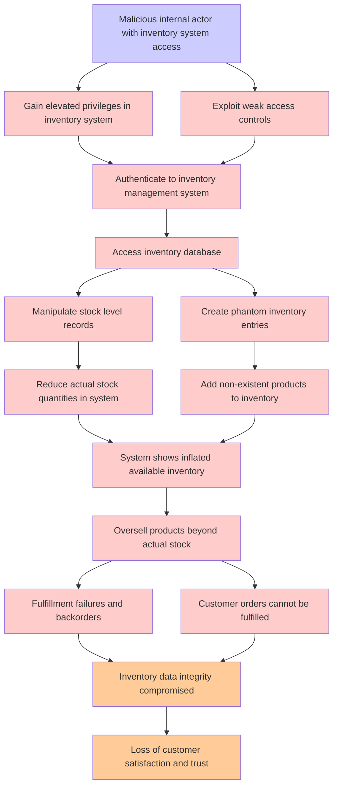

# Attack Tree: Inventory Fraud

**Threat ID**: T005
**Statement**: T005 - Inventory Fraud

## Attack Tree Diagram

## MITRE ATT&CK Mapping

This attack tree has been mapped to MITRE ATT&CK techniques:

### Add non-existent products to inventory

- **Technique**: [AT1002](https://attack.mitre.org/techniques/AT1002/) - AWS Systems Manager Run Command
- **Tactic**: Execution
- **Confidence Score**: 997.86

### Authenticate to inventory management system

- **Technique**: [T1190.A004](https://attack.mitre.org/techniques/T1190/A004/) - S3 Glacier Vault
- **Tactic**: Initial Access
- **Confidence Score**: 1302.89

### Fulfillment failures and backorders

- **Technique**: [T1190.A018](https://attack.mitre.org/techniques/T1190/A018/) - API Gateway
- **Tactic**: Initial Access
- **Confidence Score**: 1011.67

### Customer orders cannot be fulfilled

- **Technique**: [T1190.A018](https://attack.mitre.org/techniques/T1190/A018/) - API Gateway
- **Tactic**: Initial Access
- **Confidence Score**: 834.85

### Oversell products beyond actual stock

- **Technique**: [T1485.A003](https://attack.mitre.org/techniques/T1485/A003/) - S3 Objects/Buckets
- **Tactic**: Impact
- **Confidence Score**: 1305.34

### System shows inflated available inventory

- **Technique**: [AT1002](https://attack.mitre.org/techniques/AT1002/) - AWS Systems Manager Run Command
- **Tactic**: Execution
- **Confidence Score**: 1261.17

### Inventory data integrity compromised

- **Technique**: [T1490](https://attack.mitre.org/techniques/T1490/) - Inhibit System Recovery
- **Tactic**: Impact
- **Confidence Score**: 932.36
- **Mitigations (4):**
  - 🛡️ **Execution Prevention**
    Prevent the execution of unauthorized or malicious code on systems by implementing application control, script blocking,...
  - 🛡️ **Operating System Configuration**
    Operating System Configuration involves adjusting system settings and hardening the default configurations of an operati...
  - 🛡️ **User Account Management**
    User Account Management involves implementing and enforcing policies for the lifecycle of user accounts, including creat...
  - *1 more mitigation(s) available*

### Malicious internal actor with inventory system access

- **Technique**: [T1654](https://attack.mitre.org/techniques/T1654/) - Log Enumeration
- **Tactic**: Discovery
- **Confidence Score**: 962.34
- **Mitigations (1):**
  - 🛡️ **User Account Management**
    User Account Management involves implementing and enforcing policies for the lifecycle of user accounts, including creat...

### Loss of customer satisfaction and trust

- **Technique**: [AT1012](https://attack.mitre.org/techniques/AT1012/) - Region Selection and Hopping
- **Confidence Score**: 866.88

### Gain elevated privileges in inventory system

- **Technique**: [T1078.A003](https://attack.mitre.org/techniques/T1078/A003/) - Console Login
- **Tactic**: Initial Access
- **Confidence Score**: 1295.45

### Manipulate stock level records

- **Technique**: [T1564.008](https://attack.mitre.org/techniques/T1564/008/) - Email Hiding Rules
- **Tactic**: Defense Evasion
- **Confidence Score**: 1434.21
- **Mitigations (1):**
  - 🛡️ **Audit**
    Auditing is the process of recording activity and systematically reviewing and analyzing the activity and system configu...

### Create phantom inventory entries

- **Technique**: [T1190.A009](https://attack.mitre.org/techniques/T1190/A009/) - CloudSearch Domain
- **Tactic**: Initial Access
- **Confidence Score**: 1245.99

### Reduce actual stock quantities in system

- **Technique**: [T1490](https://attack.mitre.org/techniques/T1490/) - Inhibit System Recovery
- **Tactic**: Impact
- **Confidence Score**: 1488.32
- **Mitigations (4):**
  - 🛡️ **Execution Prevention**
    Prevent the execution of unauthorized or malicious code on systems by implementing application control, script blocking,...
  - 🛡️ **Operating System Configuration**
    Operating System Configuration involves adjusting system settings and hardening the default configurations of an operati...
  - 🛡️ **User Account Management**
    User Account Management involves implementing and enforcing policies for the lifecycle of user accounts, including creat...
  - *1 more mitigation(s) available*

### Access inventory database

- **Technique**: [AT1002](https://attack.mitre.org/techniques/AT1002/) - AWS Systems Manager Run Command
- **Tactic**: Execution
- **Confidence Score**: 1251.73

### Exploit weak access controls

- **Technique**: [T1119](https://attack.mitre.org/techniques/T1119/) - Automated Collection
- **Tactic**: Collection
- **Confidence Score**: 1330.15
- **Mitigations (2):**
  - 🛡️ **Remote Data Storage**
    Remote Data Storage focuses on moving critical data, such as security logs and sensitive files, to secure, off-host loca...
  - 🛡️ **Encrypt Sensitive Information**
    Protect sensitive information at rest, in transit, and during processing by using strong encryption algorithms. Encrypti...

*Total technique mappings: 15 | Mitigations found: 12*

## Attack Path Analysis

Review this attack tree to:
1. Identify critical attack paths
2. Implement appropriate security controls
3. Monitor for indicators
4. Develop incident response procedures

---
*Generated by ThreatForest*
