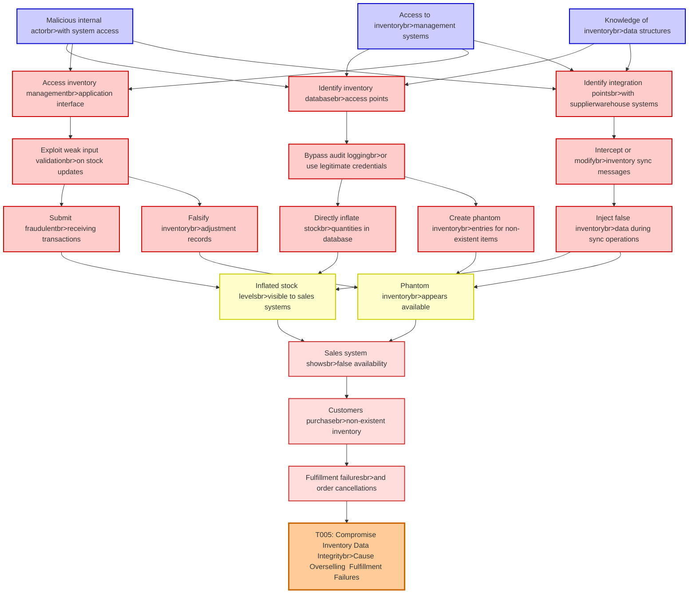

# Attack Tree: Inventory Fraud

**Threat ID**: T005
**Statement**: A malicious internal actor with access to inventory management systems, can manipulate stock levels and create phantom inventory, which leads to overselling products and fulfillment failures, resulting in reduced integrity of inventory data and customer satisfaction issues.

## Attack Tree Diagram

## MITRE ATT&CK Mapping

This attack tree has been mapped to MITRE ATT&CK techniques:

### Inject false inventorybr>data during sync operations

- **Technique**: [T1074.001](https://attack.mitre.org/techniques/T1074/001/) - Local Data Staging
- **Tactic**: Collection
- **Similarity Score**: 56.07%

### Create phantom inventorybr>entries for non-existent items

- **Technique**: [T1070](https://attack.mitre.org/techniques/T1070/) - Indicator Removal
- **Tactic**: Defense Evasion
- **Similarity Score**: 50.20%
- **Mitigations (3):**
  - 🛡️ **Encrypt Sensitive Information**
    Protect sensitive information at rest, in transit, and during processing by using strong encryption algorithms. Encrypti...
  - 🛡️ **Remote Data Storage**
    Remote Data Storage focuses on moving critical data, such as security logs and sensitive files, to secure, off-host loca...
  - 🛡️ **Restrict File and Directory Permissions**
    Restricting file and directory permissions involves setting access controls at the file system level to limit which user...

### Access to inventorybr>management systems

- **Technique**: [T1074.001](https://attack.mitre.org/techniques/T1074/001/) - Local Data Staging
- **Tactic**: Collection
- **Similarity Score**: 41.09%

### Phantom inventorybr>appears available

- **Technique**: [T1158](https://attack.mitre.org/techniques/T1158/) - Hidden Files and Directories
- **Tactic**: Defense Evasion, Persistence
- **Similarity Score**: 52.68%

### Fulfillment failuresbr>and order cancellations

- **Technique**: [T1489](https://attack.mitre.org/techniques/T1489/) - Service Stop
- **Tactic**: Impact
- **Similarity Score**: 43.41%
- **Mitigations (5):**
  - 🛡️ **Network Segmentation**
    Network segmentation involves dividing a network into smaller, isolated segments to control and limit the flow of traffi...
  - 🛡️ **User Account Management**
    User Account Management involves implementing and enforcing policies for the lifecycle of user accounts, including creat...
  - 🛡️ **Out-of-Band Communications Channel**
    Establish secure out-of-band communication channels to ensure the continuity of critical communications during security ...
  - *2 more mitigation(s) available*

### Inflated stock levelsbr>visible to sales systems

- **Technique**: [T1565](https://attack.mitre.org/techniques/T1565/) - Data Manipulation
- **Tactic**: Impact
- **Similarity Score**: 42.38%
- **Mitigations (4):**
  - 🛡️ **Encrypt Sensitive Information**
    Protect sensitive information at rest, in transit, and during processing by using strong encryption algorithms. Encrypti...
  - 🛡️ **Remote Data Storage**
    Remote Data Storage focuses on moving critical data, such as security logs and sensitive files, to secure, off-host loca...
  - 🛡️ **Network Segmentation**
    Network segmentation involves dividing a network into smaller, isolated segments to control and limit the flow of traffi...
  - *1 more mitigation(s) available*

### Sales system showsbr>false availability

- **Technique**: [T1489](https://attack.mitre.org/techniques/T1489/) - Service Stop
- **Tactic**: Impact
- **Similarity Score**: 46.61%
- **Mitigations (5):**
  - 🛡️ **Network Segmentation**
    Network segmentation involves dividing a network into smaller, isolated segments to control and limit the flow of traffi...
  - 🛡️ **User Account Management**
    User Account Management involves implementing and enforcing policies for the lifecycle of user accounts, including creat...
  - 🛡️ **Out-of-Band Communications Channel**
    Establish secure out-of-band communication channels to ensure the continuity of critical communications during security ...
  - *2 more mitigation(s) available*

### Intercept or modifybr>inventory sync messages

- **Technique**: [T1070](https://attack.mitre.org/techniques/T1070/) - Indicator Removal
- **Tactic**: Defense Evasion
- **Similarity Score**: 46.18%
- **Mitigations (3):**
  - 🛡️ **Encrypt Sensitive Information**
    Protect sensitive information at rest, in transit, and during processing by using strong encryption algorithms. Encrypti...
  - 🛡️ **Remote Data Storage**
    Remote Data Storage focuses on moving critical data, such as security logs and sensitive files, to secure, off-host loca...
  - 🛡️ **Restrict File and Directory Permissions**
    Restricting file and directory permissions involves setting access controls at the file system level to limit which user...

### Falsify inventorybr>adjustment records

- **Technique**: [T1492](https://attack.mitre.org/techniques/T1492/) - Stored Data Manipulation
- **Tactic**: Impact
- **Similarity Score**: 55.73%

### Exploit weak input validationbr>on stock updates

- **Technique**: [T1553.006](https://attack.mitre.org/techniques/T1553/006/) - Code Signing Policy Modification
- **Tactic**: Defense Evasion
- **Similarity Score**: 47.09%
- **Mitigations (3):**
  - 🛡️ **Privileged Account Management**
    Privileged Account Management focuses on implementing policies, controls, and tools to securely manage privileged accoun...
  - 🛡️ **Boot Integrity**
    Boot Integrity ensures that a system starts securely by verifying the integrity of its boot process, operating system, a...
  - 🛡️ **Restrict Registry Permissions**
    Restricting registry permissions involves configuring access control settings for sensitive registry keys and hives to e...

### Identify inventory databasebr>access points

- **Technique**: [T1018](https://attack.mitre.org/techniques/T1018/) - Remote System Discovery
- **Tactic**: Discovery
- **Similarity Score**: 62.45%

### Bypass audit loggingbr>or use legitimate credentials

- **Technique**: [T1556.008](https://attack.mitre.org/techniques/T1556/008/) - Network Provider DLL
- **Tactic**: Credential Access, Defense Evasion, Persistence
- **Similarity Score**: 60.53%
- **Mitigations (3):**
  - 🛡️ **Restrict Registry Permissions**
    Restricting registry permissions involves configuring access control settings for sensitive registry keys and hives to e...
  - 🛡️ **Audit**
    Auditing is the process of recording activity and systematically reviewing and analyzing the activity and system configu...
  - 🛡️ **Operating System Configuration**
    Operating System Configuration involves adjusting system settings and hardening the default configurations of an operati...

### Access inventory managementbr>application interface

- **Technique**: [T1218.014](https://attack.mitre.org/techniques/T1218/014/) - MMC
- **Tactic**: Defense Evasion
- **Similarity Score**: 41.37%
- **Mitigations (2):**
  - 🛡️ **Disable or Remove Feature or Program**
    Disable or remove unnecessary and potentially vulnerable software, features, or services to reduce the attack surface an...
  - 🛡️ **Execution Prevention**
    Prevent the execution of unauthorized or malicious code on systems by implementing application control, script blocking,...

### Directly inflate stockbr>quantities in database

- **Technique**: [T1492](https://attack.mitre.org/techniques/T1492/) - Stored Data Manipulation
- **Tactic**: Impact
- **Similarity Score**: 36.87%

### Submit fraudulentbr>receiving transactions

- **Technique**: [T1672](https://attack.mitre.org/techniques/T1672/) - Email Spoofing
- **Tactic**: Defense Evasion
- **Similarity Score**: 44.56%
- **Mitigations (1):**
  - 🛡️ **Software Configuration**
    Software configuration refers to making security-focused adjustments to the settings of applications, middleware, databa...

### Customers purchasebr>non-existent inventory

- **Technique**: [T1195](https://attack.mitre.org/techniques/T1195/) - Supply Chain Compromise
- **Tactic**: Initial Access
- **Similarity Score**: 37.89%
- **Mitigations (6):**
  - 🛡️ **Boot Integrity**
    Boot Integrity ensures that a system starts securely by verifying the integrity of its boot process, operating system, a...
  - 🛡️ **Application Developer Guidance**
    Application Developer Guidance focuses on providing developers with the knowledge, tools, and best practices needed to w...
  - 🛡️ **Update Software**
    Software updates ensure systems are protected against known vulnerabilities by applying patches and upgrades provided by...
  - *3 more mitigation(s) available*

### Knowledge of inventorybr>data structures

- **Technique**: [T1005](https://attack.mitre.org/techniques/T1005/) - Data from Local System
- **Tactic**: Collection
- **Similarity Score**: 53.42%
- **Mitigations (1):**
  - 🛡️ **Data Loss Prevention**
    Data Loss Prevention (DLP) involves implementing strategies and technologies to identify, categorize, monitor, and contr...

### Malicious internal actorbr>with system access

- **Technique**: [T1559.001](https://attack.mitre.org/techniques/T1559/001/) - Component Object Model
- **Tactic**: Execution
- **Similarity Score**: 56.51%
- **Mitigations (2):**
  - 🛡️ **Privileged Account Management**
    Privileged Account Management focuses on implementing policies, controls, and tools to securely manage privileged accoun...
  - 🛡️ **Application Isolation and Sandboxing**
    Application Isolation and Sandboxing refers to the technique of restricting the execution of code to a controlled and is...

### T005: Compromise Inventory Data Integritybr>Cause Overselling  Fulfillment Failures

- **Technique**: [T1195](https://attack.mitre.org/techniques/T1195/) - Supply Chain Compromise
- **Tactic**: Initial Access
- **Similarity Score**: 49.44%
- **Mitigations (6):**
  - 🛡️ **Boot Integrity**
    Boot Integrity ensures that a system starts securely by verifying the integrity of its boot process, operating system, a...
  - 🛡️ **Application Developer Guidance**
    Application Developer Guidance focuses on providing developers with the knowledge, tools, and best practices needed to w...
  - 🛡️ **Update Software**
    Software updates ensure systems are protected against known vulnerabilities by applying patches and upgrades provided by...
  - *3 more mitigation(s) available*

### Identify integration pointsbr>with supplierwarehouse systems

- **Technique**: [T1518](https://attack.mitre.org/techniques/T1518/) - Software Discovery
- **Tactic**: Discovery
- **Similarity Score**: 48.63%

*Total technique mappings: 20 | Mitigations found: 44*

## Attack Path Analysis

Review this attack tree to:
1. Identify critical attack paths
2. Implement appropriate security controls
3. Monitor for indicators
4. Develop incident response procedures

---
*Generated by ThreatForest*
