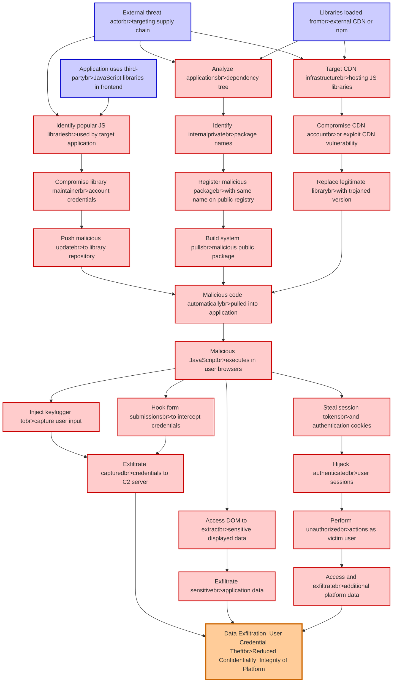

# Attack Tree: Supply Chain Attack

**Threat ID**: T006
**Statement**: A external threat actor who compromises third-party JavaScript libraries used in the frontend, can inject malicious code into the application, which leads to data exfiltration and user credential theft, resulting in reduced confidentiality and integrity of the entire platform.

## Attack Tree Diagram

## MITRE ATT&CK Mapping

This attack tree has been mapped to MITRE ATT&CK techniques:

### Register malicious packagebr>with same name on public registry

- **Technique**: [T1112](https://attack.mitre.org/techniques/T1112/) - Modify Registry
- **Tactic**: Defense Evasion, Persistence
- **Similarity Score**: 58.82%
- **Mitigations (1):**
  - 🛡️ **Restrict Registry Permissions**
    Restricting registry permissions involves configuring access control settings for sensitive registry keys and hives to e...

### Identify popular JS librariesbr>used by target application

- **Technique**: [T1059.007](https://attack.mitre.org/techniques/T1059/007/) - JavaScript
- **Tactic**: Execution
- **Similarity Score**: 53.71%
- **Mitigations (4):**
  - 🛡️ **Behavior Prevention on Endpoint**
    Behavior Prevention on Endpoint refers to the use of technologies and strategies to detect and block potentially malicio...
  - 🛡️ **Execution Prevention**
    Prevent the execution of unauthorized or malicious code on systems by implementing application control, script blocking,...
  - 🛡️ **Disable or Remove Feature or Program**
    Disable or remove unnecessary and potentially vulnerable software, features, or services to reduce the attack surface an...
  - *1 more mitigation(s) available*

### Malicious code automaticallybr>pulled into application

- **Technique**: [T1574.014](https://attack.mitre.org/techniques/T1574/014/) - AppDomainManager
- **Tactic**: Persistence, Privilege Escalation, Defense Evasion
- **Similarity Score**: 65.22%
- **Mitigations (1):**
  - 🛡️ **Restrict File and Directory Permissions**
    Restricting file and directory permissions involves setting access controls at the file system level to limit which user...

### Replace legitimate librarybr>with trojaned version

- **Technique**: [T1204.005](https://attack.mitre.org/techniques/T1204/005/) - Malicious Library
- **Tactic**: Execution
- **Similarity Score**: 65.76%
- **Mitigations (3):**
  - 🛡️ **Limit Software Installation**
    Prevent users or groups from installing unauthorized or unapproved software to reduce the risk of introducing malicious ...
  - 🛡️ **Network Intrusion Prevention**
    Use intrusion detection signatures to block traffic at network boundaries.
  - 🛡️ **User Training**
    User Training involves educating employees and contractors on recognizing, reporting, and preventing cyber threats that ...

### Malicious JavaScriptbr>executes in user browsers

- **Technique**: [T1170](https://attack.mitre.org/techniques/T1170/) - Mshta
- **Tactic**: Defense Evasion, Execution
- **Similarity Score**: 69.50%

### Compromise CDN accountbr>or exploit CDN vulnerability

- **Technique**: [T1108](https://attack.mitre.org/techniques/T1108/) - Redundant Access
- **Tactic**: Defense Evasion, Persistence
- **Similarity Score**: 50.29%

### Access DOM to extractbr>sensitive displayed data

- **Technique**: [T1027.006](https://attack.mitre.org/techniques/T1027/006/) - HTML Smuggling
- **Tactic**: Defense Evasion
- **Similarity Score**: 53.59%
- **Mitigations (1):**
  - 🛡️ **Application Isolation and Sandboxing**
    Application Isolation and Sandboxing refers to the technique of restricting the execution of code to a controlled and is...

### Identify internalprivatebr>package names

- **Technique**: [T1518](https://attack.mitre.org/techniques/T1518/) - Software Discovery
- **Tactic**: Discovery
- **Similarity Score**: 57.24%

### Hook form submissionsbr>to intercept credentials

- **Technique**: [T1056](https://attack.mitre.org/techniques/T1056/) - Input Capture
- **Tactic**: Collection, Credential Access
- **Similarity Score**: 80.68%

### Exfiltrate sensitivebr>application data

- **Technique**: [T1074.001](https://attack.mitre.org/techniques/T1074/001/) - Local Data Staging
- **Tactic**: Collection
- **Similarity Score**: 75.15%

### Perform unauthorizedbr>actions as victim user

- **Technique**: [T1088](https://attack.mitre.org/techniques/T1088/) - Bypass User Account Control
- **Tactic**: Defense Evasion, Privilege Escalation
- **Similarity Score**: 62.15%

### Inject keylogger tobr>capture user input

- **Technique**: [T1056.001](https://attack.mitre.org/techniques/T1056/001/) - Keylogging
- **Tactic**: Collection, Credential Access
- **Similarity Score**: 81.45%

### Exfiltrate capturedbr>credentials to C2 server

- **Technique**: [T1081](https://attack.mitre.org/techniques/T1081/) - Credentials in Files
- **Tactic**: Credential Access
- **Similarity Score**: 66.66%

### Compromise library maintainerbr>account credentials

- **Technique**: [T1078.003](https://attack.mitre.org/techniques/T1078/003/) - Local Accounts
- **Tactic**: Defense Evasion, Persistence, Privilege Escalation, Initial Access
- **Similarity Score**: 73.90%
- **Mitigations (4):**
  - 🛡️ **Privileged Account Management**
    Privileged Account Management focuses on implementing policies, controls, and tools to securely manage privileged accoun...
  - 🛡️ **Multi-factor Authentication**
    Multi-Factor Authentication (MFA) enhances security by requiring users to provide at least two forms of verification to ...
  - 🛡️ **Password Policies**
    Set and enforce secure password policies for accounts to reduce the likelihood of unauthorized access. Strong password p...
  - *1 more mitigation(s) available*

### Steal session tokensbr>and authentication cookies

- **Technique**: [T1539](https://attack.mitre.org/techniques/T1539/) - Steal Web Session Cookie
- **Tactic**: Credential Access
- **Similarity Score**: 82.67%
- **Mitigations (6):**
  - 🛡️ **Audit**
    Auditing is the process of recording activity and systematically reviewing and analyzing the activity and system configu...
  - 🛡️ **Software Configuration**
    Software configuration refers to making security-focused adjustments to the settings of applications, middleware, databa...
  - 🛡️ **Restrict Web-Based Content**
    Restricting web-based content involves enforcing policies and technologies that limit access to potentially malicious we...
  - *3 more mitigation(s) available*

### Build system pullsbr>malicious public package

- **Technique**: [T1195.001](https://attack.mitre.org/techniques/T1195/001/) - Compromise Software Dependencies and Development Tools
- **Tactic**: Initial Access
- **Similarity Score**: 65.91%
- **Mitigations (4):**
  - 🛡️ **Limit Software Installation**
    Prevent users or groups from installing unauthorized or unapproved software to reduce the risk of introducing malicious ...
  - 🛡️ **Vulnerability Scanning**
    Vulnerability scanning involves the automated or manual assessment of systems, applications, and networks to identify mi...
  - 🛡️ **Update Software**
    Software updates ensure systems are protected against known vulnerabilities by applying patches and upgrades provided by...
  - *1 more mitigation(s) available*

### Application uses third-partybr>JavaScript libraries in frontend

- **Technique**: [T1059.007](https://attack.mitre.org/techniques/T1059/007/) - JavaScript
- **Tactic**: Execution
- **Similarity Score**: 69.49%
- **Mitigations (4):**
  - 🛡️ **Behavior Prevention on Endpoint**
    Behavior Prevention on Endpoint refers to the use of technologies and strategies to detect and block potentially malicio...
  - 🛡️ **Execution Prevention**
    Prevent the execution of unauthorized or malicious code on systems by implementing application control, script blocking,...
  - 🛡️ **Disable or Remove Feature or Program**
    Disable or remove unnecessary and potentially vulnerable software, features, or services to reduce the attack surface an...
  - *1 more mitigation(s) available*

### Access and exfiltratebr>additional platform data

- **Technique**: [T1052](https://attack.mitre.org/techniques/T1052/) - Exfiltration Over Physical Medium
- **Tactic**: Exfiltration
- **Similarity Score**: 75.65%
- **Mitigations (3):**
  - 🛡️ **Data Loss Prevention**
    Data Loss Prevention (DLP) involves implementing strategies and technologies to identify, categorize, monitor, and contr...
  - 🛡️ **Limit Hardware Installation**
    Prevent unauthorized users or groups from installing or using hardware, such as external drives, peripheral devices, or ...
  - 🛡️ **Disable or Remove Feature or Program**
    Disable or remove unnecessary and potentially vulnerable software, features, or services to reduce the attack surface an...

### Hijack authenticatedbr>user sessions

- **Technique**: [T1563](https://attack.mitre.org/techniques/T1563/) - Remote Service Session Hijacking
- **Tactic**: Lateral Movement
- **Similarity Score**: 70.89%
- **Mitigations (5):**
  - 🛡️ **Network Segmentation**
    Network segmentation involves dividing a network into smaller, isolated segments to control and limit the flow of traffi...
  - 🛡️ **Disable or Remove Feature or Program**
    Disable or remove unnecessary and potentially vulnerable software, features, or services to reduce the attack surface an...
  - 🛡️ **Password Policies**
    Set and enforce secure password policies for accounts to reduce the likelihood of unauthorized access. Strong password p...
  - *2 more mitigation(s) available*

### Target CDN infrastructurebr>hosting JS libraries

- **Technique**: [T1059.007](https://attack.mitre.org/techniques/T1059/007/) - JavaScript
- **Tactic**: Execution
- **Similarity Score**: 52.64%
- **Mitigations (4):**
  - 🛡️ **Behavior Prevention on Endpoint**
    Behavior Prevention on Endpoint refers to the use of technologies and strategies to detect and block potentially malicio...
  - 🛡️ **Execution Prevention**
    Prevent the execution of unauthorized or malicious code on systems by implementing application control, script blocking,...
  - 🛡️ **Disable or Remove Feature or Program**
    Disable or remove unnecessary and potentially vulnerable software, features, or services to reduce the attack surface an...
  - *1 more mitigation(s) available*

### Analyze applicationsbr>dependency tree

- **Technique**: [T1518](https://attack.mitre.org/techniques/T1518/) - Software Discovery
- **Tactic**: Discovery
- **Similarity Score**: 58.50%

### Push malicious updatebr>to library repository

- **Technique**: [T1195.001](https://attack.mitre.org/techniques/T1195/001/) - Compromise Software Dependencies and Development Tools
- **Tactic**: Initial Access
- **Similarity Score**: 54.30%
- **Mitigations (4):**
  - 🛡️ **Limit Software Installation**
    Prevent users or groups from installing unauthorized or unapproved software to reduce the risk of introducing malicious ...
  - 🛡️ **Vulnerability Scanning**
    Vulnerability scanning involves the automated or manual assessment of systems, applications, and networks to identify mi...
  - 🛡️ **Update Software**
    Software updates ensure systems are protected against known vulnerabilities by applying patches and upgrades provided by...
  - *1 more mitigation(s) available*

### Libraries loaded frombr>external CDN or npm

- **Technique**: [T1129](https://attack.mitre.org/techniques/T1129/) - Shared Modules
- **Tactic**: Execution
- **Similarity Score**: 64.17%
- **Mitigations (1):**
  - 🛡️ **Execution Prevention**
    Prevent the execution of unauthorized or malicious code on systems by implementing application control, script blocking,...

### External threat actorbr>targeting supply chain

- **Technique**: [T1584.005](https://attack.mitre.org/techniques/T1584/005/) - Botnet
- **Tactic**: Resource Development
- **Similarity Score**: 57.80%
- **Mitigations (1):**
  - 🛡️ **Pre-compromise**
    Pre-compromise mitigations involve proactive measures and defenses implemented to prevent adversaries from successfully ...

### Data Exfiltration  User Credential Theftbr>Reduced Confidentiality  Integrity of Platform

- **Technique**: [T1020](https://attack.mitre.org/techniques/T1020/) - Automated Exfiltration
- **Tactic**: Exfiltration
- **Similarity Score**: 59.85%

*Total technique mappings: 25 | Mitigations found: 46*

## Attack Path Analysis

Review this attack tree to:
1. Identify critical attack paths
2. Implement appropriate security controls
3. Monitor for indicators
4. Develop incident response procedures

---
*Generated by ThreatForest*
