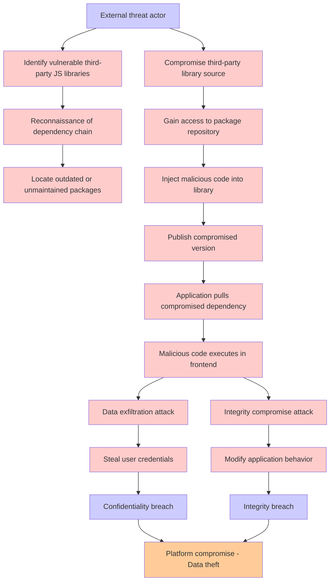

# Attack Tree: Supply Chain Attack

**Threat ID**: T006
**Statement**: T006 - Supply Chain Attack

## Attack Tree Diagram

## MITRE ATT&CK Mapping

This attack tree has been mapped to MITRE ATT&CK techniques:

### Integrity compromise attack

- **Technique**: [T1565.001](https://attack.mitre.org/techniques/T1565/001/) - Stored Data Manipulation
- **Tactic**: Impact
- **Confidence Score**: 1362.49
- **Mitigations (3):**
  - 🛡️ **Restrict File and Directory Permissions**
    Restricting file and directory permissions involves setting access controls at the file system level to limit which user...
  - 🛡️ **Remote Data Storage**
    Remote Data Storage focuses on moving critical data, such as security logs and sensitive files, to secure, off-host loca...
  - 🛡️ **Encrypt Sensitive Information**
    Protect sensitive information at rest, in transit, and during processing by using strong encryption algorithms. Encrypti...

### Identify vulnerable third-party JS libraries

- **Technique**: [AT1007](https://attack.mitre.org/techniques/AT1007/) - Create or Modify AWS Service
- **Confidence Score**: 1167.33

### Gain access to package repository

- **Technique**: [T1213.003](https://attack.mitre.org/techniques/T1213/003/) - Code Repositories
- **Tactic**: Collection
- **Confidence Score**: 1388.75
- **Mitigations (4):**
  - 🛡️ **User Training**
    User Training involves educating employees and contractors on recognizing, reporting, and preventing cyber threats that ...
  - 🛡️ **Audit**
    Auditing is the process of recording activity and systematically reviewing and analyzing the activity and system configu...
  - 🛡️ **User Account Management**
    User Account Management involves implementing and enforcing policies for the lifecycle of user accounts, including creat...
  - *1 more mitigation(s) available*

### Locate outdated or unmaintained packages

- **Technique**: [AT1007](https://attack.mitre.org/techniques/AT1007/) - Create or Modify AWS Service
- **Confidence Score**: 1152.19

### Malicious code executes in frontend

- **Technique**: [T1190](https://attack.mitre.org/techniques/T1190/) - Exploit Public-Facing Application
- **Tactic**: Initial Access
- **Confidence Score**: 1336.28
- **Mitigations (8):**
  - 🛡️ **Application Isolation and Sandboxing**
    Application Isolation and Sandboxing refers to the technique of restricting the execution of code to a controlled and is...
  - 🛡️ **Filter Network Traffic**
    Employ network appliances and endpoint software to filter ingress, egress, and lateral network traffic. This includes pr...
  - 🛡️ **Network Segmentation**
    Network segmentation involves dividing a network into smaller, isolated segments to control and limit the flow of traffi...
  - *5 more mitigation(s) available*

### Platform compromise - Data theft

- **Technique**: [T1190.A007](https://attack.mitre.org/techniques/T1190/A007/) - EC2 AMI
- **Tactic**: Initial Access
- **Confidence Score**: 1006.19

### Publish compromised version

- **Technique**: [AT1007](https://attack.mitre.org/techniques/AT1007/) - Create or Modify AWS Service
- **Confidence Score**: 937.34

### Compromise third-party library source

- **Technique**: [AT1007](https://attack.mitre.org/techniques/AT1007/) - Create or Modify AWS Service
- **Confidence Score**: 1227.41

### Data exfiltration attack

- **Technique**: [T1048](https://attack.mitre.org/techniques/T1048/) - Exfiltration Over Alternative Protocol
- **Tactic**: Exfiltration
- **Confidence Score**: 1304.05
- **Mitigations (6):**
  - 🛡️ **Network Segmentation**
    Network segmentation involves dividing a network into smaller, isolated segments to control and limit the flow of traffi...
  - 🛡️ **Data Loss Prevention**
    Data Loss Prevention (DLP) involves implementing strategies and technologies to identify, categorize, monitor, and contr...
  - 🛡️ **Filter Network Traffic**
    Employ network appliances and endpoint software to filter ingress, egress, and lateral network traffic. This includes pr...
  - *3 more mitigation(s) available*

### Steal user credentials

- **Technique**: [T1070.008](https://attack.mitre.org/techniques/T1070/008/) - Clear Mailbox Data
- **Tactic**: Defense Evasion
- **Confidence Score**: 1336.36
- **Mitigations (3):**
  - 🛡️ **Restrict File and Directory Permissions**
    Restricting file and directory permissions involves setting access controls at the file system level to limit which user...
  - 🛡️ **Audit**
    Auditing is the process of recording activity and systematically reviewing and analyzing the activity and system configu...
  - 🛡️ **Remote Data Storage**
    Remote Data Storage focuses on moving critical data, such as security logs and sensitive files, to secure, off-host loca...

### Integrity breach

- **Technique**: [T1490](https://attack.mitre.org/techniques/T1490/) - Inhibit System Recovery
- **Tactic**: Impact
- **Confidence Score**: 1274.86
- **Mitigations (4):**
  - 🛡️ **Execution Prevention**
    Prevent the execution of unauthorized or malicious code on systems by implementing application control, script blocking,...
  - 🛡️ **Operating System Configuration**
    Operating System Configuration involves adjusting system settings and hardening the default configurations of an operati...
  - 🛡️ **User Account Management**
    User Account Management involves implementing and enforcing policies for the lifecycle of user accounts, including creat...
  - *1 more mitigation(s) available*

### Inject malicious code into library

- **Technique**: [T1059](https://attack.mitre.org/techniques/T1059/) - Command and Scripting Interpreter
- **Tactic**: Execution
- **Confidence Score**: 1579.57
- **Mitigations (9):**
  - 🛡️ **Limit Software Installation**
    Prevent users or groups from installing unauthorized or unapproved software to reduce the risk of introducing malicious ...
  - 🛡️ **Code Signing**
    Code Signing is a security process that ensures the authenticity and integrity of software by digitally signing executab...
  - 🛡️ **Disable or Remove Feature or Program**
    Disable or remove unnecessary and potentially vulnerable software, features, or services to reduce the attack surface an...
  - *6 more mitigation(s) available*

### Application pulls compromised dependency

- **Technique**: [T1190.A007](https://attack.mitre.org/techniques/T1190/A007/) - EC2 AMI
- **Tactic**: Initial Access
- **Confidence Score**: 1194.87

### Confidentiality breach

- **Technique**: [T1490](https://attack.mitre.org/techniques/T1490/) - Inhibit System Recovery
- **Tactic**: Impact
- **Confidence Score**: 1286.83
- **Mitigations (4):**
  - 🛡️ **Execution Prevention**
    Prevent the execution of unauthorized or malicious code on systems by implementing application control, script blocking,...
  - 🛡️ **Operating System Configuration**
    Operating System Configuration involves adjusting system settings and hardening the default configurations of an operati...
  - 🛡️ **User Account Management**
    User Account Management involves implementing and enforcing policies for the lifecycle of user accounts, including creat...
  - *1 more mitigation(s) available*

### Modify application behavior

- **Technique**: [AT1667](https://attack.mitre.org/techniques/AT1667/) - Application API Abuse
- **Tactic**: Persistence
- **Confidence Score**: 1414.61

### Reconnaissance of dependency chain

- **Technique**: [T1190.A007](https://attack.mitre.org/techniques/T1190/A007/) - EC2 AMI
- **Tactic**: Initial Access
- **Confidence Score**: 1080.65

### External threat actor

- **Technique**: [T1654](https://attack.mitre.org/techniques/T1654/) - Log Enumeration
- **Tactic**: Discovery
- **Confidence Score**: 1017.75
- **Mitigations (1):**
  - 🛡️ **User Account Management**
    User Account Management involves implementing and enforcing policies for the lifecycle of user accounts, including creat...

*Total technique mappings: 17 | Mitigations found: 42*

## Attack Path Analysis

Review this attack tree to:
1. Identify critical attack paths
2. Implement appropriate security controls
3. Monitor for indicators
4. Develop incident response procedures

---
*Generated by ThreatForest*
