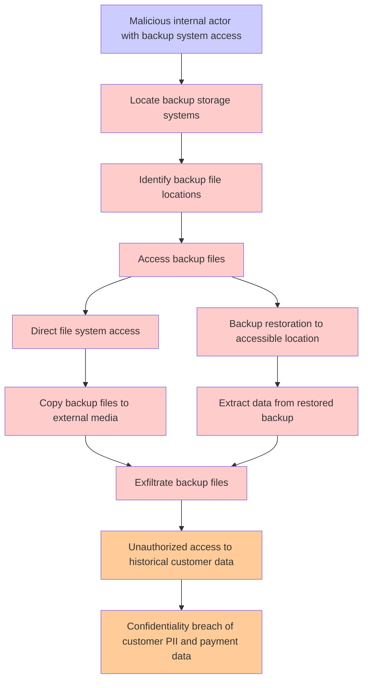

# Attack Tree: Database Backup Exposure

**Threat ID**: T007
**Statement**: T007 - Database Backup Exposure

## Attack Tree Diagram

## MITRE ATT&CK Mapping

This attack tree has been mapped to MITRE ATT&CK techniques:

### Backup restoration to accessible location

- **Technique**: [T1490](https://attack.mitre.org/techniques/T1490/) - Inhibit System Recovery
- **Tactic**: Impact
- **Confidence Score**: 1393.72
- **Mitigations (4):**
  - 🛡️ **Execution Prevention**
    Prevent the execution of unauthorized or malicious code on systems by implementing application control, script blocking,...
  - 🛡️ **Operating System Configuration**
    Operating System Configuration involves adjusting system settings and hardening the default configurations of an operati...
  - 🛡️ **User Account Management**
    User Account Management involves implementing and enforcing policies for the lifecycle of user accounts, including creat...
  - *1 more mitigation(s) available*

### Direct file system access

- **Technique**: [T1530.A003](https://attack.mitre.org/techniques/T1530/A003/) - EFS
- **Tactic**: Collection
- **Confidence Score**: 1356.94

### Extract data from restored backup

- **Technique**: [T1485](https://attack.mitre.org/techniques/T1485/) - Data Destruction
- **Tactic**: Impact
- **Confidence Score**: 1411.58
- **Mitigations (3):**
  - 🛡️ **Multi-factor Authentication**
    Multi-Factor Authentication (MFA) enhances security by requiring users to provide at least two forms of verification to ...
  - 🛡️ **Data Backup**
    Data Backup involves taking and securely storing backups of data from end-user systems and critical servers. It ensures ...
  - 🛡️ **User Account Management**
    User Account Management involves implementing and enforcing policies for the lifecycle of user accounts, including creat...

### Locate backup storage systems

- **Technique**: [T1530.A002](https://attack.mitre.org/techniques/T1530/A002/) - S3 Glacier
- **Tactic**: Collection
- **Confidence Score**: 1269.75

### Confidentiality breach of customer PII and payment data

- **Technique**: [T1490](https://attack.mitre.org/techniques/T1490/) - Inhibit System Recovery
- **Tactic**: Impact
- **Confidence Score**: 1452.98
- **Mitigations (4):**
  - 🛡️ **Execution Prevention**
    Prevent the execution of unauthorized or malicious code on systems by implementing application control, script blocking,...
  - 🛡️ **Operating System Configuration**
    Operating System Configuration involves adjusting system settings and hardening the default configurations of an operati...
  - 🛡️ **User Account Management**
    User Account Management involves implementing and enforcing policies for the lifecycle of user accounts, including creat...
  - *1 more mitigation(s) available*

### Unauthorized access to historical customer data

- **Technique**: [T1490](https://attack.mitre.org/techniques/T1490/) - Inhibit System Recovery
- **Tactic**: Impact
- **Confidence Score**: 1161.20
- **Mitigations (4):**
  - 🛡️ **Execution Prevention**
    Prevent the execution of unauthorized or malicious code on systems by implementing application control, script blocking,...
  - 🛡️ **Operating System Configuration**
    Operating System Configuration involves adjusting system settings and hardening the default configurations of an operati...
  - 🛡️ **User Account Management**
    User Account Management involves implementing and enforcing policies for the lifecycle of user accounts, including creat...
  - *1 more mitigation(s) available*

### Access backup files

- **Technique**: [T1530.A004](https://attack.mitre.org/techniques/T1530/A004/) - EBS
- **Tactic**: Collection
- **Confidence Score**: 1077.41

### Copy backup files to external media

- **Technique**: [T1530.A004](https://attack.mitre.org/techniques/T1530/A004/) - EBS
- **Tactic**: Collection
- **Confidence Score**: 1387.71

### Malicious internal actor with backup system access

- **Technique**: [T1530.A004](https://attack.mitre.org/techniques/T1530/A004/) - EBS
- **Tactic**: Collection
- **Confidence Score**: 1185.24

### Identify backup file locations

- **Technique**: [T1530.A004](https://attack.mitre.org/techniques/T1530/A004/) - EBS
- **Tactic**: Collection
- **Confidence Score**: 1439.69

### Exfiltrate backup files

- **Technique**: [T1530.A004](https://attack.mitre.org/techniques/T1530/A004/) - EBS
- **Tactic**: Collection
- **Confidence Score**: 1107.64

*Total technique mappings: 11 | Mitigations found: 15*

## Attack Path Analysis

Review this attack tree to:
1. Identify critical attack paths
2. Implement appropriate security controls
3. Monitor for indicators
4. Develop incident response procedures

---
*Generated by ThreatForest*
