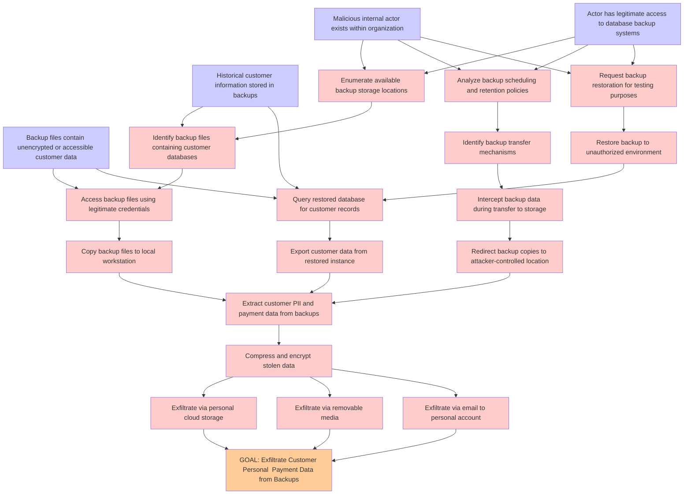

# Attack Tree: Database Backup Exposure

**Threat ID**: T007
**Statement**: A malicious internal actor with access to database backup systems, can exfiltrate backup files containing customer data, which leads to unauthorized access to historical customer information, resulting in reduced confidentiality of customer personal and payment data.

## Attack Tree Diagram

## MITRE ATT&CK Mapping

This attack tree has been mapped to MITRE ATT&CK techniques:

### Analyze backup scheduling and retention policies

- **Technique**: [T1518.002](https://attack.mitre.org/techniques/T1518/002/) - Backup Software Discovery
- **Tactic**: Discovery
- **Similarity Score**: 55.59%

### Request backup restoration for testing purposes

- **Technique**: [T1490](https://attack.mitre.org/techniques/T1490/) - Inhibit System Recovery
- **Tactic**: Impact
- **Similarity Score**: 63.35%
- **Mitigations (4):**
  - 🛡️ **Execution Prevention**
    Prevent the execution of unauthorized or malicious code on systems by implementing application control, script blocking,...
  - 🛡️ **Operating System Configuration**
    Operating System Configuration involves adjusting system settings and hardening the default configurations of an operati...
  - 🛡️ **User Account Management**
    User Account Management involves implementing and enforcing policies for the lifecycle of user accounts, including creat...
  - *1 more mitigation(s) available*

### Query restored database for customer records

- **Technique**: [T1003.003](https://attack.mitre.org/techniques/T1003/003/) - NTDS
- **Tactic**: Credential Access
- **Similarity Score**: 51.85%
- **Mitigations (4):**
  - 🛡️ **Password Policies**
    Set and enforce secure password policies for accounts to reduce the likelihood of unauthorized access. Strong password p...
  - 🛡️ **Privileged Account Management**
    Privileged Account Management focuses on implementing policies, controls, and tools to securely manage privileged accoun...
  - 🛡️ **User Training**
    User Training involves educating employees and contractors on recognizing, reporting, and preventing cyber threats that ...
  - *1 more mitigation(s) available*

### Restore backup to unauthorized environment

- **Technique**: [T1490](https://attack.mitre.org/techniques/T1490/) - Inhibit System Recovery
- **Tactic**: Impact
- **Similarity Score**: 63.78%
- **Mitigations (4):**
  - 🛡️ **Execution Prevention**
    Prevent the execution of unauthorized or malicious code on systems by implementing application control, script blocking,...
  - 🛡️ **Operating System Configuration**
    Operating System Configuration involves adjusting system settings and hardening the default configurations of an operati...
  - 🛡️ **User Account Management**
    User Account Management involves implementing and enforcing policies for the lifecycle of user accounts, including creat...
  - *1 more mitigation(s) available*

### Actor has legitimate access to database backup systems

- **Technique**: [T1074.001](https://attack.mitre.org/techniques/T1074/001/) - Local Data Staging
- **Tactic**: Collection
- **Similarity Score**: 65.68%

### Historical customer information stored in backups

- **Technique**: [T1213.006](https://attack.mitre.org/techniques/T1213/006/) - Databases
- **Tactic**: Collection
- **Similarity Score**: 57.34%
- **Mitigations (5):**
  - 🛡️ **User Training**
    User Training involves educating employees and contractors on recognizing, reporting, and preventing cyber threats that ...
  - 🛡️ **Encrypt Sensitive Information**
    Protect sensitive information at rest, in transit, and during processing by using strong encryption algorithms. Encrypti...
  - 🛡️ **Software Configuration**
    Software configuration refers to making security-focused adjustments to the settings of applications, middleware, databa...
  - *2 more mitigation(s) available*

### Extract customer PII and payment data from backups

- **Technique**: [T1119](https://attack.mitre.org/techniques/T1119/) - Automated Collection
- **Tactic**: Collection
- **Similarity Score**: 61.83%
- **Mitigations (2):**
  - 🛡️ **Remote Data Storage**
    Remote Data Storage focuses on moving critical data, such as security logs and sensitive files, to secure, off-host loca...
  - 🛡️ **Encrypt Sensitive Information**
    Protect sensitive information at rest, in transit, and during processing by using strong encryption algorithms. Encrypti...

### Compress and encrypt stolen data

- **Technique**: [T1560.003](https://attack.mitre.org/techniques/T1560/003/) - Archive via Custom Method
- **Tactic**: Collection
- **Similarity Score**: 87.53%

### Enumerate available backup storage locations

- **Technique**: [T1005](https://attack.mitre.org/techniques/T1005/) - Data from Local System
- **Tactic**: Collection
- **Similarity Score**: 73.64%
- **Mitigations (1):**
  - 🛡️ **Data Loss Prevention**
    Data Loss Prevention (DLP) involves implementing strategies and technologies to identify, categorize, monitor, and contr...

### Redirect backup copies to attacker-controlled location

- **Technique**: [T1074.001](https://attack.mitre.org/techniques/T1074/001/) - Local Data Staging
- **Tactic**: Collection
- **Similarity Score**: 74.26%

### Identify backup transfer mechanisms

- **Technique**: [T1074.001](https://attack.mitre.org/techniques/T1074/001/) - Local Data Staging
- **Tactic**: Collection
- **Similarity Score**: 64.76%

### Exfiltrate via personal cloud storage

- **Technique**: [T1567.002](https://attack.mitre.org/techniques/T1567/002/) - Exfiltration to Cloud Storage
- **Tactic**: Exfiltration
- **Similarity Score**: 85.61%
- **Mitigations (1):**
  - 🛡️ **Restrict Web-Based Content**
    Restricting web-based content involves enforcing policies and technologies that limit access to potentially malicious we...

### Backup files contain unencrypted or accessible customer data

- **Technique**: [T1560.001](https://attack.mitre.org/techniques/T1560/001/) - Archive via Utility
- **Tactic**: Collection
- **Similarity Score**: 76.40%
- **Mitigations (1):**
  - 🛡️ **Audit**
    Auditing is the process of recording activity and systematically reviewing and analyzing the activity and system configu...

### Exfiltrate via email to personal account

- **Technique**: [T1048](https://attack.mitre.org/techniques/T1048/) - Exfiltration Over Alternative Protocol
- **Tactic**: Exfiltration
- **Similarity Score**: 73.30%
- **Mitigations (6):**
  - 🛡️ **Network Segmentation**
    Network segmentation involves dividing a network into smaller, isolated segments to control and limit the flow of traffi...
  - 🛡️ **Data Loss Prevention**
    Data Loss Prevention (DLP) involves implementing strategies and technologies to identify, categorize, monitor, and contr...
  - 🛡️ **Filter Network Traffic**
    Employ network appliances and endpoint software to filter ingress, egress, and lateral network traffic. This includes pr...
  - *3 more mitigation(s) available*

### Copy backup files to local workstation

- **Technique**: [T1570](https://attack.mitre.org/techniques/T1570/) - Lateral Tool Transfer
- **Tactic**: Lateral Movement
- **Similarity Score**: 67.77%
- **Mitigations (2):**
  - 🛡️ **Filter Network Traffic**
    Employ network appliances and endpoint software to filter ingress, egress, and lateral network traffic. This includes pr...
  - 🛡️ **Network Intrusion Prevention**
    Use intrusion detection signatures to block traffic at network boundaries.

### GOAL: Exfiltrate Customer Personal  Payment Data from Backups

- **Technique**: [T1074.001](https://attack.mitre.org/techniques/T1074/001/) - Local Data Staging
- **Tactic**: Collection
- **Similarity Score**: 68.56%

### Identify backup files containing customer databases

- **Technique**: [T1005](https://attack.mitre.org/techniques/T1005/) - Data from Local System
- **Tactic**: Collection
- **Similarity Score**: 70.87%
- **Mitigations (1):**
  - 🛡️ **Data Loss Prevention**
    Data Loss Prevention (DLP) involves implementing strategies and technologies to identify, categorize, monitor, and contr...

### Export customer data from restored instance

- **Technique**: [T1074.001](https://attack.mitre.org/techniques/T1074/001/) - Local Data Staging
- **Tactic**: Collection
- **Similarity Score**: 56.42%

### Intercept backup data during transfer to storage

- **Technique**: [T1074.001](https://attack.mitre.org/techniques/T1074/001/) - Local Data Staging
- **Tactic**: Collection
- **Similarity Score**: 78.61%

### Malicious internal actor exists within organization

- **Technique**: [T1199](https://attack.mitre.org/techniques/T1199/) - Trusted Relationship
- **Tactic**: Initial Access
- **Similarity Score**: 57.54%
- **Mitigations (3):**
  - 🛡️ **Multi-factor Authentication**
    Multi-Factor Authentication (MFA) enhances security by requiring users to provide at least two forms of verification to ...
  - 🛡️ **User Account Management**
    User Account Management involves implementing and enforcing policies for the lifecycle of user accounts, including creat...
  - 🛡️ **Network Segmentation**
    Network segmentation involves dividing a network into smaller, isolated segments to control and limit the flow of traffi...

### Access backup files using legitimate credentials

- **Technique**: [T1552.001](https://attack.mitre.org/techniques/T1552/001/) - Credentials In Files
- **Tactic**: Credential Access
- **Similarity Score**: 62.74%
- **Mitigations (4):**
  - 🛡️ **User Training**
    User Training involves educating employees and contractors on recognizing, reporting, and preventing cyber threats that ...
  - 🛡️ **Audit**
    Auditing is the process of recording activity and systematically reviewing and analyzing the activity and system configu...
  - 🛡️ **Restrict File and Directory Permissions**
    Restricting file and directory permissions involves setting access controls at the file system level to limit which user...
  - *1 more mitigation(s) available*

### Exfiltrate via removable media

- **Technique**: [T1052](https://attack.mitre.org/techniques/T1052/) - Exfiltration Over Physical Medium
- **Tactic**: Exfiltration
- **Similarity Score**: 83.32%
- **Mitigations (3):**
  - 🛡️ **Data Loss Prevention**
    Data Loss Prevention (DLP) involves implementing strategies and technologies to identify, categorize, monitor, and contr...
  - 🛡️ **Limit Hardware Installation**
    Prevent unauthorized users or groups from installing or using hardware, such as external drives, peripheral devices, or ...
  - 🛡️ **Disable or Remove Feature or Program**
    Disable or remove unnecessary and potentially vulnerable software, features, or services to reduce the attack surface an...

*Total technique mappings: 22 | Mitigations found: 41*

## Attack Path Analysis

Review this attack tree to:
1. Identify critical attack paths
2. Implement appropriate security controls
3. Monitor for indicators
4. Develop incident response procedures

---
*Generated by ThreatForest*
