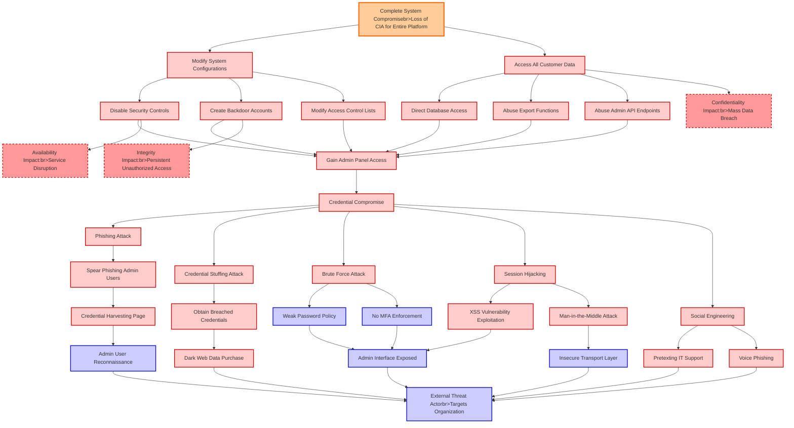

# Attack Tree: Admin Panel Compromise

**Threat ID**: T008
**Statement**: A external threat actor who gains access to administrative interfaces through credential compromise, can modify system configurations and access all customer data, which leads to complete system compromise, resulting in reduced confidentiality, integrity, and availability of the entire platform.

## Attack Tree Diagram

## MITRE ATT&CK Mapping

This attack tree has been mapped to MITRE ATT&CK techniques:

### Credential Stuffing Attack

- **Technique**: [T1110.004](https://attack.mitre.org/techniques/T1110/004/) - Credential Stuffing
- **Tactic**: Credential Access
- **Similarity Score**: 75.48%
- **Mitigations (4):**
  - 🛡️ **Account Use Policies**
    Account Use Policies help mitigate unauthorized access by configuring and enforcing rules that govern how and when accou...
  - 🛡️ **Password Policies**
    Set and enforce secure password policies for accounts to reduce the likelihood of unauthorized access. Strong password p...
  - 🛡️ **User Account Management**
    User Account Management involves implementing and enforcing policies for the lifecycle of user accounts, including creat...
  - *1 more mitigation(s) available*

### Credential Harvesting Page

- **Technique**: [T1589.001](https://attack.mitre.org/techniques/T1589/001/) - Credentials
- **Tactic**: Reconnaissance
- **Similarity Score**: 73.59%
- **Mitigations (1):**
  - 🛡️ **Pre-compromise**
    Pre-compromise mitigations involve proactive measures and defenses implemented to prevent adversaries from successfully ...

### Direct Database Access

- **Technique**: [T1213.006](https://attack.mitre.org/techniques/T1213/006/) - Databases
- **Tactic**: Collection
- **Similarity Score**: 54.48%
- **Mitigations (5):**
  - 🛡️ **User Training**
    User Training involves educating employees and contractors on recognizing, reporting, and preventing cyber threats that ...
  - 🛡️ **Encrypt Sensitive Information**
    Protect sensitive information at rest, in transit, and during processing by using strong encryption algorithms. Encrypti...
  - 🛡️ **Software Configuration**
    Software configuration refers to making security-focused adjustments to the settings of applications, middleware, databa...
  - *2 more mitigation(s) available*

### Phishing Attack

- **Technique**: [T1566](https://attack.mitre.org/techniques/T1566/) - Phishing
- **Tactic**: Initial Access
- **Similarity Score**: 80.14%
- **Mitigations (6):**
  - 🛡️ **Audit**
    Auditing is the process of recording activity and systematically reviewing and analyzing the activity and system configu...
  - 🛡️ **Network Intrusion Prevention**
    Use intrusion detection signatures to block traffic at network boundaries.
  - 🛡️ **Software Configuration**
    Software configuration refers to making security-focused adjustments to the settings of applications, middleware, databa...
  - *3 more mitigation(s) available*

### Credential Compromise

- **Technique**: [T1556](https://attack.mitre.org/techniques/T1556/) - Modify Authentication Process
- **Tactic**: Credential Access, Defense Evasion, Persistence
- **Similarity Score**: 78.64%
- **Mitigations (9):**
  - 🛡️ **Restrict Registry Permissions**
    Restricting registry permissions involves configuring access control settings for sensitive registry keys and hives to e...
  - 🛡️ **Multi-factor Authentication**
    Multi-Factor Authentication (MFA) enhances security by requiring users to provide at least two forms of verification to ...
  - 🛡️ **Password Policies**
    Set and enforce secure password policies for accounts to reduce the likelihood of unauthorized access. Strong password p...
  - *6 more mitigation(s) available*

### Weak Password Policy

- **Technique**: [T1174](https://attack.mitre.org/techniques/T1174/) - Password Filter DLL
- **Tactic**: Credential Access
- **Similarity Score**: 80.99%

### No MFA Enforcement

- **Technique**: [T1556.006](https://attack.mitre.org/techniques/T1556/006/) - Multi-Factor Authentication
- **Tactic**: Credential Access, Defense Evasion, Persistence
- **Similarity Score**: 79.24%
- **Mitigations (3):**
  - 🛡️ **User Account Management**
    User Account Management involves implementing and enforcing policies for the lifecycle of user accounts, including creat...
  - 🛡️ **Audit**
    Auditing is the process of recording activity and systematically reviewing and analyzing the activity and system configu...
  - 🛡️ **Multi-factor Authentication**
    Multi-Factor Authentication (MFA) enhances security by requiring users to provide at least two forms of verification to ...

### Create Backdoor Accounts

- **Technique**: [T1136](https://attack.mitre.org/techniques/T1136/) - Create Account
- **Tactic**: Persistence
- **Similarity Score**: 81.32%
- **Mitigations (4):**
  - 🛡️ **Network Segmentation**
    Network segmentation involves dividing a network into smaller, isolated segments to control and limit the flow of traffi...
  - 🛡️ **Operating System Configuration**
    Operating System Configuration involves adjusting system settings and hardening the default configurations of an operati...
  - 🛡️ **Multi-factor Authentication**
    Multi-Factor Authentication (MFA) enhances security by requiring users to provide at least two forms of verification to ...
  - *1 more mitigation(s) available*

### XSS Vulnerability Exploitation

- **Technique**: [T1059.007](https://attack.mitre.org/techniques/T1059/007/) - JavaScript
- **Tactic**: Execution
- **Similarity Score**: 51.76%
- **Mitigations (4):**
  - 🛡️ **Behavior Prevention on Endpoint**
    Behavior Prevention on Endpoint refers to the use of technologies and strategies to detect and block potentially malicio...
  - 🛡️ **Execution Prevention**
    Prevent the execution of unauthorized or malicious code on systems by implementing application control, script blocking,...
  - 🛡️ **Disable or Remove Feature or Program**
    Disable or remove unnecessary and potentially vulnerable software, features, or services to reduce the attack surface an...
  - *1 more mitigation(s) available*

### Integrity Impact:br>Persistent Unauthorized Access

- **Technique**: [T1222.002](https://attack.mitre.org/techniques/T1222/002/) - Linux and Mac File and Directory Permissions Modification
- **Tactic**: Defense Evasion
- **Similarity Score**: 63.81%
- **Mitigations (2):**
  - 🛡️ **Restrict File and Directory Permissions**
    Restricting file and directory permissions involves setting access controls at the file system level to limit which user...
  - 🛡️ **Privileged Account Management**
    Privileged Account Management focuses on implementing policies, controls, and tools to securely manage privileged accoun...

### Disable Security Controls

- **Technique**: [T1089](https://attack.mitre.org/techniques/T1089/) - Disabling Security Tools
- **Tactic**: Defense Evasion
- **Similarity Score**: 81.06%

### Spear Phishing Admin Users

- **Technique**: [T1566](https://attack.mitre.org/techniques/T1566/) - Phishing
- **Tactic**: Initial Access
- **Similarity Score**: 82.25%
- **Mitigations (6):**
  - 🛡️ **Audit**
    Auditing is the process of recording activity and systematically reviewing and analyzing the activity and system configu...
  - 🛡️ **Network Intrusion Prevention**
    Use intrusion detection signatures to block traffic at network boundaries.
  - 🛡️ **Software Configuration**
    Software configuration refers to making security-focused adjustments to the settings of applications, middleware, databa...
  - *3 more mitigation(s) available*

### Admin User Reconnaissance

- **Technique**: [T1087](https://attack.mitre.org/techniques/T1087/) - Account Discovery
- **Tactic**: Discovery
- **Similarity Score**: 69.41%
- **Mitigations (2):**
  - 🛡️ **Operating System Configuration**
    Operating System Configuration involves adjusting system settings and hardening the default configurations of an operati...
  - 🛡️ **User Account Management**
    User Account Management involves implementing and enforcing policies for the lifecycle of user accounts, including creat...

### Admin Interface Exposed

- **Technique**: [T1218.002](https://attack.mitre.org/techniques/T1218/002/) - Control Panel
- **Tactic**: Defense Evasion
- **Similarity Score**: 43.70%
- **Mitigations (2):**
  - 🛡️ **Restrict File and Directory Permissions**
    Restricting file and directory permissions involves setting access controls at the file system level to limit which user...
  - 🛡️ **Execution Prevention**
    Prevent the execution of unauthorized or malicious code on systems by implementing application control, script blocking,...

### Abuse Admin API Endpoints

- **Technique**: [T1059.009](https://attack.mitre.org/techniques/T1059/009/) - Cloud API
- **Tactic**: Execution
- **Similarity Score**: 52.89%
- **Mitigations (2):**
  - 🛡️ **Execution Prevention**
    Prevent the execution of unauthorized or malicious code on systems by implementing application control, script blocking,...
  - 🛡️ **Privileged Account Management**
    Privileged Account Management focuses on implementing policies, controls, and tools to securely manage privileged accoun...

### Modify System Configurations

- **Technique**: [T1601](https://attack.mitre.org/techniques/T1601/) - Modify System Image
- **Tactic**: Defense Evasion
- **Similarity Score**: 66.04%
- **Mitigations (6):**
  - 🛡️ **Multi-factor Authentication**
    Multi-Factor Authentication (MFA) enhances security by requiring users to provide at least two forms of verification to ...
  - 🛡️ **Password Policies**
    Set and enforce secure password policies for accounts to reduce the likelihood of unauthorized access. Strong password p...
  - 🛡️ **Credential Access Protection**
    Credential Access Protection focuses on implementing measures to prevent adversaries from obtaining credentials, such as...
  - *3 more mitigation(s) available*

### Confidentiality Impact:br>Mass Data Breach

- **Technique**: [T1565](https://attack.mitre.org/techniques/T1565/) - Data Manipulation
- **Tactic**: Impact
- **Similarity Score**: 71.22%
- **Mitigations (4):**
  - 🛡️ **Encrypt Sensitive Information**
    Protect sensitive information at rest, in transit, and during processing by using strong encryption algorithms. Encrypti...
  - 🛡️ **Remote Data Storage**
    Remote Data Storage focuses on moving critical data, such as security logs and sensitive files, to secure, off-host loca...
  - 🛡️ **Network Segmentation**
    Network segmentation involves dividing a network into smaller, isolated segments to control and limit the flow of traffi...
  - *1 more mitigation(s) available*

### Social Engineering

- **Technique**: [T1566](https://attack.mitre.org/techniques/T1566/) - Phishing
- **Tactic**: Initial Access
- **Similarity Score**: 70.29%
- **Mitigations (6):**
  - 🛡️ **Audit**
    Auditing is the process of recording activity and systematically reviewing and analyzing the activity and system configu...
  - 🛡️ **Network Intrusion Prevention**
    Use intrusion detection signatures to block traffic at network boundaries.
  - 🛡️ **Software Configuration**
    Software configuration refers to making security-focused adjustments to the settings of applications, middleware, databa...
  - *3 more mitigation(s) available*

### Voice Phishing

- **Technique**: [T1566.004](https://attack.mitre.org/techniques/T1566/004/) - Spearphishing Voice
- **Tactic**: Initial Access
- **Similarity Score**: 86.80%
- **Mitigations (1):**
  - 🛡️ **User Training**
    User Training involves educating employees and contractors on recognizing, reporting, and preventing cyber threats that ...

### Man-in-the-Middle Attack

- **Technique**: [T1102.003](https://attack.mitre.org/techniques/T1102/003/) - One-Way Communication
- **Tactic**: Command And Control
- **Similarity Score**: 53.90%
- **Mitigations (2):**
  - 🛡️ **Restrict Web-Based Content**
    Restricting web-based content involves enforcing policies and technologies that limit access to potentially malicious we...
  - 🛡️ **Network Intrusion Prevention**
    Use intrusion detection signatures to block traffic at network boundaries.

### Session Hijacking

- **Technique**: [T1563.002](https://attack.mitre.org/techniques/T1563/002/) - RDP Hijacking
- **Tactic**: Lateral Movement
- **Similarity Score**: 77.50%
- **Mitigations (7):**
  - 🛡️ **Limit Access to Resource Over Network**
    Restrict access to network resources, such as file shares, remote systems, and services, to only those users, accounts, ...
  - 🛡️ **Network Segmentation**
    Network segmentation involves dividing a network into smaller, isolated segments to control and limit the flow of traffi...
  - 🛡️ **Operating System Configuration**
    Operating System Configuration involves adjusting system settings and hardening the default configurations of an operati...
  - *4 more mitigation(s) available*

### Obtain Breached Credentials

- **Technique**: [T1110.004](https://attack.mitre.org/techniques/T1110/004/) - Credential Stuffing
- **Tactic**: Credential Access
- **Similarity Score**: 78.78%
- **Mitigations (4):**
  - 🛡️ **Account Use Policies**
    Account Use Policies help mitigate unauthorized access by configuring and enforcing rules that govern how and when accou...
  - 🛡️ **Password Policies**
    Set and enforce secure password policies for accounts to reduce the likelihood of unauthorized access. Strong password p...
  - 🛡️ **User Account Management**
    User Account Management involves implementing and enforcing policies for the lifecycle of user accounts, including creat...
  - *1 more mitigation(s) available*

### Dark Web Data Purchase

- **Technique**: [T1597.002](https://attack.mitre.org/techniques/T1597/002/) - Purchase Technical Data
- **Tactic**: Reconnaissance
- **Similarity Score**: 67.76%
- **Mitigations (1):**
  - 🛡️ **Pre-compromise**
    Pre-compromise mitigations involve proactive measures and defenses implemented to prevent adversaries from successfully ...

### Modify Access Control Lists

- **Technique**: [T1222.001](https://attack.mitre.org/techniques/T1222/001/) - Windows File and Directory Permissions Modification
- **Tactic**: Defense Evasion
- **Similarity Score**: 76.72%
- **Mitigations (2):**
  - 🛡️ **Privileged Account Management**
    Privileged Account Management focuses on implementing policies, controls, and tools to securely manage privileged accoun...
  - 🛡️ **Restrict File and Directory Permissions**
    Restricting file and directory permissions involves setting access controls at the file system level to limit which user...

### Abuse Export Functions

- **Technique**: [T1560.001](https://attack.mitre.org/techniques/T1560/001/) - Archive via Utility
- **Tactic**: Collection
- **Similarity Score**: 37.61%
- **Mitigations (1):**
  - 🛡️ **Audit**
    Auditing is the process of recording activity and systematically reviewing and analyzing the activity and system configu...

### Brute Force Attack

- **Technique**: [T1110](https://attack.mitre.org/techniques/T1110/) - Brute Force
- **Tactic**: Credential Access
- **Similarity Score**: 71.04%
- **Mitigations (4):**
  - 🛡️ **User Account Management**
    User Account Management involves implementing and enforcing policies for the lifecycle of user accounts, including creat...
  - 🛡️ **Account Use Policies**
    Account Use Policies help mitigate unauthorized access by configuring and enforcing rules that govern how and when accou...
  - 🛡️ **Multi-factor Authentication**
    Multi-Factor Authentication (MFA) enhances security by requiring users to provide at least two forms of verification to ...
  - *1 more mitigation(s) available*

### Access All Customer Data

- **Technique**: [T1530](https://attack.mitre.org/techniques/T1530/) - Data from Cloud Storage
- **Tactic**: Collection
- **Similarity Score**: 62.82%
- **Mitigations (6):**
  - 🛡️ **User Account Management**
    User Account Management involves implementing and enforcing policies for the lifecycle of user accounts, including creat...
  - 🛡️ **Encrypt Sensitive Information**
    Protect sensitive information at rest, in transit, and during processing by using strong encryption algorithms. Encrypti...
  - 🛡️ **Restrict File and Directory Permissions**
    Restricting file and directory permissions involves setting access controls at the file system level to limit which user...
  - *3 more mitigation(s) available*

### External Threat Actorbr>Targets Organization

- **Technique**: [T1591.002](https://attack.mitre.org/techniques/T1591/002/) - Business Relationships
- **Tactic**: Reconnaissance
- **Similarity Score**: 70.51%
- **Mitigations (1):**
  - 🛡️ **Pre-compromise**
    Pre-compromise mitigations involve proactive measures and defenses implemented to prevent adversaries from successfully ...

### Insecure Transport Layer

- **Technique**: [T1572](https://attack.mitre.org/techniques/T1572/) - Protocol Tunneling
- **Tactic**: Command And Control
- **Similarity Score**: 71.50%
- **Mitigations (2):**
  - 🛡️ **Filter Network Traffic**
    Employ network appliances and endpoint software to filter ingress, egress, and lateral network traffic. This includes pr...
  - 🛡️ **Network Intrusion Prevention**
    Use intrusion detection signatures to block traffic at network boundaries.

### Pretexting IT Support

- **Technique**: [T1027.010](https://attack.mitre.org/techniques/T1027/010/) - Command Obfuscation
- **Tactic**: Defense Evasion
- **Similarity Score**: 52.18%
- **Mitigations (2):**
  - 🛡️ **Behavior Prevention on Endpoint**
    Behavior Prevention on Endpoint refers to the use of technologies and strategies to detect and block potentially malicio...
  - 🛡️ **Antivirus/Antimalware**
    Antivirus/Antimalware solutions utilize signatures, heuristics, and behavioral analysis to detect, block, and remediate ...

### Complete System Compromisebr>Loss of CIA for Entire Platform

- **Technique**: [T1070](https://attack.mitre.org/techniques/T1070/) - Indicator Removal
- **Tactic**: Defense Evasion
- **Similarity Score**: 51.70%
- **Mitigations (3):**
  - 🛡️ **Encrypt Sensitive Information**
    Protect sensitive information at rest, in transit, and during processing by using strong encryption algorithms. Encrypti...
  - 🛡️ **Remote Data Storage**
    Remote Data Storage focuses on moving critical data, such as security logs and sensitive files, to secure, off-host loca...
  - 🛡️ **Restrict File and Directory Permissions**
    Restricting file and directory permissions involves setting access controls at the file system level to limit which user...

### Gain Admin Panel Access

- **Technique**: [T1088](https://attack.mitre.org/techniques/T1088/) - Bypass User Account Control
- **Tactic**: Defense Evasion, Privilege Escalation
- **Similarity Score**: 58.64%

### Availability Impact:br>Service Disruption

- **Technique**: [T1499.004](https://attack.mitre.org/techniques/T1499/004/) - Application or System Exploitation
- **Tactic**: Impact
- **Similarity Score**: 61.01%
- **Mitigations (1):**
  - 🛡️ **Filter Network Traffic**
    Employ network appliances and endpoint software to filter ingress, egress, and lateral network traffic. This includes pr...

*Total technique mappings: 33 | Mitigations found: 103*

## Attack Path Analysis

Review this attack tree to:
1. Identify critical attack paths
2. Implement appropriate security controls
3. Monitor for indicators
4. Develop incident response procedures

---
*Generated by ThreatForest*
