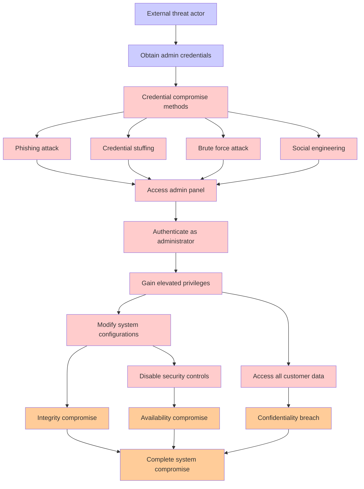

# Attack Tree: Admin Panel Compromise

**Threat ID**: T008
**Statement**: T008 - Admin Panel Compromise

## Attack Tree Diagram

## MITRE ATT&CK Mapping

This attack tree has been mapped to MITRE ATT&CK techniques:

### Brute force attack

- **Technique**: [T1201](https://attack.mitre.org/techniques/T1201/) - Password Policy Discovery
- **Tactic**: Discovery
- **Confidence Score**: 1446.44
- **Mitigations (1):**
  - 🛡️ **Password Policies**
    Set and enforce secure password policies for accounts to reduce the likelihood of unauthorized access. Strong password p...

### Modify system configurations

- **Technique**: [T1530.A004](https://attack.mitre.org/techniques/T1530/A004/) - EBS
- **Tactic**: Collection
- **Confidence Score**: 1337.81

### Integrity compromise

- **Technique**: [T1490](https://attack.mitre.org/techniques/T1490/) - Inhibit System Recovery
- **Tactic**: Impact
- **Confidence Score**: 1270.41
- **Mitigations (4):**
  - 🛡️ **Execution Prevention**
    Prevent the execution of unauthorized or malicious code on systems by implementing application control, script blocking,...
  - 🛡️ **Operating System Configuration**
    Operating System Configuration involves adjusting system settings and hardening the default configurations of an operati...
  - 🛡️ **User Account Management**
    User Account Management involves implementing and enforcing policies for the lifecycle of user accounts, including creat...
  - *1 more mitigation(s) available*

### Authenticate as administrator

- **Technique**: [AT1028](https://attack.mitre.org/techniques/AT1028/) - Create or Modify EC2 Key Pair
- **Tactic**: Persistence
- **Confidence Score**: 1335.24

### Credential stuffing

- **Technique**: [T1201](https://attack.mitre.org/techniques/T1201/) - Password Policy Discovery
- **Tactic**: Discovery
- **Confidence Score**: 1150.62
- **Mitigations (1):**
  - 🛡️ **Password Policies**
    Set and enforce secure password policies for accounts to reduce the likelihood of unauthorized access. Strong password p...

### Obtain admin credentials

- **Technique**: [T1098](https://attack.mitre.org/techniques/T1098/) - Account Manipulation
- **Tactic**: Persistence, Privilege Escalation
- **Confidence Score**: 1004.43
- **Mitigations (7):**
  - 🛡️ **Network Segmentation**
    Network segmentation involves dividing a network into smaller, isolated segments to control and limit the flow of traffi...
  - 🛡️ **Disable or Remove Feature or Program**
    Disable or remove unnecessary and potentially vulnerable software, features, or services to reduce the attack surface an...
  - 🛡️ **User Account Management**
    User Account Management involves implementing and enforcing policies for the lifecycle of user accounts, including creat...
  - *4 more mitigation(s) available*

### Credential compromise methods

- **Technique**: [AT1028](https://attack.mitre.org/techniques/AT1028/) - Create or Modify EC2 Key Pair
- **Tactic**: Persistence
- **Confidence Score**: 1274.14

### Phishing attack

- **Technique**: [T1566](https://attack.mitre.org/techniques/T1566/) - Phishing
- **Tactic**: Initial Access
- **Confidence Score**: 1088.26
- **Mitigations (6):**
  - 🛡️ **Audit**
    Auditing is the process of recording activity and systematically reviewing and analyzing the activity and system configu...
  - 🛡️ **Network Intrusion Prevention**
    Use intrusion detection signatures to block traffic at network boundaries.
  - 🛡️ **Software Configuration**
    Software configuration refers to making security-focused adjustments to the settings of applications, middleware, databa...
  - *3 more mitigation(s) available*

### Social engineering

- **Technique**: [T1566.004](https://attack.mitre.org/techniques/T1566/004/) - Spearphishing Voice
- **Tactic**: Initial Access
- **Confidence Score**: 1061.67
- **Mitigations (1):**
  - 🛡️ **User Training**
    User Training involves educating employees and contractors on recognizing, reporting, and preventing cyber threats that ...

### Confidentiality breach

- **Technique**: [T1490](https://attack.mitre.org/techniques/T1490/) - Inhibit System Recovery
- **Tactic**: Impact
- **Confidence Score**: 1286.83
- **Mitigations (4):**
  - 🛡️ **Execution Prevention**
    Prevent the execution of unauthorized or malicious code on systems by implementing application control, script blocking,...
  - 🛡️ **Operating System Configuration**
    Operating System Configuration involves adjusting system settings and hardening the default configurations of an operati...
  - 🛡️ **User Account Management**
    User Account Management involves implementing and enforcing policies for the lifecycle of user accounts, including creat...
  - *1 more mitigation(s) available*

### Gain elevated privileges

- **Technique**: [T1548](https://attack.mitre.org/techniques/T1548/) - Abuse Elevation Control Mechanism
- **Tactic**: Privilege Escalation, Defense Evasion
- **Confidence Score**: 1107.10
- **Mitigations (8):**
  - 🛡️ **Execution Prevention**
    Prevent the execution of unauthorized or malicious code on systems by implementing application control, script blocking,...
  - 🛡️ **Operating System Configuration**
    Operating System Configuration involves adjusting system settings and hardening the default configurations of an operati...
  - 🛡️ **Update Software**
    Software updates ensure systems are protected against known vulnerabilities by applying patches and upgrades provided by...
  - *5 more mitigation(s) available*

### Disable security controls

- **Technique**: [T1490](https://attack.mitre.org/techniques/T1490/) - Inhibit System Recovery
- **Tactic**: Impact
- **Confidence Score**: 1340.63
- **Mitigations (4):**
  - 🛡️ **Execution Prevention**
    Prevent the execution of unauthorized or malicious code on systems by implementing application control, script blocking,...
  - 🛡️ **Operating System Configuration**
    Operating System Configuration involves adjusting system settings and hardening the default configurations of an operati...
  - 🛡️ **User Account Management**
    User Account Management involves implementing and enforcing policies for the lifecycle of user accounts, including creat...
  - *1 more mitigation(s) available*

### Access admin panel

- **Technique**: [T1078.A002](https://attack.mitre.org/techniques/T1078/A002/) - Account Root User
- **Tactic**: Defense Evasion, Persistence, Privilege Escalation, Initial Access
- **Confidence Score**: 1217.85

### Complete system compromise

- **Technique**: [T1190.A013.A005](https://attack.mitre.org/techniques/T1190/A013/A005/) - RDS Instance Manipulation - RDS Snapshot
- **Tactic**: Initial Access
- **Confidence Score**: 1155.18

### Availability compromise

- **Technique**: [T1190.A007](https://attack.mitre.org/techniques/T1190/A007/) - EC2 AMI
- **Tactic**: Initial Access
- **Confidence Score**: 1045.70

### Access all customer data

- **Technique**: [T1190.A004](https://attack.mitre.org/techniques/T1190/A004/) - S3 Glacier Vault
- **Tactic**: Initial Access
- **Confidence Score**: 1173.47

### External threat actor

- **Technique**: [T1654](https://attack.mitre.org/techniques/T1654/) - Log Enumeration
- **Tactic**: Discovery
- **Confidence Score**: 1017.75
- **Mitigations (1):**
  - 🛡️ **User Account Management**
    User Account Management involves implementing and enforcing policies for the lifecycle of user accounts, including creat...

*Total technique mappings: 17 | Mitigations found: 37*

## Attack Path Analysis

Review this attack tree to:
1. Identify critical attack paths
2. Implement appropriate security controls
3. Monitor for indicators
4. Develop incident response procedures

---
*Generated by ThreatForest*
