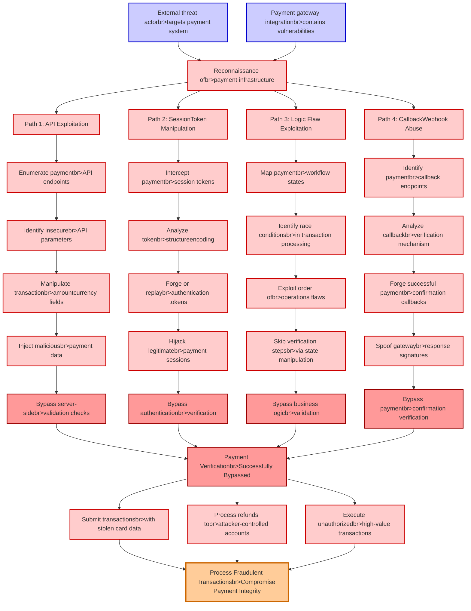

# Attack Tree: Payment Gateway Fraud

**Threat ID**: T009
**Statement**: A external threat actor who exploits vulnerabilities in payment gateway integration, can bypass payment verification, which leads to processing fraudulent transactions, resulting in reduced integrity of payment processing and financial losses.

## Attack Tree Diagram

## MITRE ATT&CK Mapping

This attack tree has been mapped to MITRE ATT&CK techniques:

### Inject maliciousbr>payment data

- **Technique**: [T1048.003](https://attack.mitre.org/techniques/T1048/003/) - Exfiltration Over Unencrypted Non-C2 Protocol
- **Tactic**: Exfiltration
- **Similarity Score**: 38.33%
- **Mitigations (4):**
  - 🛡️ **Network Intrusion Prevention**
    Use intrusion detection signatures to block traffic at network boundaries.
  - 🛡️ **Data Loss Prevention**
    Data Loss Prevention (DLP) involves implementing strategies and technologies to identify, categorize, monitor, and contr...
  - 🛡️ **Filter Network Traffic**
    Employ network appliances and endpoint software to filter ingress, egress, and lateral network traffic. This includes pr...
  - *1 more mitigation(s) available*

### Process Fraudulent Transactionsbr>Compromise Payment Integrity

- **Technique**: [T1657](https://attack.mitre.org/techniques/T1657/) - Financial Theft
- **Tactic**: Impact
- **Similarity Score**: 46.22%
- **Mitigations (2):**
  - 🛡️ **User Training**
    User Training involves educating employees and contractors on recognizing, reporting, and preventing cyber threats that ...
  - 🛡️ **User Account Management**
    User Account Management involves implementing and enforcing policies for the lifecycle of user accounts, including creat...

### Path 3: Logic Flaw Exploitation

- **Technique**: [T1211](https://attack.mitre.org/techniques/T1211/) - Exploitation for Defense Evasion
- **Tactic**: Defense Evasion
- **Similarity Score**: 53.38%
- **Mitigations (4):**
  - 🛡️ **Exploit Protection**
    Deploy capabilities that detect, block, and mitigate conditions indicative of software exploits. These capabilities aim ...
  - 🛡️ **Update Software**
    Software updates ensure systems are protected against known vulnerabilities by applying patches and upgrades provided by...
  - 🛡️ **Threat Intelligence Program**
    A Threat Intelligence Program enables organizations to proactively identify, analyze, and act on cyber threats by levera...
  - *1 more mitigation(s) available*

### Path 1: API Exploitation

- **Technique**: [T1106](https://attack.mitre.org/techniques/T1106/) - Native API
- **Tactic**: Execution
- **Similarity Score**: 56.12%
- **Mitigations (2):**
  - 🛡️ **Execution Prevention**
    Prevent the execution of unauthorized or malicious code on systems by implementing application control, script blocking,...
  - 🛡️ **Behavior Prevention on Endpoint**
    Behavior Prevention on Endpoint refers to the use of technologies and strategies to detect and block potentially malicio...

### Forge successful paymentbr>confirmation callbacks

- **Technique**: [T1621](https://attack.mitre.org/techniques/T1621/) - Multi-Factor Authentication Request Generation
- **Tactic**: Credential Access
- **Similarity Score**: 32.14%
- **Mitigations (3):**
  - 🛡️ **Multi-factor Authentication**
    Multi-Factor Authentication (MFA) enhances security by requiring users to provide at least two forms of verification to ...
  - 🛡️ **Account Use Policies**
    Account Use Policies help mitigate unauthorized access by configuring and enforcing rules that govern how and when accou...
  - 🛡️ **User Training**
    User Training involves educating employees and contractors on recognizing, reporting, and preventing cyber threats that ...

### Identify race conditionsbr>in transaction processing

- **Technique**: [T1480.002](https://attack.mitre.org/techniques/T1480/002/) - Mutual Exclusion
- **Tactic**: Defense Evasion
- **Similarity Score**: 48.16%
- **Mitigations (1):**
  - 🛡️ **Do Not Mitigate**
    The Do Not Mitigate category highlights scenarios where attempting to mitigate a specific technique may inadvertently in...

### Spoof gatewaybr>response signatures

- **Technique**: [T1001.003](https://attack.mitre.org/techniques/T1001/003/) - Protocol or Service Impersonation
- **Tactic**: Command And Control
- **Similarity Score**: 65.15%
- **Mitigations (1):**
  - 🛡️ **Network Intrusion Prevention**
    Use intrusion detection signatures to block traffic at network boundaries.

### Skip verification stepsbr>via state manipulation

- **Technique**: [T1553.003](https://attack.mitre.org/techniques/T1553/003/) - SIP and Trust Provider Hijacking
- **Tactic**: Defense Evasion
- **Similarity Score**: 48.68%
- **Mitigations (3):**
  - 🛡️ **Execution Prevention**
    Prevent the execution of unauthorized or malicious code on systems by implementing application control, script blocking,...
  - 🛡️ **Restrict Registry Permissions**
    Restricting registry permissions involves configuring access control settings for sensitive registry keys and hives to e...
  - 🛡️ **Restrict File and Directory Permissions**
    Restricting file and directory permissions involves setting access controls at the file system level to limit which user...

### Reconnaissance ofbr>payment infrastructure

- **Technique**: [T1657](https://attack.mitre.org/techniques/T1657/) - Financial Theft
- **Tactic**: Impact
- **Similarity Score**: 34.37%
- **Mitigations (2):**
  - 🛡️ **User Training**
    User Training involves educating employees and contractors on recognizing, reporting, and preventing cyber threats that ...
  - 🛡️ **User Account Management**
    User Account Management involves implementing and enforcing policies for the lifecycle of user accounts, including creat...

### Intercept paymentbr>session tokens

- **Technique**: [T1550.004](https://attack.mitre.org/techniques/T1550/004/) - Web Session Cookie
- **Tactic**: Defense Evasion, Lateral Movement
- **Similarity Score**: 50.83%
- **Mitigations (1):**
  - 🛡️ **Software Configuration**
    Software configuration refers to making security-focused adjustments to the settings of applications, middleware, databa...

### Manipulate transactionbr>amountcurrency fields

- **Technique**: [T1493](https://attack.mitre.org/techniques/T1493/) - Transmitted Data Manipulation
- **Tactic**: Impact
- **Similarity Score**: 35.05%

### External threat actorbr>targets payment system

- **Technique**: [T1657](https://attack.mitre.org/techniques/T1657/) - Financial Theft
- **Tactic**: Impact
- **Similarity Score**: 51.72%
- **Mitigations (2):**
  - 🛡️ **User Training**
    User Training involves educating employees and contractors on recognizing, reporting, and preventing cyber threats that ...
  - 🛡️ **User Account Management**
    User Account Management involves implementing and enforcing policies for the lifecycle of user accounts, including creat...

### Bypass server-sidebr>validation checks

- **Technique**: [T1553.003](https://attack.mitre.org/techniques/T1553/003/) - SIP and Trust Provider Hijacking
- **Tactic**: Defense Evasion
- **Similarity Score**: 40.31%
- **Mitigations (3):**
  - 🛡️ **Execution Prevention**
    Prevent the execution of unauthorized or malicious code on systems by implementing application control, script blocking,...
  - 🛡️ **Restrict Registry Permissions**
    Restricting registry permissions involves configuring access control settings for sensitive registry keys and hives to e...
  - 🛡️ **Restrict File and Directory Permissions**
    Restricting file and directory permissions involves setting access controls at the file system level to limit which user...

### Bypass authenticationbr>verification

- **Technique**: [T1550](https://attack.mitre.org/techniques/T1550/) - Use Alternate Authentication Material
- **Tactic**: Defense Evasion, Lateral Movement
- **Similarity Score**: 79.09%
- **Mitigations (7):**
  - 🛡️ **Audit**
    Auditing is the process of recording activity and systematically reviewing and analyzing the activity and system configu...
  - 🛡️ **Password Policies**
    Set and enforce secure password policies for accounts to reduce the likelihood of unauthorized access. Strong password p...
  - 🛡️ **Account Use Policies**
    Account Use Policies help mitigate unauthorized access by configuring and enforcing rules that govern how and when accou...
  - *4 more mitigation(s) available*

### Map paymentbr>workflow states

- **Technique**: [T1007](https://attack.mitre.org/techniques/T1007/) - System Service Discovery
- **Tactic**: Discovery
- **Similarity Score**: 31.29%

### Bypass paymentbr>confirmation verification

- **Technique**: [T1553.003](https://attack.mitre.org/techniques/T1553/003/) - SIP and Trust Provider Hijacking
- **Tactic**: Defense Evasion
- **Similarity Score**: 39.63%
- **Mitigations (3):**
  - 🛡️ **Execution Prevention**
    Prevent the execution of unauthorized or malicious code on systems by implementing application control, script blocking,...
  - 🛡️ **Restrict Registry Permissions**
    Restricting registry permissions involves configuring access control settings for sensitive registry keys and hives to e...
  - 🛡️ **Restrict File and Directory Permissions**
    Restricting file and directory permissions involves setting access controls at the file system level to limit which user...

### Enumerate paymentbr>API endpoints

- **Technique**: [T1538](https://attack.mitre.org/techniques/T1538/) - Cloud Service Dashboard
- **Tactic**: Discovery
- **Similarity Score**: 45.82%
- **Mitigations (1):**
  - 🛡️ **User Account Management**
    User Account Management involves implementing and enforcing policies for the lifecycle of user accounts, including creat...

### Payment Verificationbr>Successfully Bypassed

- **Technique**: [T1553.003](https://attack.mitre.org/techniques/T1553/003/) - SIP and Trust Provider Hijacking
- **Tactic**: Defense Evasion
- **Similarity Score**: 40.55%
- **Mitigations (3):**
  - 🛡️ **Execution Prevention**
    Prevent the execution of unauthorized or malicious code on systems by implementing application control, script blocking,...
  - 🛡️ **Restrict Registry Permissions**
    Restricting registry permissions involves configuring access control settings for sensitive registry keys and hives to e...
  - 🛡️ **Restrict File and Directory Permissions**
    Restricting file and directory permissions involves setting access controls at the file system level to limit which user...

### Exploit order ofbr>operations flaws

- **Technique**: [T1036.002](https://attack.mitre.org/techniques/T1036/002/) - Right-to-Left Override
- **Tactic**: Defense Evasion
- **Similarity Score**: 37.37%

### Forge or replaybr>authentication tokens

- **Technique**: [T1550](https://attack.mitre.org/techniques/T1550/) - Use Alternate Authentication Material
- **Tactic**: Defense Evasion, Lateral Movement
- **Similarity Score**: 78.68%
- **Mitigations (7):**
  - 🛡️ **Audit**
    Auditing is the process of recording activity and systematically reviewing and analyzing the activity and system configu...
  - 🛡️ **Password Policies**
    Set and enforce secure password policies for accounts to reduce the likelihood of unauthorized access. Strong password p...
  - 🛡️ **Account Use Policies**
    Account Use Policies help mitigate unauthorized access by configuring and enforcing rules that govern how and when accou...
  - *4 more mitigation(s) available*

### Analyze callbackbr>verification mechanism

- **Technique**: [T1553.003](https://attack.mitre.org/techniques/T1553/003/) - SIP and Trust Provider Hijacking
- **Tactic**: Defense Evasion
- **Similarity Score**: 49.32%
- **Mitigations (3):**
  - 🛡️ **Execution Prevention**
    Prevent the execution of unauthorized or malicious code on systems by implementing application control, script blocking,...
  - 🛡️ **Restrict Registry Permissions**
    Restricting registry permissions involves configuring access control settings for sensitive registry keys and hives to e...
  - 🛡️ **Restrict File and Directory Permissions**
    Restricting file and directory permissions involves setting access controls at the file system level to limit which user...

### Bypass business logicbr>validation

- **Technique**: [T1553.003](https://attack.mitre.org/techniques/T1553/003/) - SIP and Trust Provider Hijacking
- **Tactic**: Defense Evasion
- **Similarity Score**: 47.92%
- **Mitigations (3):**
  - 🛡️ **Execution Prevention**
    Prevent the execution of unauthorized or malicious code on systems by implementing application control, script blocking,...
  - 🛡️ **Restrict Registry Permissions**
    Restricting registry permissions involves configuring access control settings for sensitive registry keys and hives to e...
  - 🛡️ **Restrict File and Directory Permissions**
    Restricting file and directory permissions involves setting access controls at the file system level to limit which user...

### Execute unauthorizedbr>high-value transactions

- **Technique**: [T1205.002](https://attack.mitre.org/techniques/T1205/002/) - Socket Filters
- **Tactic**: Defense Evasion, Persistence, Command And Control
- **Similarity Score**: 33.43%
- **Mitigations (1):**
  - 🛡️ **Filter Network Traffic**
    Employ network appliances and endpoint software to filter ingress, egress, and lateral network traffic. This includes pr...

### Identify insecurebr>API parameters

- **Technique**: [T1556.002](https://attack.mitre.org/techniques/T1556/002/) - Password Filter DLL
- **Tactic**: Credential Access, Defense Evasion, Persistence
- **Similarity Score**: 45.95%
- **Mitigations (1):**
  - 🛡️ **Operating System Configuration**
    Operating System Configuration involves adjusting system settings and hardening the default configurations of an operati...

### Payment gateway integrationbr>contains vulnerabilities

- **Technique**: [T1211](https://attack.mitre.org/techniques/T1211/) - Exploitation for Defense Evasion
- **Tactic**: Defense Evasion
- **Similarity Score**: 39.22%
- **Mitigations (4):**
  - 🛡️ **Exploit Protection**
    Deploy capabilities that detect, block, and mitigate conditions indicative of software exploits. These capabilities aim ...
  - 🛡️ **Update Software**
    Software updates ensure systems are protected against known vulnerabilities by applying patches and upgrades provided by...
  - 🛡️ **Threat Intelligence Program**
    A Threat Intelligence Program enables organizations to proactively identify, analyze, and act on cyber threats by levera...
  - *1 more mitigation(s) available*

### Submit transactionsbr>with stolen card data

- **Technique**: [T1048.003](https://attack.mitre.org/techniques/T1048/003/) - Exfiltration Over Unencrypted Non-C2 Protocol
- **Tactic**: Exfiltration
- **Similarity Score**: 42.66%
- **Mitigations (4):**
  - 🛡️ **Network Intrusion Prevention**
    Use intrusion detection signatures to block traffic at network boundaries.
  - 🛡️ **Data Loss Prevention**
    Data Loss Prevention (DLP) involves implementing strategies and technologies to identify, categorize, monitor, and contr...
  - 🛡️ **Filter Network Traffic**
    Employ network appliances and endpoint software to filter ingress, egress, and lateral network traffic. This includes pr...
  - *1 more mitigation(s) available*

### Path 4: CallbackWebhook Abuse

- **Technique**: [T1100](https://attack.mitre.org/techniques/T1100/) - Web Shell
- **Tactic**: Persistence, Privilege Escalation
- **Similarity Score**: 48.70%

### Hijack legitimatebr>payment sessions

- **Technique**: [T1563](https://attack.mitre.org/techniques/T1563/) - Remote Service Session Hijacking
- **Tactic**: Lateral Movement
- **Similarity Score**: 53.46%
- **Mitigations (5):**
  - 🛡️ **Network Segmentation**
    Network segmentation involves dividing a network into smaller, isolated segments to control and limit the flow of traffi...
  - 🛡️ **Disable or Remove Feature or Program**
    Disable or remove unnecessary and potentially vulnerable software, features, or services to reduce the attack surface an...
  - 🛡️ **Password Policies**
    Set and enforce secure password policies for accounts to reduce the likelihood of unauthorized access. Strong password p...
  - *2 more mitigation(s) available*

### Identify paymentbr>callback endpoints

- **Technique**: [T1016.001](https://attack.mitre.org/techniques/T1016/001/) - Internet Connection Discovery
- **Tactic**: Discovery
- **Similarity Score**: 32.73%

### Process refunds tobr>attacker-controlled accounts

- **Technique**: [T1666](https://attack.mitre.org/techniques/T1666/) - Modify Cloud Resource Hierarchy
- **Tactic**: Defense Evasion
- **Similarity Score**: 57.94%
- **Mitigations (3):**
  - 🛡️ **Software Configuration**
    Software configuration refers to making security-focused adjustments to the settings of applications, middleware, databa...
  - 🛡️ **User Account Management**
    User Account Management involves implementing and enforcing policies for the lifecycle of user accounts, including creat...
  - 🛡️ **Audit**
    Auditing is the process of recording activity and systematically reviewing and analyzing the activity and system configu...

### Path 2: SessionToken Manipulation

- **Technique**: [T1134.003](https://attack.mitre.org/techniques/T1134/003/) - Make and Impersonate Token
- **Tactic**: Defense Evasion, Privilege Escalation
- **Similarity Score**: 62.10%
- **Mitigations (2):**
  - 🛡️ **Privileged Account Management**
    Privileged Account Management focuses on implementing policies, controls, and tools to securely manage privileged accoun...
  - 🛡️ **User Account Management**
    User Account Management involves implementing and enforcing policies for the lifecycle of user accounts, including creat...

### Analyze tokenbr>structureencoding

- **Technique**: [T1132.002](https://attack.mitre.org/techniques/T1132/002/) - Non-Standard Encoding
- **Tactic**: Command And Control
- **Similarity Score**: 50.51%
- **Mitigations (1):**
  - 🛡️ **Network Intrusion Prevention**
    Use intrusion detection signatures to block traffic at network boundaries.

*Total technique mappings: 32 | Mitigations found: 76*

## Attack Path Analysis

Review this attack tree to:
1. Identify critical attack paths
2. Implement appropriate security controls
3. Monitor for indicators
4. Develop incident response procedures

---
*Generated by ThreatForest*
