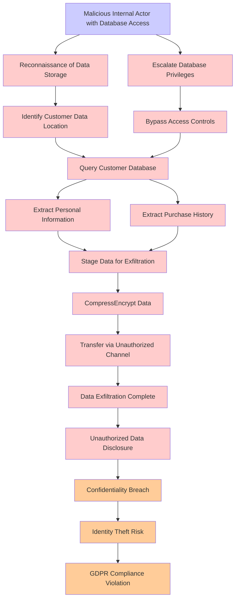

# Attack Tree: Customer Data Exfiltration

**Threat ID**: T010
**Statement**: T010 - Customer Data Exfiltration

## Attack Tree Diagram

## MITRE ATT&CK Mapping

This attack tree has been mapped to MITRE ATT&CK techniques:

### Reconnaissance of Data Storage

- **Technique**: [T1530.A002](https://attack.mitre.org/techniques/T1530/A002/) - S3 Glacier
- **Tactic**: Collection
- **Confidence Score**: 1052.59

### Confidentiality Breach

- **Technique**: [T1530.A002](https://attack.mitre.org/techniques/T1530/A002/) - S3 Glacier
- **Tactic**: Collection
- **Confidence Score**: 1286.20

### Transfer via Unauthorized Channel

- **Technique**: [T1537](https://attack.mitre.org/techniques/T1537/) - Transfer Data to Cloud Account
- **Tactic**: Exfiltration
- **Confidence Score**: 1397.06
- **Mitigations (4):**
  - 🛡️ **Data Loss Prevention**
    Data Loss Prevention (DLP) involves implementing strategies and technologies to identify, categorize, monitor, and contr...
  - 🛡️ **User Account Management**
    User Account Management involves implementing and enforcing policies for the lifecycle of user accounts, including creat...
  - 🛡️ **Software Configuration**
    Software configuration refers to making security-focused adjustments to the settings of applications, middleware, databa...
  - *1 more mitigation(s) available*

### Identify Customer Data Location

- **Technique**: [T1530.A002](https://attack.mitre.org/techniques/T1530/A002/) - S3 Glacier
- **Tactic**: Collection
- **Confidence Score**: 1397.29

### Data Exfiltration Complete

- **Technique**: [T1490](https://attack.mitre.org/techniques/T1490/) - Inhibit System Recovery
- **Tactic**: Impact
- **Confidence Score**: 1278.25
- **Mitigations (4):**
  - 🛡️ **Execution Prevention**
    Prevent the execution of unauthorized or malicious code on systems by implementing application control, script blocking,...
  - 🛡️ **Operating System Configuration**
    Operating System Configuration involves adjusting system settings and hardening the default configurations of an operati...
  - 🛡️ **User Account Management**
    User Account Management involves implementing and enforcing policies for the lifecycle of user accounts, including creat...
  - *1 more mitigation(s) available*

### Extract Personal Information

- **Technique**: [T1070.008](https://attack.mitre.org/techniques/T1070/008/) - Clear Mailbox Data
- **Tactic**: Defense Evasion
- **Confidence Score**: 1396.69
- **Mitigations (3):**
  - 🛡️ **Restrict File and Directory Permissions**
    Restricting file and directory permissions involves setting access controls at the file system level to limit which user...
  - 🛡️ **Audit**
    Auditing is the process of recording activity and systematically reviewing and analyzing the activity and system configu...
  - 🛡️ **Remote Data Storage**
    Remote Data Storage focuses on moving critical data, such as security logs and sensitive files, to secure, off-host loca...

### Malicious Internal Actor with Database Access

- **Technique**: [AT1029.001](https://attack.mitre.org/techniques/AT1029/001/) - DynamoDB
- **Tactic**: Collection
- **Confidence Score**: 1272.30

### Extract Purchase History

- **Technique**: [T1496.001](https://attack.mitre.org/techniques/T1496/001/) - Compute Hijacking
- **Tactic**: Impact
- **Confidence Score**: 1340.37

### Unauthorized Data Disclosure

- **Technique**: [T1530.A004](https://attack.mitre.org/techniques/T1530/A004/) - EBS
- **Tactic**: Collection
- **Confidence Score**: 1261.78

### Escalate Database Privileges

- **Technique**: [T1190.A013.A005](https://attack.mitre.org/techniques/T1190/A013/A005/) - RDS Instance Manipulation - RDS Snapshot
- **Tactic**: Initial Access
- **Confidence Score**: 1146.80

### GDPR Compliance Violation

- **Technique**: [T1070.008](https://attack.mitre.org/techniques/T1070/008/) - Clear Mailbox Data
- **Tactic**: Defense Evasion
- **Confidence Score**: 1356.89
- **Mitigations (3):**
  - 🛡️ **Restrict File and Directory Permissions**
    Restricting file and directory permissions involves setting access controls at the file system level to limit which user...
  - 🛡️ **Audit**
    Auditing is the process of recording activity and systematically reviewing and analyzing the activity and system configu...
  - 🛡️ **Remote Data Storage**
    Remote Data Storage focuses on moving critical data, such as security logs and sensitive files, to secure, off-host loca...

### Query Customer Database

- **Technique**: [T1087.004](https://attack.mitre.org/techniques/T1087/004/) - Cloud Account
- **Tactic**: Discovery
- **Confidence Score**: 1228.33
- **Mitigations (2):**
  - 🛡️ **Audit**
    Auditing is the process of recording activity and systematically reviewing and analyzing the activity and system configu...
  - 🛡️ **User Account Management**
    User Account Management involves implementing and enforcing policies for the lifecycle of user accounts, including creat...

### CompressEncrypt Data

- **Technique**: [T1490](https://attack.mitre.org/techniques/T1490/) - Inhibit System Recovery
- **Tactic**: Impact
- **Confidence Score**: 1466.88
- **Mitigations (4):**
  - 🛡️ **Execution Prevention**
    Prevent the execution of unauthorized or malicious code on systems by implementing application control, script blocking,...
  - 🛡️ **Operating System Configuration**
    Operating System Configuration involves adjusting system settings and hardening the default configurations of an operati...
  - 🛡️ **User Account Management**
    User Account Management involves implementing and enforcing policies for the lifecycle of user accounts, including creat...
  - *1 more mitigation(s) available*

### Identity Theft Risk

- **Technique**: [T1530.A002](https://attack.mitre.org/techniques/T1530/A002/) - S3 Glacier
- **Tactic**: Collection
- **Confidence Score**: 1302.63

### Bypass Access Controls

- **Technique**: [T1490](https://attack.mitre.org/techniques/T1490/) - Inhibit System Recovery
- **Tactic**: Impact
- **Confidence Score**: 1319.92
- **Mitigations (4):**
  - 🛡️ **Execution Prevention**
    Prevent the execution of unauthorized or malicious code on systems by implementing application control, script blocking,...
  - 🛡️ **Operating System Configuration**
    Operating System Configuration involves adjusting system settings and hardening the default configurations of an operati...
  - 🛡️ **User Account Management**
    User Account Management involves implementing and enforcing policies for the lifecycle of user accounts, including creat...
  - *1 more mitigation(s) available*

### Stage Data for Exfiltration

- **Technique**: [T1074.002](https://attack.mitre.org/techniques/T1074/002/) - Remote Data Staging
- **Tactic**: Collection
- **Confidence Score**: 1202.54

*Total technique mappings: 16 | Mitigations found: 24*

## Attack Path Analysis

Review this attack tree to:
1. Identify critical attack paths
2. Implement appropriate security controls
3. Monitor for indicators
4. Develop incident response procedures

---
*Generated by ThreatForest*
