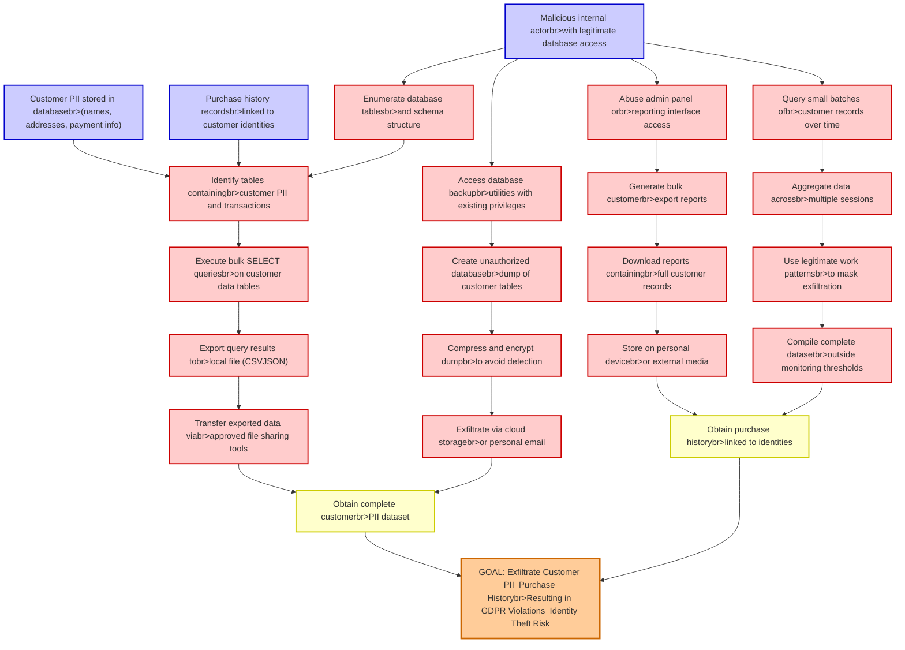

# Attack Tree: Customer Data Exfiltration

**Threat ID**: T010
**Statement**: A malicious internal actor with database access, can export customer personal information and purchase history, which leads to unauthorized data disclosure and potential identity theft, resulting in reduced confidentiality of customer personal data and GDPR violations.

## Attack Tree Diagram

## MITRE ATT&CK Mapping

This attack tree has been mapped to MITRE ATT&CK techniques:

### Obtain purchase historybr>linked to identities

- **Technique**: [T1139](https://attack.mitre.org/techniques/T1139/) - Bash History
- **Tactic**: Credential Access
- **Similarity Score**: 40.23%

### Query small batches ofbr>customer records over time

- **Technique**: [T1591.003](https://attack.mitre.org/techniques/T1591/003/) - Identify Business Tempo
- **Tactic**: Reconnaissance
- **Similarity Score**: 47.80%
- **Mitigations (1):**
  - 🛡️ **Pre-compromise**
    Pre-compromise mitigations involve proactive measures and defenses implemented to prevent adversaries from successfully ...

### GOAL: Exfiltrate Customer PII  Purchase Historybr>Resulting in GDPR Violations  Identity Theft Risk

- **Technique**: [T1020](https://attack.mitre.org/techniques/T1020/) - Automated Exfiltration
- **Tactic**: Exfiltration
- **Similarity Score**: 56.56%

### Execute bulk SELECT queriesbr>on customer data tables

- **Technique**: [T1213.006](https://attack.mitre.org/techniques/T1213/006/) - Databases
- **Tactic**: Collection
- **Similarity Score**: 55.57%
- **Mitigations (5):**
  - 🛡️ **User Training**
    User Training involves educating employees and contractors on recognizing, reporting, and preventing cyber threats that ...
  - 🛡️ **Encrypt Sensitive Information**
    Protect sensitive information at rest, in transit, and during processing by using strong encryption algorithms. Encrypti...
  - 🛡️ **Software Configuration**
    Software configuration refers to making security-focused adjustments to the settings of applications, middleware, databa...
  - *2 more mitigation(s) available*

### Compress and encrypt dumpbr>to avoid detection

- **Technique**: [T1560.003](https://attack.mitre.org/techniques/T1560/003/) - Archive via Custom Method
- **Tactic**: Collection
- **Similarity Score**: 81.68%

### Purchase history recordsbr>linked to customer identities

- **Technique**: [T1213.004](https://attack.mitre.org/techniques/T1213/004/) - Customer Relationship Management Software
- **Tactic**: Collection
- **Similarity Score**: 54.72%
- **Mitigations (4):**
  - 🛡️ **User Account Management**
    User Account Management involves implementing and enforcing policies for the lifecycle of user accounts, including creat...
  - 🛡️ **User Training**
    User Training involves educating employees and contractors on recognizing, reporting, and preventing cyber threats that ...
  - 🛡️ **Software Configuration**
    Software configuration refers to making security-focused adjustments to the settings of applications, middleware, databa...
  - *1 more mitigation(s) available*

### Identify tables containingbr>customer PII and transactions

- **Technique**: [T1033](https://attack.mitre.org/techniques/T1033/) - System Owner/User Discovery
- **Tactic**: Discovery
- **Similarity Score**: 45.77%

### Download reports containingbr>full customer records

- **Technique**: [T1213.004](https://attack.mitre.org/techniques/T1213/004/) - Customer Relationship Management Software
- **Tactic**: Collection
- **Similarity Score**: 55.02%
- **Mitigations (4):**
  - 🛡️ **User Account Management**
    User Account Management involves implementing and enforcing policies for the lifecycle of user accounts, including creat...
  - 🛡️ **User Training**
    User Training involves educating employees and contractors on recognizing, reporting, and preventing cyber threats that ...
  - 🛡️ **Software Configuration**
    Software configuration refers to making security-focused adjustments to the settings of applications, middleware, databa...
  - *1 more mitigation(s) available*

### Create unauthorized databasebr>dump of customer tables

- **Technique**: [T1213.006](https://attack.mitre.org/techniques/T1213/006/) - Databases
- **Tactic**: Collection
- **Similarity Score**: 60.65%
- **Mitigations (5):**
  - 🛡️ **User Training**
    User Training involves educating employees and contractors on recognizing, reporting, and preventing cyber threats that ...
  - 🛡️ **Encrypt Sensitive Information**
    Protect sensitive information at rest, in transit, and during processing by using strong encryption algorithms. Encrypti...
  - 🛡️ **Software Configuration**
    Software configuration refers to making security-focused adjustments to the settings of applications, middleware, databa...
  - *2 more mitigation(s) available*

### Store on personal devicebr>or external media

- **Technique**: [T1025](https://attack.mitre.org/techniques/T1025/) - Data from Removable Media
- **Tactic**: Collection
- **Similarity Score**: 64.85%
- **Mitigations (1):**
  - 🛡️ **Data Loss Prevention**
    Data Loss Prevention (DLP) involves implementing strategies and technologies to identify, categorize, monitor, and contr...

### Enumerate database tablesbr>and schema structure

- **Technique**: [T1005](https://attack.mitre.org/techniques/T1005/) - Data from Local System
- **Tactic**: Collection
- **Similarity Score**: 58.54%
- **Mitigations (1):**
  - 🛡️ **Data Loss Prevention**
    Data Loss Prevention (DLP) involves implementing strategies and technologies to identify, categorize, monitor, and contr...

### Compile complete datasetbr>outside monitoring thresholds

- **Technique**: [T1054](https://attack.mitre.org/techniques/T1054/) - Indicator Blocking
- **Tactic**: Defense Evasion
- **Similarity Score**: 45.22%

### Aggregate data acrossbr>multiple sessions

- **Technique**: [T1074.002](https://attack.mitre.org/techniques/T1074/002/) - Remote Data Staging
- **Tactic**: Collection
- **Similarity Score**: 46.63%

### Obtain complete customerbr>PII dataset

- **Technique**: [T1589](https://attack.mitre.org/techniques/T1589/) - Gather Victim Identity Information
- **Tactic**: Reconnaissance
- **Similarity Score**: 62.61%
- **Mitigations (1):**
  - 🛡️ **Pre-compromise**
    Pre-compromise mitigations involve proactive measures and defenses implemented to prevent adversaries from successfully ...

### Exfiltrate via cloud storagebr>or personal email

- **Technique**: [T1567.002](https://attack.mitre.org/techniques/T1567/002/) - Exfiltration to Cloud Storage
- **Tactic**: Exfiltration
- **Similarity Score**: 82.92%
- **Mitigations (1):**
  - 🛡️ **Restrict Web-Based Content**
    Restricting web-based content involves enforcing policies and technologies that limit access to potentially malicious we...

### Generate bulk customerbr>export reports

- **Technique**: [T1213.004](https://attack.mitre.org/techniques/T1213/004/) - Customer Relationship Management Software
- **Tactic**: Collection
- **Similarity Score**: 52.38%
- **Mitigations (4):**
  - 🛡️ **User Account Management**
    User Account Management involves implementing and enforcing policies for the lifecycle of user accounts, including creat...
  - 🛡️ **User Training**
    User Training involves educating employees and contractors on recognizing, reporting, and preventing cyber threats that ...
  - 🛡️ **Software Configuration**
    Software configuration refers to making security-focused adjustments to the settings of applications, middleware, databa...
  - *1 more mitigation(s) available*

### Malicious internal actorbr>with legitimate database access

- **Technique**: [T1213.006](https://attack.mitre.org/techniques/T1213/006/) - Databases
- **Tactic**: Collection
- **Similarity Score**: 48.84%
- **Mitigations (5):**
  - 🛡️ **User Training**
    User Training involves educating employees and contractors on recognizing, reporting, and preventing cyber threats that ...
  - 🛡️ **Encrypt Sensitive Information**
    Protect sensitive information at rest, in transit, and during processing by using strong encryption algorithms. Encrypti...
  - 🛡️ **Software Configuration**
    Software configuration refers to making security-focused adjustments to the settings of applications, middleware, databa...
  - *2 more mitigation(s) available*

### Access database backupbr>utilities with existing privileges

- **Technique**: [T1006](https://attack.mitre.org/techniques/T1006/) - Direct Volume Access
- **Tactic**: Defense Evasion
- **Similarity Score**: 64.26%
- **Mitigations (2):**
  - 🛡️ **Behavior Prevention on Endpoint**
    Behavior Prevention on Endpoint refers to the use of technologies and strategies to detect and block potentially malicio...
  - 🛡️ **User Account Management**
    User Account Management involves implementing and enforcing policies for the lifecycle of user accounts, including creat...

### Abuse admin panel orbr>reporting interface access

- **Technique**: [T1562.012](https://attack.mitre.org/techniques/T1562/012/) - Disable or Modify Linux Audit System
- **Tactic**: Defense Evasion
- **Similarity Score**: 38.65%
- **Mitigations (2):**
  - 🛡️ **Audit**
    Auditing is the process of recording activity and systematically reviewing and analyzing the activity and system configu...
  - 🛡️ **User Account Management**
    User Account Management involves implementing and enforcing policies for the lifecycle of user accounts, including creat...

### Transfer exported data viabr>approved file sharing tools

- **Technique**: [T1570](https://attack.mitre.org/techniques/T1570/) - Lateral Tool Transfer
- **Tactic**: Lateral Movement
- **Similarity Score**: 79.10%
- **Mitigations (2):**
  - 🛡️ **Filter Network Traffic**
    Employ network appliances and endpoint software to filter ingress, egress, and lateral network traffic. This includes pr...
  - 🛡️ **Network Intrusion Prevention**
    Use intrusion detection signatures to block traffic at network boundaries.

### Use legitimate work patternsbr>to mask exfiltration

- **Technique**: [T1567.001](https://attack.mitre.org/techniques/T1567/001/) - Exfiltration to Code Repository
- **Tactic**: Exfiltration
- **Similarity Score**: 65.29%
- **Mitigations (1):**
  - 🛡️ **Restrict Web-Based Content**
    Restricting web-based content involves enforcing policies and technologies that limit access to potentially malicious we...

### Customer PII stored in databasebr>(names, addresses, payment info)

- **Technique**: [T1213.004](https://attack.mitre.org/techniques/T1213/004/) - Customer Relationship Management Software
- **Tactic**: Collection
- **Similarity Score**: 54.37%
- **Mitigations (4):**
  - 🛡️ **User Account Management**
    User Account Management involves implementing and enforcing policies for the lifecycle of user accounts, including creat...
  - 🛡️ **User Training**
    User Training involves educating employees and contractors on recognizing, reporting, and preventing cyber threats that ...
  - 🛡️ **Software Configuration**
    Software configuration refers to making security-focused adjustments to the settings of applications, middleware, databa...
  - *1 more mitigation(s) available*

### Export query results tobr>local file (CSVJSON)

- **Technique**: [T1119](https://attack.mitre.org/techniques/T1119/) - Automated Collection
- **Tactic**: Collection
- **Similarity Score**: 47.35%
- **Mitigations (2):**
  - 🛡️ **Remote Data Storage**
    Remote Data Storage focuses on moving critical data, such as security logs and sensitive files, to secure, off-host loca...
  - 🛡️ **Encrypt Sensitive Information**
    Protect sensitive information at rest, in transit, and during processing by using strong encryption algorithms. Encrypti...

*Total technique mappings: 23 | Mitigations found: 45*

## Attack Path Analysis

Review this attack tree to:
1. Identify critical attack paths
2. Implement appropriate security controls
3. Monitor for indicators
4. Develop incident response procedures

---
*Generated by ThreatForest*
